# LetLetMe Briefing — 全链路架构与落地计划

- **状态：** Briefing 产品与跨仓实现的权威设计
- **记录日期：** 2026-08-18
- **范围：** X/Grok 采集、来源治理、编辑生产、Data、PostgreSQL、Redis、GraphQL、Web、后台运营、缓存、纠错与未来通知
- **首个纵向切片：** `Briefing → 本周`
- **次级菜单详细设计：** [本周 / Week 跨仓实施方案](letletme-briefing-week-cross-repo-implementation-plan.md)、[新闻 / News](letletme-briefing-news-architecture.md)、[观点 / Views](letletme-briefing-views-architecture.md)、[深度 / Features](letletme-briefing-features-architecture.md)
- **关联仓库：** `letletme_data`、`letletme-graphql`、`letletme-web`
- **替代关系：** 本文替代既有产品文档中所有关于 Briefing 的导航位置、个性化、follow/mute、采集方式和跨仓实现结论；其他非 Briefing 结论继续有效

## 1. 最终结论

### 1.1 产品位置

Briefing 升级为第二个顶级导航，不再藏在 Explore 中：

| Locale | 顶级导航顺序 |
| --- | --- |
| `zh-CN` | **实时 · 资讯 · 我的 FPL · 赛事 · 探索** |
| `en` | **Live · Briefing · My FPL · Competitions · Explore** |

`Briefing` 是内部、路由和英文产品名；中文展示名为 `资讯`。它是用户查看真实世界足球与 FPL 相关信息的固定入口，不是聊天机器人、社交平台镜像或 LetLetMe 选人助手。

### 1.2 四个次级菜单

| 菜单 | 用户要解决的问题 | 主要内容 | 公开组织单位 | 更新特点 |
| --- | --- | --- | --- | --- |
| **[本周 / Week](letletme-briefing-week-cross-repo-implementation-plan.md)** | 截止日前，本轮真正发生了什么、哪些信息值得我自己判断？ | 发布会、伤停、训练与阵容消息、首发传闻、具名 KOL 本周观点与模板、值得读/听/看的内容 | 一份全站统一的 Week edition，引用已发布 Story | 高时效；越接近 deadline 越频繁 |
| **[新闻 / News](letletme-briefing-news-architecture.md)** | 俱乐部和球员最近发生了什么？ | 转会、俱乐部公告、记者消息、球队动态、伤停和赛前信息 | `NEWS` Story 的编辑集合 | 日内持续更新；更正优先于新增 |
| **[观点 / Views](letletme-briefing-views-architecture.md)** | 可信的记者、分析者和 KOL 在怎么判断？ | X、YouTube、播客中的具名观点、模板、差异和反对意见 | `OPINION` Story 的编辑集合 | 强归因；不生成“社区共识” |
| **[深度 / Features](letletme-briefing-features-architecture.md)** | 哪些长文章、节目或分析值得花时间？ | 球队分析文章、专题、播客/视频的许可摘要和编辑重组 | `FEATURE` Story 的编辑集合 | 低频、长生命周期、权利审查更严格 |

四个菜单共享同一套 canonical Story。`本周` 不是第四种内容类型，而是一个带 FPL deadline 范围的编辑出版物，可以引用 News、Views、Features 中的同一 Story。这样不会出现同一消息复制四份、改一处漏三处的问题。

### 1.3 已确定的边界

1. Briefing 内容的事实来源是现实世界公开来源，不是从 FPL 数据推导新闻。
2. FPL event 和 deadline 只用于确定“本周”的时间范围、页面标题和刷新优先级。
3. Briefing V1 不读取、记录或改变任何个人内容状态。所有用户在同一时刻看到同一个 active revision、相同 Story ID 和相同顺序。
4. `en` 与 `zh-CN` 可以有不同文案，但必须属于同一 publication revision，引用相同 Story 集合和顺序。
5. V1 不支持关注、订阅、mute 球队、记者、KOL 或主题。
6. LetLetMe 不主动推荐球员，不输出自己署名的买入、卖出、必选、队长或模板结论。
7. 可以准确转述“某位 KOL 推荐谁、发布了什么模板”，但必须把判断归属于该 KOL，并保留原链接和时间。
8. LetLetMe 自己从 FPL 数据计算的 Top 1k/Top 10k 持有率或模板仍属于 Explore → Trends；只有当某个具名来源发布这类内容时，它才可作为 Briefing 来源材料。
9. 通知投递后置。当前只保留足够的 publication/change event，未来再接站内信、邮件和其他通信工具。
10. 不购买 X API。生产使用已有 Grok 订阅、Grok Build 的原生 X 搜索能力和版本化 skill。
11. V1 不做开放式“全网发现”。采集入口是一份人工维护、可审计的来源名单。

### 1.4 四菜单执行合同

以下是 companion 设计收敛后的 V1 默认值；它们是数据库可配置 policy，不硬编码为永久产品限制：

| Surface | Skill profile | Publication scope | GraphQL | 活跃集合/分页 | 公共缓存初值 |
| --- | --- | --- | --- | --- | --- |
| Week | `week` | `SURFACE:week` | `briefingWeek` | 当前 target event 的 sectioned edition；不做 feed cursor | 约 30 秒，deadline 附近 clamp |
| News | `news` | `SURFACE:news` | `briefingNews` | developing + 最近 14 天；cap 200；20/页 | 30–60 秒 |
| Views | `views` | `SURFACE:views` | `briefingViews` | target/validity 未过期；cap 120；20/页 | 30–60 秒 |
| Features | `features` | `SURFACE:features` | `briefingFeatures` | 最近 30 天 + reviewAt 有效 evergreen；cap 80；20/页 | 5 分钟 |

四个 surface 各自只有一个全站 active revision，均引用独立 `STORY:<story_id>` publication。News/Views/Features 使用相同 bounded connection/cursor 机制，但保留各自明确的 GraphQL field、filter enum 和 card projection；这不是四套不同的读取基础设施。

## 2. 全链路

```mermaid
flowchart LR
    SR["Data: 来源名单与采集策略"] --> SC["Data: deadline-aware scheduler"]
    SC --> Q["BullMQ: content-x-scan"]
    Q --> GW["content-x-worker"]
    GW --> GK["Grok CLI + monitor-fpl-x-sources"]
    GK --> TV["会话 trace + JSON 双重校验"]
    TV --> RI["PostgreSQL: 原帖 receipts 与采集审计"]
    RI --> CL["候选聚类、来源追溯、矛盾检查"]
    CL --> ED["编辑审核与双语 Story version"]
    ED --> PB["Data: edition 编译与发布"]
    PB --> PG["PostgreSQL 权威 publication"]
    PB --> RD["Redis 不可变公开 payload + active pointer"]
    PG --> GQL["GraphQL 校验读取与一致回退"]
    RD --> GQL
    GQL --> WEB["Web: Briefing 公共页面"]
    ED --> CH["更正、撤稿、material change outbox"]
    CH --> PB
    CH -. "未来" .-> NT["站内信 / 邮件 / 其他通知"]
```



这条链路有三个不可混淆的层次：

- **Evidence：** 实际抓到的原帖、URL、来源身份、时间、线程关系和采集覆盖。
- **Editorial：** 聚类、claim、Story、双语版本、归因、编辑状态和更正历史。
- **Publication：** 某一公开页面在某个 revision 下的完整、不可变、可回退 payload。

LLM 可以辅助 Evidence → Editorial，但不能替代真实 receipt；Web 只展示 Publication，不直接读取 Grok 输出或原始采集表。

## 3. 来源名单与治理

### 3.1 名单的 source of truth

来源名单存放在 Data 的 PostgreSQL `content` schema 中。Skill 内不维护另一份运行时账号名单；每次采集由 Data 生成一个带版本号的 source snapshot 交给 skill。

每个来源至少需要：

| 字段 | 作用 |
| --- | --- |
| `source_id` | LetLetMe 内部稳定 ID，不随 handle 改名 |
| `platform` | `X`、`YOUTUBE`、`PODCAST`、`WEB` 等 |
| `external_user_id` | 平台稳定用户 ID；X user ID 优先于 handle |
| `handle` / `canonical_url` | 当前展示和查询身份 |
| `source_type` | 来源类型 |
| `club_ids` | 可空；关联的现实球队身份 |
| `topics` | 伤停、阵容、转会、战术、FPL、播客等 |
| `source_tier` | 运营用来源等级，不公开变成“真相分数” |
| `reporting_family` | 同一记者/编辑部/聚合链，避免把转载算独立 corroboration |
| `group_id` / `poll_policy_id` | 采集分组和节奏 |
| `rights_policy_version` | 允许采集、存储、摘要和展示的版本化政策 |
| `status` | `ACTIVE`、`PAUSED`、`DISABLED` |
| `identity_checked_at` | 最近一次身份核验时间 |

初始 `source_type`：

- `OFFICIAL_CLUB`
- `OFFICIAL_LEAGUE`
- `JOURNALIST`
- `TEAM_NEWS`
- `LINEUP_SOURCE`
- `FPL_KOL`
- `ANALYST`
- `PUBLICATION`
- `SHOW`
- `PODCAST`
- `YOUTUBE`
- `AGGREGATOR`

### 3.2 名单维护流程

1. 运营手动录入首批账号并核验 X user ID、handle、类型、所属球队、reporting family 和 rights policy。
2. 已关注来源引用、quote、reply 或反复指向未知账号时，系统只生成 `suggested_source`。
3. 新账号必须人工确认身份、价值、采集节奏和权利模式后才能进入 `ACTIVE`。
4. Handle 改名只更新 alias；稳定 `source_id` 和平台 user ID 不变。
5. 来源失效、被盗号、持续低质量、权利变化或成本异常时可单独暂停，不影响其他来源。
6. Emergency disable 必须立即阻止新采集和公开投影，但保留内部审计和历史更正记录。

V1 禁止 LLM 自动把陌生账号加入正式名单，也禁止仅根据蓝标、粉丝量或模型记忆提升来源等级。

初始运营节奏：系统每日自动检查连续失败和 handle drift；运营每周处理 `suggested_sources`、低质量来源和 reporting family；每月复核 rights policy、采集采用率和 Grok/转写成本。任何来源和分类变更都有版本和操作者，不直接改 skill 中的隐藏名单。

### 3.3 权利模式

每个来源明确配置，而不是根据“技术上抓得到”推断：

| 模式 | 可公开内容 |
| --- | --- |
| `LINK_ONLY` | 来源身份、时间、链接和最少元数据 |
| `METADATA` | 加标题、节目名、时长、封面等许可元数据 |
| `SUMMARY` | 允许发布编辑或模型辅助摘要 |
| `EXCERPT` | 允许在明确字符上限内显示原文片段 |
| `TRANSCRIPT` | 允许保存私有转写并公开受限摘要或分段投影 |

共同规则：

- 不绕过 paywall，不把完整付费文章、播客或视频变成替代原作的公开副本。
- 私人账号凭据只允许存在于 Data/Grok 生产 secret，不进入 Web、GraphQL payload、日志或 skill 文件。
- 使用私人订阅做编辑背景研究，需要逐来源确认服务条款和再利用权；默认只能产出变换性摘要、归因和原链接。
- 原文/转写只在 rights policy 允许时保存于私有表，并带 content hash、retention deadline 和 policy revision。
- 公开摘要必须能追溯到真实 source item；权利变化、删除或更正能使公开 payload 失效并重新发布。
- 在没有 X API/webhook 的前提下，删除检测只能 best effort：已发布的重要 receipt 在更正、expiry 或人工举报时复核。要求“平台删除立即回调”的来源政策不能由 Grok-only adapter 承诺。

## 4. Grok skill 方案

### 4.1 已找到的现有 skill

用户提到但忘记名字的通用 X skill 是：

```text
/Users/tong/.agents/skills/whathappened/SKILL.md
```

另一个已有实现是：

```text
/Users/tong/Documents/Codex/2026-07-17/n/.grok/skills/transfer-radar/SKILL.md
```

新生产 skill 建议命名：

```text
.grok/skills/monitor-fpl-x-sources/
  SKILL.md
  references/input-schema.json
  references/output-schema.json
  references/query-patterns.md
  references/failure-modes.md
  references/content-taxonomy.yaml
  examples/
```

它最终应版本化在 `letletme_data`，随 Data release 部署到已有 Grok 生产环境。`content-taxonomy.yaml` 只存稳定分类，不存运行时来源名单。

### 4.2 复用与舍弃

| 现有资产 | 复用 | 不复用 |
| --- | --- | --- |
| `whathappened` | 搜索 lattice、实体 grounding、Latest 优先、thread enrichment、neutral synthesis、明确 gaps | 自适应话题时间窗、舆论阵营百分比、面向人的最终文章模板、开放发现 |
| `transfer-radar` | 精确 UTC window、真实 post receipt、call budget、origin/corroboration/contradiction、reporting family、严格 JSON、EMPTY 与 FAILED 分离 | 转会专属分类、热度/可靠度分数、逐俱乐部固定运行、每次强制 Top lane、skill 内静态来源名单 |
| transfer-radar dashboard | `spawn(..., shell:false)`、streaming JSON、session ID、读取最后一个 `agent_message_chunk`、timeout/kill、schema validation | 内存队列、文件缓存、Next.js 进程内 job manager、只校验最终 JSON 而不校验真实 X tool trace |

新 skill 是自包含的新合同，不在运行时串行调用旧 skill。这样旧 skill 的输出格式变化不会破坏生产采集。

### 4.3 输入合同

Data worker 为每个 run 生成只读、短期的 JSON 输入文件，放在受限 runtime 工作目录。输入至少包含：

```json
{
  "schemaVersion": 1,
  "runId": "uuid",
  "mode": "poll",
  "profile": "week",
  "windowStart": "2026-08-18T08:00:00.000Z",
  "windowEnd": "2026-08-18T08:30:00.000Z",
  "sourceSnapshot": {
    "revision": 42,
    "groupId": "official-clubs-a",
    "sources": []
  },
  "targetEvent": {
    "seasonCode": "2026",
    "eventId": 1,
    "deadlineTime": "2026-08-21T17:30:00.000Z"
  },
  "callBudget": {
    "maxXCalls": 2
  }
}
```

`profile` 取 `week/news/views/features`，决定稳定 taxonomy、materiality 和 output extension；不能改变来源名单、窗口、预算或基础 envelope。`targetEvent` 只对需要 event scope 的 profile 必填。Source snapshot 必须带稳定 ID、平台 user ID、当前 handle、来源类型、reporting family、topics 和允许的查询用途。Skill 不连接数据库，也不自行扩充名单。

现有 CLI 调用方式可作为基础：

```text
grok --disable-web-search --output-format streaming-json \
  -p '/monitor-fpl-x-sources input=work/content-x-runs/<run-id>/input.json format=json'
```

实际实现必须继续使用参数数组和 `shell:false`，并限制 input 路径只能位于该 run 的工作目录内。

### 4.4 三种模式

| 模式 | 输入 | 工作 | X tool 预算初值 | 输出 |
| --- | --- | --- | --- | --- |
| `poll` | 来源组、精确窗口 | 分组运行 Latest 查询，返回真实帖子和轻量候选聚类 | 默认最多 2 次 | receipts、coverage、candidate hints、suggested sources |
| `enrich` | 已持久化候选和缺口 | 找 origin、首方说明、独立 corroboration、矛盾和 thread context | 默认最多 4 次 | enriched claim graph、contradictions、review flags |
| `compose` | profile-specific 已验证 receipts/claims/artifacts/chunk notes、locale pair | 生成中立、可追溯的双语 Story 草稿和建议 expiry | 0 次 X tool | 双语 draft + citation IDs，不新增事实 |

普通 poll 不跑 Top、semantic 或 thread。只有候选通过确定性过滤并达到 material gate 后才进入 enrich；只有编辑准备采用的候选才进入 compose。

Poll 对 source snapshot 做确定性分区，生成类似以下 Latest lane：

```text
(from:handle_a OR from:handle_b OR from:handle_c) since:2026-08-18
```

官方低频来源可抓取窗口内全部帖后再分类；高频 KOL/聚合来源可加入版本化的 football/FPL topic filter。X 查询时间操作符只用于粗窗口，最终仍按返回的 `postedAt` 精确过滤。如果结果数量达到 tool limit，coverage 视为不完整：系统缩小 source partition 或安排补扫，不能把饱和结果当成完整成功。

### 4.5 输出合同

最终 JSON envelope 至少分为四部分：

```text
run
  runId, mode, profile, schemaVersion, generatedAt
  windowStart, windowEnd, sourceSnapshotRevision
  executedQueries[], xCallsUsed, coverage[], gaps[]

receipts[]
  sourceId, platformUserId, handle
  postId (string), url, postedAt
  text/hash according to rights mode
  replyToPostId, quotePostId, repostOfPostId
  observed engagement fields only when returned by X

candidates[]
  candidateKey, kind, conciseClaim
  evidencePostIds[], contradictionPostIds[]
  entityHints[], materialityReasons[]
  suggestedExpiresAt, requiresReview[]

suggestedSources[]
  handle, platformUserId if observed
  discoveredViaPostId, reason
```

所有 X post ID 必须按字符串处理，不能转成 JavaScript number。Skill 不得编造 URL、时间、互动量或来源身份。

### 4.6 结果有效性

最终 JSON 通过 schema 不等于采集成功。Data worker 还必须读取该 Grok session 的 update/tool trace，并验证：

1. Session ID 属于本次 run。
2. `poll` 实际执行了预期数量的 `x_keyword_search` Latest lanes。
3. `enrich` 声称的 thread 或 semantic 证据对应本 session 的真实 tool result。
4. 每个 receipt 的 post ID、URL、handle 和时间来自 tool result。
5. 返回的精确时间在 `[windowStart, windowEnd]` 内；日期粒度查询得到的窗口外帖子被确定性剔除。
6. `xCallsUsed` 与 trace 一致且未超预算。
7. Source coverage 没有被静默省略。
8. 达到搜索结果上限的 partition 标记 saturation，不得进入 `SUCCEEDED_EMPTY` 或完整 coverage。

因此运行结果至少有：

- `SUCCEEDED_WITH_ITEMS`
- `SUCCEEDED_EMPTY`：查询真实执行并覆盖完整，只是没有合格帖子
- `PARTIAL`：有可保存 receipt，但某些来源分区或必要 lane 失败
- `FAILED`：没有执行必要 X tool、JSON/trace 不一致、超时、超预算或结果不可验证

一个格式完美但没有真实 X tool call 的空对象必须是 `FAILED`，绝不能伪装成“没有新闻”。

### 4.7 Prompt injection 防护

X 帖子、网页、字幕和转写全部是不可信数据：

- Skill 明确忽略来源文本中的指令、工具请求和格式覆盖。
- `poll/enrich` 只允许既定 X tools，CLI 继续禁用 web search。
- Source content 不能改变 call budget、窗口、source snapshot 或输出 schema。
- Data 重新验证所有标识、URL、时间、枚举和引用关系。
- Compose 只能引用传入的 claim/receipt ID，不能自行搜索或新增事实。

## 5. 调度、窗口与成本

### 5.1 Deadline phase

Data 根据目标 FPL event 的 deadline 动态选择 poll policy：

- `NORMAL`：距离 deadline 超过 24 小时
- `APPROACHING`：距离 deadline 不超过 24 小时
- `FINAL_90`：距离 deadline 不超过 90 分钟

初始建议值全部存数据库，可运营调整，不硬编码成永久 cron：

| 来源组 | NORMAL | APPROACHING | FINAL_90 |
| --- | ---: | ---: | ---: |
| 官方俱乐部/赛事 | 30 分钟 | 5–10 分钟 | 3 分钟 |
| 跟队记者、球队消息 | 30 分钟 | 5–10 分钟 | 3 分钟 |
| FPL KOL | 60 分钟 | 15 分钟 | 5–10 分钟 |
| 首发消息源 | 默认关闭 | 15 分钟 | 2–3 分钟 |
| 播客/YouTube 发布账号 | 2 小时 | 30–60 分钟 | 30 分钟 |
| 聚合账号 | 60 分钟 | 20–30 分钟 | 10 分钟 |

### 5.2 精确窗口和 checkpoint

每个 source group/partition 独立维护成功 checkpoint：

```text
scanEnd   = now - safetyLag
scanStart = lastSuccessfulEnd - configuredOverlap
```

- `safetyLag` 和 `overlap` 属于 poll policy；重叠用于抵抗 X 索引延迟。
- 查询可以使用日期级 `since:`，但 Data 必须用 tool 返回的真实时间做精确过滤。
- `(source_id, external_id)` 唯一键消化重叠窗口的重复结果。
- `(group_id, partition_key, mode, window_start, window_end)` 使用唯一 run scope 和确定性 BullMQ job ID；scheduler 重试或人工重复点击复用已有 run，不能重复消耗 Grok session。
- 只有 receipts 和 run audit 已在同一事务中持久化后，才推进 checkpoint。
- `FAILED` 不推进；`PARTIAL` 只推进已完整覆盖的 partition。
- 长时间失败后从旧 checkpoint 补扫，但受最大 backfill window 和成本预算限制，不能无限扩窗。
- 新启用来源从 policy 中明确的 `initialBackfill` 开始，禁止默认抓取账号全部历史。

### 5.3 成本控制

1. 一次查询组合一组 handles，而不是每个 handle 启动一次 Grok session。
2. Query 长度超限时确定性分区；超过本轮 call budget 的分区留到后续 run，并明确记录 `PARTIAL`。
3. 普通 poll 只用 Latest，不跑全量 Top、semantic 和 thread。
4. 先用 post ID、时间、来源和 topic 做确定性过滤，再花 LLM 调用做 enrich。
5. 只为 material candidate enrich，只为准备发布的 candidate compose。
6. Grok worker 初期全局 concurrency 为 1，避免订阅额度竞争和 session 文件冲突。
7. Deadline 队列优先级：官方/首发/伤停 > 跟队消息 > KOL > 节目公告 > suggested-source discovery。
8. 记录每个 run 的 Grok session 数、X calls、持续时间、超时、输入/输出字节、candidate 数、最终采用率。
9. 播客和视频先抓节目公告/metadata；只有进入编辑候选后才转写。
10. 运行 7–14 天后根据真实 quota、平均时长和 adoption rate 调整预算，不用猜测订阅成本。
11. Worker 落后时合并已错过的轮询为一个受 backfill cap 限制的 catch-up window，不依次执行一长串已经过时的 poll。

## 6. 非 X 内容

X 是 V1 的主入口，但统一 Source Item 模型需要支持后续来源：

### 6.1 文章

- 优先 RSS、公开 canonical URL、站点 metadata 和许可正文。
- Paywall 页面默认 `LINK_ONLY` 或 `METADATA`。
- 私人账号访问只在来源政策明确后运行于 Data 私有环境；不保存 cookie、账号或完整正文到公共层。
- Rewrite 实际定义为“可追溯、变换性的编辑摘要”，不是近似复制原文。

### 6.2 YouTube 和播客

- 第一阶段从官方 X/频道/RSS 获取节目发布、标题、时间、链接和章节等 metadata。
- 有官方 transcript/caption 且许可允许时优先使用；否则对被编辑选中的内容运行后台转写。
- 用 media content hash 去重，避免同一节目重复转写。
- 记录音频分钟数、语言、模型、成本、转写版本和 retention。
- 私有 transcript 不能经 GraphQL 整体返回；公开层只得到受 rights policy 限制的摘要或短分段。

### 6.3 获取优先顺序

```text
公开 metadata/link
  → 是否进入 material candidate
  → 是否已有许可 transcript
  → 是否值得产生转写成本
  → 编辑审核
  → 公开变换性摘要
```

## 7. Data：数据库、队列与服务职责

### 7.1 所有权

Data 是以下内容的唯一写入者和事实权威：

- 来源名单、rights policy、分组、poll policy 和 checkpoint
- Grok run、tool coverage、receipt、原始/私有内容 retention
- 候选、claim、聚类、实体关联和编辑状态
- Story、双语 version、更正、删除和 expiry
- 四个 Briefing surface 的 edition、publication 和 outbox
- Redis 公开 payload 的编译与切换

GraphQL 不抓来源、不运行 LLM、不创建 Story；Web 不直接修改 Data 数据库。

### 7.2 PostgreSQL schema

新增独立 `content` schema，不把现实世界内容塞进 `fpl`、`reporting` 或现有 `ops.dataset_publications` 的 FPL dataset union。

#### 来源与控制层

| Relation | 职责与关键约束 |
| --- | --- |
| `content.sources` | 稳定来源身份；平台 user ID、handle、类型、status；平台身份唯一 |
| `content.source_aliases` | Handle/URL 历史，不覆盖旧 receipt 身份 |
| `content.source_groups` | 可调度分组和优先级 |
| `content.source_group_members` | 来源与组的多对多关系；唯一 membership |
| `content.poll_policies` | phase cadence、overlap、safety lag、call budget、backfill cap |
| `content.source_policy_versions` | rights/acquisition/display/retention 的 append-only 版本 |
| `content.source_access_profiles` | adapter/access mode、status、policy、不可逆 secret reference；不保存 credential |
| `content.source_checkpoints` | 每个 group/partition 的 durable checkpoint |
| `content.suggested_sources` | 待人工审核的新来源候选，不自动启用 |
| `content.attribution_subjects` | 跨平台 person/show/publication/account 的稳定归因身份 |
| `content.attribution_subject_aliases` | 历史名字、speaker label 和 display aliases |
| `content.attribution_subject_sources` | attribution subject 与 X/YouTube/podcast/web source 的可审计映射 |
| `content.content_budget_policies` | Grok/ASR/LLM 的 daily/monthly/per-job cap 和 circuit breaker |

#### Evidence 与运行层

| Relation | 职责与关键约束 |
| --- | --- |
| `content.acquisition_runs` | run window、mode、状态、Grok/skill/schema/session 版本、预算和错误 |
| `content.acquisition_run_partitions` | 每个来源分区的 query、coverage、tool calls 和 checkpoint 结果 |
| `content.source_items` | 通用外部内容身份；`UNIQUE(source_id, external_id)`；URL、发布时间、状态、hash |
| `content.x_posts` | X 专属扩展；post ID 全部为 text；reply/quote/repost 引用 |
| `content.source_item_bodies` | append-only 私有正文/转写版本；body ID、hash、storage reference、policy、retention/status |
| `content.source_item_chunks` | 文章 body 的 heading/paragraph chunks、ordinal、hash 和 private slice reference |
| `content.source_item_segments` | media body 的 time range、speaker/verification、hash 和 retention |
| `content.source_item_relations` | original、repost、quote、reply、same-report 等关系 |
| `content.acquisition_run_items` | run 与 receipt 的多对多关系，保留重复观测和覆盖审计 |
| `content.transcription_jobs` | provider/model/language/minutes、estimate/actual cost、policy、status 和 idempotency |
| `content.content_cost_ledger` | Grok/ASR/LLM/fetch 的 run/job/source 成本审计；不保存 private body |

#### 编辑层

| Relation | 职责与关键约束 |
| --- | --- |
| `content.candidate_clusters` | 一个潜在故事；claim signature、状态、materiality、expiry |
| `content.candidate_cluster_items` | 支持、矛盾、背景 receipt；同一 root report 不重复算 corroboration |
| `content.stories` | 稳定 canonical Story；`NEWS`、`OPINION`、`FEATURE`；slug 和生命周期 |
| `content.story_slug_aliases` | 已发布旧 slug 的永久 alias；不可与当前/历史 slug 冲突或复用 |
| `content.story_claims` | 结构化 claim 与 claim 状态，必须关联 evidence |
| `content.story_sources` | Story 中使用的 source item、角色、归因顺序 |
| `content.story_versions` | append-only 双语正文；`version_group_id + locale` 唯一；编辑者、模型/提示版本、source hash |
| `content.story_entities` | 球员、俱乐部、event、topic 关联及人工审核状态 |
| `content.story_changes` | material update、correction、removal、expiry 的可审计事件 |

#### Menu-specific typed extensions

| Surface/Story | 主要 relation | 权威细节 |
| --- | --- | --- |
| Week | 通用 Story + `editions/edition_items` 的 target event、section、placement | 本文第 9 节 |
| News | `news_story_profiles`、`transfer_claims`、`availability_claims` | [News companion](letletme-briefing-news-architecture.md) |
| Views | `opinion_story_profiles`、`opinion_claims`、`opinion_artifacts/items` | [Views companion](letletme-briefing-views-architecture.md) |
| Features | `feature_story_profiles`、source dependencies、typed sections/localizations/citations | [Features companion](letletme-briefing-features-architecture.md) |

所有 Story-kind extension 使用 constant kind + composite FK（或等价 database constraint trigger），不能只靠 TypeScript 保证 `NEWS/OPINION/FEATURE` 类型。结构化 claim/artifact/section 不能成为无约束 JSON bag；公共 JSON 只是经过 schema/checksum 验证的不可变 publication projection。

#### Edition 与发布层

| Relation | 职责与关键约束 |
| --- | --- |
| `content.editions` | `WEEK`、`NEWS`、`VIEWS`、`FEATURES` 的编辑快照；Week 带 season/event/deadline |
| `content.edition_items` | Story publication/version、placement、sort order、section；同 edition/story 唯一 |
| `content.publications` | `STORY` 或 `SURFACE` scope 的不可变公开 revision、状态、published/retired 时间、active scope |
| `content.publication_payloads` | 每个 locale 的编译 JSON、byte count、SHA-256；同 revision/locale 唯一 |
| `content.publication_dependencies` | Publication 引用的 Story、Story revision 和 source；支持精确重编译与紧急撤回 |
| `content.publication_outbox` | 发布、更正、撤稿、cache invalidation 和未来通知事件 |

关系使用真实外键，所有外键列建立对应索引；时间统一 `timestamptz`；状态和 JSON shape 加 check constraint。新 migration 使用 Data 当前序列的下一个手写 SQL migration，并同步更新 Drizzle typed mapping。

`story_entities` 使用稳定身份：球员使用稳定 FPL player code 加赛季映射，俱乐部使用稳定 club identity，event 使用 `season + event_id`。当前赛季的 FPL element ID 不能充当跨赛季球员身份；名字相同也不能自动发布关联。LLM 只生成 entity candidate，歧义关联必须人工审核。

已发布 Story 改 slug 时，必须在同一事务中先保存旧 slug alias。GraphQL 返回 canonical slug；Web 对 alias 做 permanent redirect，并保留合法 locale。旧 slug 永远不能分配给另一个 Story。

每个 scope 只能有一个 active publication：一个 Story 一个 active Story publication，每个 Briefing surface 一个 active Surface publication；Week 的 active Surface publication 全站唯一并携带 target event。

### 7.3 数据库角色

| Runtime | 权限 |
| --- | --- |
| Data API/worker | `content` 写入和读取；secret 管理在进程环境中 |
| GraphQL | 只读 active publication/payload 所需表或专用 view；不读私有 body、Grok prompt 或后台审计 |
| Web public | 只通过 GraphQL |
| Web admin | 通过带 service authentication 的 Data internal API；不直连 content DB |

### 7.4 队列和进程

建议新增：

```text
content-x-scan       poll / enrich，Grok concurrency 初始为 1
content-processing   normalize / cluster / compose / translation
content-media        transcript / media metadata，独立限流和成本预算
content-publication  compile / activate / correction / cache repair
```

Grok job 放入独立 `content-x-worker` 进程，不加入现有 FPL worker 的共享 runtime。原因是 Grok session 较慢、资源和失败模式不同，不能阻塞 FPL、Live 或 Understat 队列。

Data 当前已有 BullMQ、队列监控、worker heartbeat、优雅关闭和 Redis connection 基础；可以复用基础设施，但需要新增独立 build entry、启动脚本、healthcheck 和部署服务。

Data 内部定义窄 `GrokRunner` interface。生产 adapter 使用现有本地 CLI/session trace，测试 adapter 使用确定性 fixture；除非 Phase 0 证明进程无法共置，否则不新建远程 Grok 服务，也不引入 X API provider abstraction。

### 7.5 内部 API 与后台操作

Data 提供受保护的 command API，至少覆盖：

- 来源新增、核验、分组、暂停、禁用和 policy revision
- Poll policy 调整和带 cooldown 的人工 scan
- Candidate 接受、拒绝、合并、拆分、enrich 和 expiry
- Story 创建、双语编辑、证据检查、ready/reject
- Edition 选入、section/placement/order 调整、preview
- Publish、rollback、correction、removal 和 Redis repair

所有命令要求操作者、幂等键、理由和审计时间；公开 GraphQL 继续完全只读。

## 8. 处理与编辑状态机

### 8.1 从 poll 到 Story

1. Scheduler 读取 source group、target event、phase 和 checkpoint，创建 `QUEUED` run。
2. Worker 固化 source snapshot 和精确窗口，启动 Grok session。
3. Data 同时验证 session trace 和最终 JSON。
4. 在一个短事务中 upsert receipts、写 run coverage，并只为完成的 partition 推进 checkpoint。
5. 确定性规则先去掉窗口外、重复、无 receipt、禁用来源和明显非主题帖子。
6. LLM 提议 candidate cluster；Data 通过 root relation、reporting family、entity 和时间再次验证。
7. Material candidate 才进入 enrich；矛盾保留在同一个 candidate，不拆成两个“新闻”。
8. 编辑接受后创建 canonical Story 和 claim，或把 candidate 合并进已有 Story。
9. Compose 根据已验证 evidence 生成草稿；编辑检查事实、归因、边界和两种 locale。
10. Story `READY` 后才能进入 edition。

Candidate kind、Story kind、evidence class、section 和 materiality reason 都来自版本化 taxonomy。LLM 遇到无法归类的内容必须返回 review flag，不能在输出里临时创造新的公共栏目或枚举。

### 8.2 状态建议

```text
Source:    ACTIVE | PAUSED | DISABLED
Run:       QUEUED | RUNNING | SUCCEEDED_WITH_ITEMS | SUCCEEDED_EMPTY | PARTIAL | FAILED
Candidate: NEW | ENRICHING | READY_FOR_REVIEW | ACCEPTED | REJECTED | MERGED | EXPIRED
Story:     DRAFT | IN_REVIEW | READY | PUBLISHED | CORRECTED | REMOVED | EXPIRED
Edition:   DRAFT | READY | PUBLISHED | RETIRED
```

状态变化由 Data command 执行。LLM 输出不能直接把 Story 或 Edition 改成 `PUBLISHED`。

### 8.3 首发 V1 的人工门槛

首发阶段建议所有公开 Story 和 edition 都需要人工 publish。官方来源可以更快进入 review queue，但仍不自动公开。系统有了数周误报、更正和操作数据后，再单独评估是否允许极少数结构化官方事实自动发布。

### 8.4 Expiry 与历史

| 内容 | Active surface 中的默认 expiry | Expiry 后 |
| --- | --- | --- |
| 首发/阵容小道消息 | 对应 deadline 或 kickoff，以更早者为准 | 从 Week active surface 移除；Story detail 标为历史/已过期 |
| 发布会、伤停、训练 | 对应 event deadline，或被新的官方状态替代 | 新 claim/version 取代；旧证据保留审计 |
| KOL 本周选人/模板 | 对应 event deadline | 不再作为当前 Week 判断；可在 Views 保留具名历史观点 |
| 转会消息 | 编辑设置 expiry，或被确认、否认、更新取代 | 更新同一 Story，而不是不断创建重复 Story |
| 深度文章/节目 | 默认不随 deadline 立即过期；按赛季和 rights policy 复核 | 可继续在 Features，失去现实相关性后 retire |

Expiry 由 Data 执行并触发 edition 重编译。过期不等于删除：canonical URL、归因和历史状态仍可按 rights policy 保留。

## 9. “本周”的时间与编辑合同

### 9.1 Target event

`本周` 的 target event 是：

```text
当前赛季中 deadline_time > now 的最早 FPL event
```

- Deadline 一到，target 立即切到下一个 event，不把旧 event 的 edition 挂在新 event 标题下。
- 如果新 edition 尚未完成，GraphQL 返回新 target 的 `STALE` 且不带旧 event Story；只有一次有效采集/编辑明确确认无内容后才返回 `EMPTY`。
- 当前赛季不存在未来 event 时返回 `OFFSEASON`。
- FPL event 只提供 scope；Story 的事实来源仍是现实世界 evidence。

### 9.2 Week edition 结构

Data 决定公开顺序和 placement，Web 不重新排序：

```text
LEAD
SECONDARY
MAIN
RAIL
```

初始 section：

- `FEATURED`
- `AVAILABILITY_AND_PRESSERS`
- `LINEUP_WATCH`
- `EXPERT_VIEWS`
- `WORTH_READING_LISTENING`

每个 item 只引用一个 canonical Story，可附该 Story 在本周的短 editorial note。没有合格内容时 section 可以为空；不能为了填满版面制造摘要或推荐。

## 10. Publication 与 Redis

### 10.1 独立 publication contract

Data 现有 `fpl:core`、`fpl:live`、`fpl:market` publication contract 是 exact union。Briefing 不扩充这个 union，而是建立 `content.publications`。它支持两种 scope：

- `STORY:<story_id>`：canonical Story detail 的独立、双语、可纠错 publication。
- `SURFACE:<week|news|views|features>`：页面 edition 的 publication，固定引用具体 Story publication revision。

Story 先发布，Surface 后引用。Story 离开当前 Week 后 canonical detail URL 仍然有效；Story 更正先产生新 Story revision，再重编译所有引用它的 active Surface。

复用的是原则：

- PostgreSQL 是 durable source of truth。
- Payload 按 revision 不可变。
- Manifest/pointer 使用 exact fields、byte count 和 SHA-256 校验。
- 先 stage 完整 payload，再切 active pointer。
- Reader 在一次请求内 pin 一个 revision，不能混用新旧 item。
- Redis 缺失、损坏或不一致时，GraphQL 从 PostgreSQL 读取同一 compiled payload，而不是临时拼原始表。

### 10.2 Redis key

Week 初始 key：

```text
llm:content:briefing:week:active
llm:content:briefing:week:<revision>:en
llm:content:briefing:week:<revision>:zh-CN
llm:content:briefing:story:<story-id>:active
llm:content:briefing:story:<story-id>:<revision>:en
llm:content:briefing:story:<story-id>:<revision>:zh-CN
```

其他菜单采用同样 namespace：`news`、`views`、`features`。

- Active pointer 不依赖 TTL 维持可用性。
- Active immutable payload 保持存在；revision retired 后再设置有界 TTL。
- PostgreSQL 永久保留 publication 的审计元数据；payload body 只按 rights/retention policy 保留。
- Pointer 包含 `scopeKind`、`scopeKey`、`revision`、`publicationId`、`publishedAt`、`sourceCheckedAt`、`state`、可空 `validUntil`、每 locale payload key/bytes/checksum。
- Week 的 `validUntil` 不晚于 target deadline；过期 pointer 不能继续作为新 target event 的缓存命中。

### 10.3 发布顺序

1. 在 PostgreSQL 为目标 `STORY` 或 `SURFACE` scope 创建 staging publication 和两个 locale 的 immutable payload；Surface 必须固定引用已发布的 Story revision。
2. 校验 Story 集合、顺序、locale 完整性、rights projection、byte count 和 checksum。
3. Stage 两个 Redis payload key 并读回校验。
4. PostgreSQL 短事务中激活新 publication、retire 旧 publication、写 outbox。
5. Redis Lua/CAS 原子切换 active pointer；失败则由 outbox repair job 重试。
6. GraphQL 在 pointer 缺失、损坏、过期或 revision 不完整时读取 PostgreSQL active compiled payload。

步骤 4 成功后即代表发布成立；Redis 是加速层。步骤 4 与 5 之间旧 Redis revision 可以在其 `validUntil` 之前短暂继续服务，但不能跨 deadline 冒充下一轮。

### 10.4 公开状态

| 状态 | 语义 |
| --- | --- |
| `READY` | 当前 target 的有效 edition 有公开内容 |
| `EMPTY` | 当前 target 的采集/编辑结果确认没有可公开内容；不是系统错误 |
| `STALE` | 当前 target 缺少 fresh edition 或已有 edition 超过 freshness 门槛；target 不匹配时不得返回旧 Story |
| `OFFSEASON` | 当前赛季没有未来 deadline |
| `UNAVAILABLE` | Redis 和 PostgreSQL 的一致读取均失败，或 publication 无法验证 |

失败不能降级成 `EMPTY`；旧 event 不能用新 event 标题展示。

## 11. GraphQL：只读公共合同

### 11.1 职责

GraphQL 负责：

- 校验 active pointer、payload exact shape、checksum 和 revision。
- 一次 request pin 一个 publication revision。
- Redis 失败时读取 PostgreSQL 的同一 scope/revision compiled payload。
- 把内部 payload 映射为稳定的公共 schema。
- 批量解析公共实体和 canonical route，不访问私有 body。

GraphQL 不负责：

- 抓 X、调用 Grok、重新总结内容。
- 根据用户身份调整 Story 或顺序。
- 在 resolver 中拼装跨 revision 内容。
- 暴露内部 prompt、source tier、信任分数、raw transcript 或运行日志。

### 11.2 V1 query

```graphql
query BriefingWeek($locale: BriefingLocale!) {
  briefingWeek(locale: $locale) {
    state
    revision
    publicationId
    publishedAt
    sourceCheckedAt
    staleAt
    event {
      seasonCode
      eventId
      name
      deadlineTime
    }
    featured { ...BriefingStoryCard }
    sections {
      key
      items { ...BriefingStoryCard }
    }
  }
}

query BriefingStory($slug: String!, $locale: BriefingLocale!) {
  briefingStory(slug: $slug, locale: $locale) {
    state
    story { ...BriefingStoryDetail }
  }
}
```

`briefingStory` 读取 canonical Story 的 active `STORY` publication，不依赖该 Story 是否仍出现在当前 Week。Week card 返回所引用的 `storyRevision`；更正后的 detail 可以先显示更新 revision，outbox 随后重编译仍引用旧 card 的 active surface。

Slug alias lookup 返回 canonical slug metadata，而不是创建第二套 cache identity。Web 在渲染正文前永久重定向到 canonical Story URL。

Story result state 使用 `READY | CORRECTED | REMOVED | UNAVAILABLE`。Removal 发布只含稳定身份、归因允许字段和公开说明的 tombstone revision，同时使旧正文 payload 不可服务；不能只删除数据库行后让 CDN 继续显示旧正文。

News/Views/Features 分别暴露 `briefingNews`、`briefingViews`、`briefingFeatures`，但底层复用同一 bounded collection loader、connection/pageInfo、revision-bound signed cursor 和 PostgreSQL fallback；差异只在 filter/card projection，不为每个来源平台建立 feed query。

### 11.3 Story 公共字段

公开 card/detail 只包含：

- 稳定 Story ID、slug、kind、evidence class、标题、摘要和发布时间
- placement/section（仅 edition context）
- 相关俱乐部、球员、event 的已审核公共 identity
- 具名来源、原链接、来源发布时间和允许显示的 excerpt/metadata
- `EDITORIAL` 或 `MODEL_ASSISTED` 摘要 provenance
- correction/removal 标识和可公开说明
- freshness/expiry

不能包含内部 reliability score、Grok reasoning、完整原帖集合、private transcript、未审核 entity hint 或 source list 运维字段。

### 11.4 缓存

`BriefingWeek` 和公开 `BriefingStory` 可加入 Web GraphQL proxy 的公共 allowlist，因为结果不依赖 session。GraphQL/Redis 内部 payload key 必须包含 publication revision；Web proxy key 使用 operation、locale、slug 和其他 variables，并依靠短 TTL 获取新的 active revision。任何带用户身份或 Authorization 的请求继续 `no-store`。

## 12. Web：导航、页面和后台

### 12.1 公共路由

```text
/<locale>/briefing                  → redirect /<locale>/briefing/week
/<locale>/briefing/week
/<locale>/briefing/news
/<locale>/briefing/views
/<locale>/briefing/features
/<locale>/briefing/story/<slug>
```

首个实现只开放 `week` 和 Story detail；其余菜单在对应完整 read contract 可用前不链接到错误占位页。

### 12.2 整体布局

不在本设计中规定每个卡片像素，只规定页面信息层级：

- Desktop 使用 12-column editorial grid，主要内容约 8 列，右 rail 约 4 列。
- Lead、secondary 和主要 section 在左；全局 deadline、最近 material update、值得读/听在右 rail。
- Mobile 变为单列，并保留 sticky Briefing submenu。
- Source 类型、归因、原发布时间、最近更新、矛盾或更正必须可见。
- Data 给出 `LEAD/SECONDARY/MAIN/RAIL` 和 sort order；Web 只做响应式映射，不根据点击或用户重新排名。
- 不使用 localStorage 记录 Briefing 已读、关注或偏好。

### 12.3 公共缓存和状态

- 成功页面使用短公共 CDN/SWR 缓存，初始约 30 秒，并在 deadline 附近 clamp，不能跨 deadline 长时间缓存旧 Week。
- Publication outbox 可在后续接 Web revalidation webhook；没有 webhook 时短 TTL 仍保证有界陈旧。
- `EMPTY`、`STALE`、`OFFSEASON`、`UNAVAILABLE` 使用不同 UI，不把请求错误显示为“本周没有消息”。
- Story removed 后 detail 返回明确 removed/corrected 状态，不继续展示缓存正文。
- 外链显示来源身份并使用安全 external link 属性；不在客户端渲染任意 provider HTML。

### 12.4 编辑后台

建议在 Web 增加受保护的 `/admin/briefing`，调用 Data internal API：

- Sources：名单、身份、分组、policy、健康和最近 poll。
- Runs：窗口、coverage、queries、X calls、Grok/skill version、FAILED/PARTIAL 原因。
- Inbox：candidate、证据、origin、同 reporting family、矛盾和 suggested source。
- Story editor：双语标题/摘要、归因、实体、expiry、rights preview、更正历史。
- Edition builder：选择 Story、section、placement、排序、两 locale preview、publish/rollback。

后台权限角色和操作者审计必须先确定；浏览器不持有 Grok 或来源账号 secret。

浏览器先向 Web 的受保护 server route 提交命令；Web 校验登录用户和 editor/publisher 权限后，再使用 server-only service credential 调用 Data internal API。浏览器不能直接取得该 credential 或绕过 Web 权限检查。

### 12.5 匿名聚合分析

可以记录服务产品目标所需的聚合事件，但这些事件不成为 Briefing 的个人状态，也不参与排序：

- `briefing_page_view`
- `briefing_section_view`
- `briefing_story_open`
- `briefing_source_open`
- `briefing_media_start`

事件带 `surface`、publication revision、section、placement、Story ID 和 source class；不记录用户关注/已读列表。核心产品指标是每轮复访、Week 到 Story 的阅读深度、来源外链打开、媒体开始率、deadline 前活跃和新 publication 后的回访，而不是用无限滚动虚增时长。

## 13. 纠错、撤稿和未来通知

### 13.1 纠错链路

1. 新 receipt 指向已有 claim 的更新或矛盾。
2. Candidate matcher 关联现有 Story，并产生 review task。
3. 编辑选择补充、纠正、撤稿或无变化。
4. Story append 新 version；旧 version 不覆盖删除。
5. `story_changes` 写 material event。
6. 引用该 Story 的 active edition 重新编译并产生新 publication revision。
7. Redis pointer、GraphQL 和 Web cache 失效。

来源删除、X post 删除或 rights policy 收紧时，默认 fail closed：通过 `publication_dependencies` 找到所有受影响 scope，先将旧 payload 标记为不可服务并清除对应 Redis revision，再发布安全投影。若安全重编译失败，该 scope 返回 `UNAVAILABLE`，不能回退到已撤权正文。Publication 的 ID、checksum 和操作审计可保留；正文 payload 按 policy 删除。

### 13.2 通知后置但不返工

当前不建立用户订阅表，也不发送通知。`publication_outbox` 先稳定记录：

- `EDITION_ACTIVATED`
- `STORY_PUBLISHED`
- `STORY_MATERIALLY_UPDATED`
- `STORY_CORRECTED`
- `STORY_REMOVED`

未来站内信、邮件或其他通信工具消费这些 domain events，再加入用户订阅和 delivery 状态；不会反过来改 Story 或 publication 模型。

## 14. 可观测性与故障策略

### 14.1 必须记录

- Source/group lag、checkpoint age、coverage、连续失败和 handle identity drift
- Queue depth、oldest job、Grok concurrency、session duration、timeout、kill 和 retry
- X calls/run、schema/trace rejection、窗口外 receipt、duplicate 和 suggested source 数
- Candidate adoption、enrich rate、compose rate、编辑等待时间和更正率
- 每个 Story 的 evidence 数、独立 reporting family 数、expiry 和 rights policy revision
- Publication compile/activate/repair 时间、Redis hit/fallback/corruption、GraphQL state 和 Web cache age
- Transcript minutes、provider/model、成本和 adoption

禁止在普通日志中记录完整原文、private transcript、cookie、账号 secret、Grok prompt 全量或未脱敏私人数据。

### 14.2 故障行为

| 故障 | 正确行为 |
| --- | --- |
| Grok/X 不可用 | Run `FAILED`，checkpoint 不推进；现有 publication 变 `STALE`，不制造空结果 |
| 一部分 source partition 失败 | 保存可验证 receipt，run `PARTIAL`，只推进完整 partition |
| 最终 JSON 合法但无 X trace | `FAILED` |
| Post/URL/time 不一致 | 拒绝该 receipt；material coverage 受影响时 run `PARTIAL/FAILED` |
| LLM 聚类错误 | Receipt 保留；candidate 可拒绝/拆分/合并，不污染 canonical Story |
| Redis payload/pointer 损坏 | GraphQL 从 PostgreSQL compiled payload 回退并触发 repair |
| PostgreSQL publication 不可读 | `UNAVAILABLE`；不从旧碎片临时拼页面 |
| 新 event edition 未准备好 | 返回新 target 的 `STALE` 且不带旧 Story；明确确认有效空结果后才是 `EMPTY` |
| Rights/source emergency disable | 停采、停止公开投影、重编译受影响 publication、保留最小审计 |

## 15. 三仓落地顺序

### Phase 0 — 运营和合同先决条件

- 确定首批来源名单、source owner、rights mode 和 reporting family。
- 核实现有生产 Grok service user、`GROK_BIN`、skill discovery cwd、session root、timeout 和并发限制。
- 确定编辑后台角色和 V1 publish 审批人。
- 固化 skill input/output schema 和 fixture。

### Phase 1 — Data foundation

- 新增 `content` schema migration、Drizzle types、repositories 和 state transitions。
- 新增 source/policy/admin command API。
- 创建 `monitor-fpl-x-sources` skill、fixture Grok adapter 和真实 Grok adapter。
- 新增 BullMQ queues、deadline scheduler、独立 content worker、run/trace validation。
- 完成 receipt idempotency、checkpoint、candidate 和 Story 基础。

### Phase 2 — Week publication

- 实现 target event、Week edition、双语 Story version 和 publication compiler。
- 实现 PostgreSQL authority、Redis immutable payload、active pointer、repair 和 rollback。
- 首批只接官方/跟队伤停与发布会来源，人工 publish。

### Phase 3 — GraphQL + Web 纵向验收

- GraphQL 增加 `briefingWeek`、`briefingStory`、Redis validation 和 PostgreSQL fallback。
- Web 增加第二个顶级 Briefing、Week shell、Story detail、状态和短公共缓存。
- 增加受保护的最小编辑后台。
- 完成 `en`/`zh-CN` 同 revision E2E。

### Phase 4 — KOL、首发和完整 Week

- 接 FPL KOL 和 lineup source group。
- 加 candidate enrich、矛盾和具名模板/推荐表达。
- 开启 FINAL_90 cadence 和严格 cost/circuit-breaker。

### Phase 5 — News、Views、Features 与媒体

- 按共享 Story/edition contract 依次开放三个菜单。
- 增加文章 metadata、RSS、YouTube/podcast metadata 和选择性转写。
- 做 source-specific rights/retention 测试后才开放 richer display mode。

### Future — 通知

- 消费现有 publication outbox。
- 再设计用户订阅、站内信、邮件、其他渠道和 delivery preference；不改变公共 edition 的全站一致性。

## 16. 验收矩阵

### Data

- 重叠窗口重复运行不会创建重复 source item。
- X post ID 超过 JS safe integer 仍原样保存和返回。
- 必要 X tool 未执行时，即使 JSON 合法也失败。
- EMPTY、PARTIAL、FAILED 和 checkpoint 推进符合合同。
- 同 reporting family/转载不算独立 corroboration。
- Disabled source、removed item、rights downgrade 不再进入公开 payload。
- Story 无 evidence 不能 READY；LLM 不能直接 PUBLISH。
- 两 locale Story 集合/顺序不一致时 publication 失败。
- Story publication 离开当前 edition 后仍可按 canonical slug 读取；更正产生新 revision。
- Week active publication 全局唯一，不能跨 deadline 继续激活。
- Rights revoke 会使受影响的历史正文 payload 不可服务，不能经 PostgreSQL fallback 泄漏。
- Redis stage、CAS、repair、rollback 和 PostgreSQL fallback 可重复验证。

### GraphQL

- Exact manifest/payload/checksum 校验失败会回退同一 PostgreSQL revision。
- 一次 query 不混合两个 revision。
- 同 revision 下 `en` 和 `zh-CN` Story ID/顺序完全一致。
- EMPTY、STALE、OFFSEASON、UNAVAILABLE 可区分。
- 不返回 raw body、private transcript、prompt、内部 tier/score 或后台 run 数据。
- Session/cookie 不改变 `briefingWeek` 结果。

### Web

- Briefing 固定在顶级导航第二位，两个 locale 路由正确。
- 匿名、登录和不同用户看到相同 revision/排序。
- Desktop 8+4 和 mobile single-column 不改变 Data placement 顺序。
- Deadline 前后不会把旧 event 内容挂到新 event 标题下。
- Source link、归因、时间、更正和外链安全可见。
- EMPTY/STALE/OFFSEASON/UNAVAILABLE 不互相伪装。
- Removed/corrected Story 不从浏览器或 CDN 旧缓存继续显示正文。

### End-to-end

一条验收路径必须覆盖：

```text
启用 fixture source
→ scheduler 创建精确窗口 run
→ fixture/真实 Grok 产生可验证 trace 与 receipt
→ Data 去重并形成 candidate
→ 编辑创建双语 Story
→ Week edition publish
→ PostgreSQL + Redis revision 一致
→ GraphQL Redis read
→ 人为破坏 Redis 后 GraphQL PostgreSQL fallback
→ Web en/zh-CN 同一 Story 集合
→ correction/removal 产生新 revision 并失效旧公开内容
```

## 17. 明确不在当前范围

- X API 采购或全 X firehose
- 开放式 trending/discovery feed
- 用户个性化排序、已读状态、follow/mute 和个人订阅
- 用户通知投递
- LetLetMe 自己的选人、队长、转会或模板推荐
- 自动发布未审核 LLM 内容
- 绕过 paywall 或公开完整付费内容/完整 transcript
- 将所有来源无差别转写
- 用文件缓存或 Web 内存作为生产 source of truth
- 把 Briefing 加进现有 FPL publication dataset union

## 18. 仍需确认的问题

| 问题 | 为什么需要确认 | 建议默认值 | 是否阻塞 |
| --- | --- | --- | --- |
| **首批来源名单和维护负责人是谁？** | 没有名单就无法验证 query 分组、覆盖和真实成本 | 先由产品/编辑人工维护少量高价值官方、跟队、lineup 和 KOL 来源；不追求数量 | 阻塞真实采集，不阻塞 schema/fixture |
| **V1 谁拥有 publish/correction/removal 权限？** | 决定后台角色、审计和发布 SLA | 所有公开 Story/edition 先人工审批，至少一个明确 owner | 阻塞公开发布 |
| **已有 Grok 生产环境的确切运行合同是什么？** | 已确认能力存在，但仍需核对 service user、cwd、skill 同步、session root、quota 和重启方式 | 沿用已验证的 CLI streaming-json 模式，Data 部署时固定 skill SHA；Grok concurrency 1 | 阻塞真实 worker 部署，不阻塞开发 |
| **Deadline 到达后，“本周”是否立即切换下一轮？** | 这决定 target event、旧内容可见性和 cache `validUntil` | 建议 deadline 一到立即切下一轮，因为 Briefing 的核心任务是赛前决策；旧内容仍可从 Story/News/Views 访问 | 阻塞 Week 最终语义 |
| **FINAL_90 是否有编辑值守和明确 publish SLA？** | 2–3 分钟采集若无人审核只会消耗额度，不会改善用户时效 | 只在有人值守的窗口启用 FINAL_90；技术侧保证 candidate 尽快入 inbox、点击 publish 后 60 秒内激活 | 阻塞 FINAL_90，不阻塞普通 Week |
| **哪些付费文章/私人账号允许做变换性摘要？** | 技术可访问不代表允许存储或再发布 | 未完成 source-specific policy 的来源一律 `LINK_ONLY/METADATA` | 只阻塞该来源的 richer mode |
| **未来是否允许极少数官方事实自动发布？** | 影响时效、误报和编辑工作量 | V1 不允许；积累真实误报/更正数据后另行决策 | 不阻塞 V1 |
| **后台使用现有哪一套管理员角色？** | 当前文档未确认 Web auth 中可复用的 admin/permission contract | 复用现有 auth identity，新增最小 `content_editor/content_publisher` server-side 权限 | 阻塞 admin 实现 |
| **News/Views/Features 的首发顺序和默认容量是否接受？** | Companion 已给出可执行初值，但公共 rollout 和运营负担仍需产品确认 | Week 验收后依次 News → Views → Features；News 200、Views 120、Features 80，均 20/页并按真实密度调整 | 不阻塞基础设施；阻塞各 surface 正式 rollout |
| **转写 provider 与月度预算是多少？** | 影响媒体 worker、retention 和 cost circuit breaker | 在 metadata-only 阶段先测 adoption；未设预算前不自动转写 | 不阻塞 X/Week |

这些问题之外，顶级导航、无个性化、无用户订阅、无 LetLetMe 主动推荐、无 X API、名单驱动、Grok + skill、PostgreSQL 权威和 Data → GraphQL → Web 的职责边界视为已经确定。
