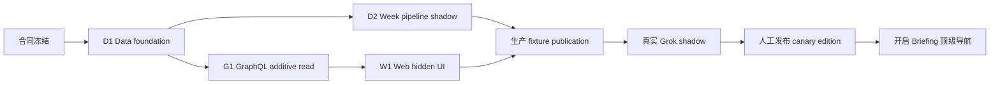

# LetLetMe Briefing → 本周（Week）— 跨仓实施与发布管理方案

- **状态：** Week V1 的工程执行与发布管理权威方案
- **记录日期：** 2026-08-18
- **上位设计：** [LetLetMe Briefing — 全链路架构与落地计划](letletme-briefing-content-architecture.md)
- **相邻菜单：** [新闻 / News](letletme-briefing-news-architecture.md)、[观点 / Views](letletme-briefing-views-architecture.md)、[深度 / Features](letletme-briefing-features-architecture.md)
- **关联仓库：** `letletme_data`、`letletme-graphql`、`letletme-web`
- **范围：** 从 branch/worktree 建立，到合同冻结、Data、GraphQL、Web、编辑后台、CI、合并、部署、灰度、验收、回滚和清理

本文不重新定义 Week 的产品语义、证据标准或 publication 模型；这些以上位设计为准。本文回答的是：

> 三个仓库如何在不污染现有开发现场的前提下，把第一个菜单 Week 从零实施到生产，并让每个阶段都有明确输入、输出、门禁、回滚点和责任人？

## 1. 交付结论

### 1.1 一个功能，三个仓库，五个合并单元

Week V1 不是一个跨仓大分支。每个 Git 仓库保留独立历史，使用隔离 worktree 和独立 PR/合并单元：

| 单元 | 仓库 | 建议分支 | 交付内容 | 是否可先部署但不公开 |
| --- | --- | --- | --- | --- |
| D1 | `letletme_data` | `codex/briefing-content-foundation` | `content` schema、权限、typed mapping、合同 fixture、基础 repository | 是 |
| D2 | `letletme_data` | `codex/briefing-week-pipeline` | 名单、Grok skill/runner、队列、编辑、Week publication、后台 command API | 是，shadow/disabled |
| G1 | `letletme-graphql` | `codex/briefing-week-read` | publication reader、PostgreSQL fallback、`briefingWeek`/`briefingStory` | 是，Web 尚未入口 |
| W1 | `letletme-web` | `codex/briefing-week-web` | 顶级导航、Week/Story 页面、状态、缓存、最小编辑后台 | 是，public flag 关闭 |
| O1 | 运行配置 | 无代码分支 | 来源组、采集、发布和公共入口分级启用 | 可逐级撤回 |

D1 与 D2 分开，是为了先把数据库和跨仓合同作为稳定地基部署，再让真实 Grok、编辑和 publication 运行时进入生产。W1 不再拆第二个“开启导航”代码 PR；公共入口通过显式生产开关启用，避免因为重新合并一份 UI commit 延长上线窗口。

### 1.2 固定的仓库职责

| 仓库 | Week 中唯一承担的职责 | 明确不能承担 |
| --- | --- | --- |
| `letletme_data` | 来源名单、获取、证据、编辑状态、Story、Week edition、PostgreSQL、Redis publication、后台写命令 | 不提供按用户变化的排序；不把 LLM 输出直接发布 |
| `letletme-graphql` | 只读校验一个固定 revision，Redis 失败时读取同一 PostgreSQL compiled payload，映射公共 schema | 不抓 X、不运行 Grok/LLM、不现场拼 Story、不写内容库 |
| `letletme-web` | 顶级入口、公共 Week/Story 展示、公共缓存、安全的编辑后台 server boundary | 不直连 `content` 数据库、不持有 Grok/source credential、不重排 Data placement |

### 1.3 上线顺序不可交换



可以并行写代码，但生产依赖顺序固定为 Data schema/publisher → GraphQL additive contract → Web hidden surface → 真实来源 shadow → 人工 canary publication → 公共导航。

## 2. 开始前：冻结现场而不是切换现有工作目录

### 2.1 三个现有 checkout 都只做基线入口

开始实施前，每个仓库执行以下只读审计并把结果写入 release ledger：

```bash
git fetch origin --prune
git status --short --branch
git rev-parse HEAD
git rev-parse origin/main
git rev-list --left-right --count HEAD...origin/main
git worktree list --porcelain
git branch -vv
```

规则：

1. 不要求已有 checkout 必须切回 `main`，也不自动 stash、clean 或 reset。
2. 现有 dirty/untracked 文件默认属于其他工作；不得用 `git add -A`、`git clean` 或全仓 stash 处理。
3. 新分支一律从刚 fetch 的 `origin/main` 创建，不从当前 checkout 的 HEAD 猜测基线。
4. 如果建议分支名或目标 worktree 已存在，先审计其 HEAD、dirt 和 PR 状态；不得强制复用或覆盖。
5. 如果 `origin/main` 在建立三个 worktree 期间变化，ledger 分别记录每仓真实 base SHA，不伪造“同一个跨仓 SHA”。

### 2.2 固定 worktree 根目录

本功能只使用以下显式路径：

```text
/Users/tong/.codex/worktrees/briefing-week-v1/
  data
  graphql
  web
```

禁止把临时 worktree 放进任何仓库目录内，否则 Web 的构建、打包或文件扫描可能把另一个 checkout 当成产品文件。也禁止用 `/`, `~` 或未解析的环境变量作为清理目标。

### 2.3 第一次建立 worktree

以下命令是执行模板；实际运行前必须确认目标路径和分支都不存在：

```bash
test ! -e /Users/tong/.codex/worktrees/briefing-week-v1/data
test ! -e /Users/tong/.codex/worktrees/briefing-week-v1/graphql
test ! -e /Users/tong/.codex/worktrees/briefing-week-v1/web

git -C /Users/tong/CursorProjects/letletme_data \
  worktree add -b codex/briefing-content-foundation \
  /Users/tong/.codex/worktrees/briefing-week-v1/data origin/main

git -C /Users/tong/CursorProjects/letletme-graphql \
  worktree add -b codex/briefing-week-read \
  /Users/tong/.codex/worktrees/briefing-week-v1/graphql origin/main

git -C /Users/tong/CursorProjects/letletme-web \
  worktree add -b codex/briefing-week-web \
  /Users/tong/.codex/worktrees/briefing-week-v1/web origin/main
```

D1 合并后，Data worktree 才结束第一个分支并进入 D2：

```bash
git -C /Users/tong/.codex/worktrees/briefing-week-v1/data status --porcelain
git -C /Users/tong/.codex/worktrees/briefing-week-v1/data fetch origin --prune
git -C /Users/tong/.codex/worktrees/briefing-week-v1/data switch --detach origin/main
git -C /Users/tong/.codex/worktrees/briefing-week-v1/data branch -d codex/briefing-content-foundation
git -C /Users/tong/.codex/worktrees/briefing-week-v1/data \
  switch -c codex/briefing-week-pipeline origin/main
```

只有 D1 已远程确认 merged、该 worktree 干净、`origin/main` 已包含 D1 时，才允许执行上述转换。若使用 squash merge，不能只凭 ancestry 判断；必须结合 PR merged 状态、tree/patch 对比和 `git cherry`。

### 2.4 Release ledger

项目开始时建立一份只含版本协调信息、不含 secret 的 ledger。它可以放在项目 issue、release task 或专用 `docs/releases/briefing-week-v1.yaml` 中：

```yaml
releaseId: briefing-week-v1
contractVersion: 1
status: contract_frozen
repositories:
  data:
    repository: tonglam/letletme_data
    foundationBase: "<full-sha>"
    foundationHead: null
    pipelineBase: null
    pipelineHead: null
    deployedSha: null
  graphql:
    repository: tonglam/letletme-graphql
    base: "<full-sha>"
    head: null
    pinnedDataSha: null
    deployedSha: null
  web:
    repository: tonglam/letletme-web
    base: "<full-sha>"
    head: null
    deployedSha: null
runtime:
  publicationSchemaVersion: 1
  skillVersion: null
  sourceSnapshotRevision: null
  activeWeekPublicationId: null
  publicEnabled: false
```

每次 merge、deploy、flag change 或 rollback 只追加时间、操作者、旧值和新值。Ledger 是发布协调记录，不是 PostgreSQL/Redis 的运行时 source of truth。

## 3. 分支和提交管理

### 3.1 每个合并单元的提交边界

D1 建议提交顺序：

1. `db: add content schema and runtime roles`
2. `db: map content schema in Drizzle`
3. `test: add Briefing publication contract fixtures`
4. `docs: record content contract and migration notes`

D2 建议提交顺序：

1. `feat(content): add source and policy management`
2. `feat(content): add versioned Grok acquisition skill`
3. `feat(content): add acquisition and processing workers`
4. `feat(content): add Week editorial workflow`
5. `feat(content): publish revisioned Week payloads`
6. `feat(content): add protected content command API`
7. `test(content): cover Week lifecycle and failure modes`

G1 建议提交顺序：

1. `feat(briefing): validate content publications`
2. `feat(briefing): add Week repository and fallback`
3. `feat(briefing): expose Week and Story schema`
4. `test(briefing): add contract and failure coverage`
5. `ci: pin merged Data content contract`

W1 建议提交顺序：

1. `feat(briefing): add public GraphQL operations`
2. `feat(briefing): add Week and Story routes`
3. `feat(briefing): add navigation and cache policy`
4. `feat(briefing): add protected editorial workspace`
5. `test(briefing): cover public and editorial states`

一个 commit 只能承担可描述、可测试的一个层次。禁止把生成物、Grok session、原始帖子、转写、截图、`.next`、coverage 或本地 `.env` 加入提交。

### 3.2 同步主线

每个分支在第一次 push 前和最终 merge 前都执行：

```bash
git fetch origin --prune
git status --porcelain
git rev-list --left-right --count HEAD...origin/main
git merge --no-edit origin/main
```

如果分支只有单人使用且尚未发布，可以 rebase；一旦 PR 或其他执行者已引用其 SHA，使用显式 merge，避免无提示改写历史。任何冲突必须按当前 schema/合同重新验证，不能机械选择 ours/theirs。

### 3.3 Migration 编号

本文不预留固定 migration 文件号。D1 建分支后读取 `migrations/` 当前最大手写序号，再分配下一号；最终 merge 前若 `main` 新增 migration，则先同步主线并改成新的唯一序号。

迁移必须：

- additive、可重复检测、先 schema/relations/indexes，再 grants/views；
- 不删除或改写现有 `fpl`、`reporting`、`ops.dataset_publications` 合同；
- 同步 Drizzle mapping 和 declaration-parity test；
- 给所有 FK 列建立匹配索引；
- 只给 GraphQL reader 暴露 compiled publication 所需 view/table；
- 不给 GraphQL 读取 private body、prompt、run trace 或 cost ledger 的权限。

## 4. 跨仓合同包

### 4.1 谁拥有合同

Data 拥有运行时 publication wire contract；GraphQL 拥有公共 GraphQL schema；Web 是 GraphQL consumer。三者通过显式版本和 fixture 协作，不复制隐含 TypeScript 类型当事实权威。

建议的文件落点：

```text
letletme_data/
  src/content/contracts/week-publication.ts
  tests/fixtures/content/week-publication-v1.fixture.ts
  tests/fixtures/content/week-publication-v1.json

letletme-graphql/
  src/infra/content-publication.ts
  src/domains/briefing/schema.ts
  src/domains/briefing/repository.ts
  src/domains/briefing/service.ts
  src/domains/briefing/resolvers.ts
  tests/fixtures/briefing/week-publication-v1.json

letletme-web/
  lib/graphql/operations/briefing.ts
  lib/briefing/types.ts
  test/fixtures/briefing/week-ready.json
```

GraphQL 的 fixture 必须来自已合并 Data commit，并在 G1 ledger/CI 中记录该 Data SHA 和 fixture SHA-256；不能手写一个“差不多”的消费者 fixture。

### 4.2 Publication envelope

Week payload 至少固定以下版本字段：

```json
{
  "schemaVersion": 1,
  "scopeKind": "SURFACE",
  "scopeKey": "week",
  "revision": 1,
  "publicationId": "00000000-0000-4000-8000-000000000001",
  "state": "READY",
  "locale": "en",
  "publishedAt": "2026-08-18T10:00:00.000Z",
  "sourceCheckedAt": "2026-08-18T09:58:00.000Z",
  "validUntil": "2026-08-21T17:30:00.000Z",
  "event": {
    "seasonCode": "2627",
    "eventId": 1,
    "name": "Gameweek 1",
    "deadlineTime": "2026-08-21T17:30:00.000Z"
  },
  "featured": [],
  "sections": []
}
```

精确规则：

- `schemaVersion` 只在 breaking wire change 时增加。
- `revision` 对一个 scope 单调增加，不能复用。
- `publicationId` 与 PostgreSQL active row 一致。
- `locale` payload 分开存，但同 revision 的 Story ID、Story revision、section 和顺序必须一致。
- `validUntil` 不晚于 target deadline；到期 payload 不能继续作为当前 Week。
- exact-field、byte count 和 SHA-256 任一不符都不能作为 Redis hit。

### 4.3 兼容性矩阵

| Producer / Consumer | GraphQL 未部署 | GraphQL 已部署 | Web 未部署 | Web 已部署但 flag off | Web flag on |
| --- | --- | --- | --- | --- | --- |
| Data schema only | 无用户变化 | 返回 `OFFSEASON/STALE` 或 disabled state | 无变化 | 无变化 | 不允许 |
| Data fixture publication | 无用户变化 | 可内部查询 | 无变化 | 可 hidden smoke | 不允许真实公开 |
| Data real shadow | 无用户变化 | 仅后台/内部验收 | 无变化 | hidden smoke | 不允许自动公开 |
| 人工 active Week | 无用户变化 | 稳定读取 | 无变化 | 可完整验收 | 可启用 |

Data 的更改必须向后兼容已部署 GraphQL；GraphQL 的新增 field 必须对未部署 Web 无影响；Web 不能依赖尚未生产部署的 schema。

## 5. D1：Data foundation

### 5.1 目录落点

在当前 Data 结构内新增独立 `content` feature，而不是把所有文件摊进已有 FPL service：

```text
src/content/
  contracts/
  domain/
  repositories/
  services/
  publication/
  acquisition/
  editorial/
  api/
src/db/schemas/content.schema.ts
tests/unit/content/
tests/integration/content/
tests/fixtures/content/
```

顶层 `src/index.ts` 只注册窄 API/plugin；现有 `src/worker.ts` 不加载 Grok worker。D1 不需要真实 Grok 运行，也不应在 import 时启动 content job。

### 5.2 Migration 分层

D1 一次引入完整关系模型，但按以下顺序执行，避免 circular FK 和 grant 漏洞：

1. `content` schema、枚举/约束和 runtime roles。
2. 来源与策略表：sources、aliases、groups、members、policies、checkpoints、budgets。
3. acquisition/evidence 表：runs、partitions、source items、X extensions、bodies、relations、cost ledger。
4. editorial 表：candidate clusters、stories、claims、sources、versions、entities、changes。
5. editions/publications/payloads/dependencies/outbox。
6. unique/partial indexes、FK indexes 和 active-scope constraint。
7. GraphQL 只读 compiled publication view 和最小 grants。
8. Data runtime role grants、migration status 和 typed declaration parity。

关键唯一约束：

- `(source_id, external_id)` 唯一；X post ID 使用 text。
- `(group_id, partition_key, mode, window_start, window_end)` 唯一 run scope。
- `(version_group_id, locale)` 唯一 Story localization。
- `(edition_id, story_id)` 唯一。
- `(publication_id, locale)` 唯一 payload。
- 每个 Story/surface scope 最多一个 active publication；Week active surface 全站唯一。
- 旧 slug alias 永远不能重新分配。

### 5.3 D1 repository 和合同测试

D1 只实现能证明 schema 正确的最小读写：

- source/policy CRUD repository；
- acquisition run + receipt 幂等写入；
- Story/version/edition fixture builder；
- publication staging/activation repository；
- compiled payload fixture 和 checksum verifier；
- GraphQL reader role contract test。

D1 不实现真实 scheduler、Grok subprocess、LLM compose 或公共 Web。

### 5.4 D1 完成门禁

- migration 在空 PG15 和已迁移数据库各执行两次；
- Drizzle declaration 与 SQL schema 一致；
- GraphQL reader 能读取 active compiled view，但读取 private body/run/cost 表被拒绝；
- 两 locale Story 集合或顺序不一致时 activation 失败；
- 同 scope 并发 activation 只能成功一个；
- migration 不改变现有 FPL publication union；
- `bun run typecheck`、`bun run lint`、`bun test` 和目标 integration tests 通过。

## 6. D2：Week pipeline

### 6.1 来源和 policy 管理

V1 从少量名单开始，名单只存 PostgreSQL。D2 提供：

- source、stable platform ID、handle alias、source type 和 reporting family；
- source group、poll policy、deadline phase 和 call budget；
- rights/acquisition/display/retention policy version；
- `ACTIVE/PAUSED/DISABLED` 和 emergency disable；
- suggested source inbox，但绝不自动激活未知账号；
- 每次 run 使用不可变 source snapshot revision。

开发 fixture 至少覆盖官方俱乐部、跟队记者、lineup source 和 FPL KOL 四种来源；真实生产名单不进入 Git。

### 6.2 Skill 和 Grok runner

Skill 随 Data 版本化：

```text
.grok/skills/monitor-fpl-x-sources/
  SKILL.md
  references/input-schema.json
  references/output-schema.json
  references/query-patterns.md
  references/failure-modes.md
  references/content-taxonomy.yaml
  examples/
```

运行时规则：

- `GrokRunner` 是窄 interface；fixture adapter 与 CLI adapter 共用同一 validator。
- CLI 使用参数数组和 `shell:false`，禁止拼接 shell 命令。
- 每个 run 有受限目录、输入 JSON、session ID、timeout 和清理策略。
- `poll` 必须验证真实 `x_keyword_search` trace；只有合法最终 JSON 不算成功。
- Grok 初始全局 concurrency 为 1，普通 poll 默认最多两次 X call。
- X post ID 从输入到数据库全部保持 string。
- session、prompt、trace 和原文不得进入日志或公开 payload。
- skill SHA、Grok adapter version、schema version 写入 acquisition run。

### 6.3 独立进程和队列

新增入口和服务：

```text
src/content-worker.ts
src/content/workers/content-x.worker.ts
src/content/workers/content-processing.worker.ts
src/content/workers/content-publication.worker.ts
```

队列：

```text
content-x-scan
content-processing
content-media
content-publication
```

`content-x-worker` 必须是独立 Docker Compose service、独立 heartbeat/healthcheck 和独立 graceful shutdown。不能把 Grok job 放进现有 `src/worker.ts`，否则慢 session 会影响 FPL、Live、Tournament 和 Understat 队列。

Scheduler 先计算 target event 和 deadline phase，再以确定性 job ID enqueue。Checkpoint 只有在 receipt 与 run audit 同一事务成功后推进；`FAILED` 不推进，`PARTIAL` 只推进完整 partition。

### 6.4 Evidence → Editorial

状态流：

```text
receipt
  → candidate cluster
  → deterministic material gate
  → optional enrich
  → editor accepts/rejects/merges/splits
  → bilingual Story draft
  → evidence/rights/entity validation
  → READY
  → Story publication
  → Week edition publication
```

不可跳过的门禁：

- Story 至少一个可服务 evidence item；
- 同 reporting family 的转载不算独立 corroboration；
- LLM entity hint 未经审核不能进入公共 relation；
- `compose` 只能引用传入 receipt/claim ID，不能新增事实；
- 两 locale 必须同 Story 集合与顺序；
- 具名 KOL 推荐必须归属于 KOL，不能改写成 LetLetMe 推荐；
- lineup rumor、伤停和本周模板都必须有 expiry；
- 任何 public publish 都需人工 publisher。

### 6.5 Week publication

发布器按固定顺序执行：

1. 发布每个 READY Story 的双语 immutable revision。
2. 创建 target event 对应 Week edition，保存 section/placement/order。
3. 编译 `en` 和 `zh-CN` payload，验证 rights projection、集合、顺序、bytes 和 checksum。
4. stage Redis immutable payload 并读回验证。
5. PostgreSQL 短事务激活 publication、retire 旧 revision、写 outbox。
6. Redis Lua/CAS 切 active pointer；失败由 publication worker repair。
7. deadline 后立即使旧 event Week pointer 不可作为当前 target 命中。

Redis namespace：

```text
llm:content:briefing:week:active
llm:content:briefing:week:<revision>:en
llm:content:briefing:week:<revision>:zh-CN
llm:content:briefing:story:<story-id>:active
llm:content:briefing:story:<story-id>:<revision>:en
llm:content:briefing:story:<story-id>:<revision>:zh-CN
```

PostgreSQL activation 成功即为 durable publish；Redis 是可重建加速层。Redis repair 只能由 Data 写入者执行，GraphQL 不自修缓存。

### 6.6 后台 command API

新增 `src/content/api/` 路由，至少覆盖 source、policy、scan、candidate、Story、edition、publish、correction、removal、rollback 和 repair。

安全边界：

- 浏览器永不直接请求 Data API。
- Web server 先完成 Better Auth 和 `content_editor/content_publisher` 授权。
- Web → Data 使用独立 service secret；operator ID、role、timestamp、nonce、reason 和 idempotency key 被签名并写审计。
- Data 不信任浏览器提交的 actor/role。
- publish、rollback、removal 和 emergency disable 必须要求 reason。
- 同一 idempotency key 的重试返回原 command 结果，不重复发布。

### 6.7 D2 完成门禁

- fixture poll 的 `WITH_ITEMS/EMPTY/PARTIAL/FAILED` 全覆盖；
- 无真实 X tool trace 的“成功空结果”被拒绝；
- overlap 重跑不产生重复 receipt；
- saturation 不会推进完整 checkpoint；
- Grok timeout 不阻塞其他 worker；
- Story 无 evidence、rights 不允许或 locale 不完整均不能 publish；
- Redis stage/CAS/repair/rollback 和 PostgreSQL fallback fixture 可重复验证；
- correction/removal 生成新 revision 并使旧正文不可服务；
- content master switch 关闭时不创建新真实 Grok session。

## 7. G1：GraphQL additive read

### 7.1 目录落点

```text
src/domains/briefing/
  schema.ts
  repository.ts
  service.ts
  resolvers.ts
  types.ts
src/infra/content-publication.ts
tests/domains/briefing/
tests/infra/content-publication.test.ts
```

`src/graphql/schema.ts` 只注册新的 typeDefs/resolvers。不要把 Briefing 加进现有 `DataPublicationDataset = fpl:core | fpl:live | fpl:market` union；它使用独立 `llm:content` reader。

### 7.2 Reader 算法

每次 query：

1. 读取 `week:active` pointer 并 exact-field validate。
2. 校验 schema version、scope、target event、`validUntil` 和 locale manifest。
3. 读取该 pointer 固定的 immutable payload。
4. 校验 byte count、SHA-256、publication ID 和 revision。
5. 成功后将该 revision pin 到本次 resolver request。
6. 任一 Redis 校验失败，从 PostgreSQL 读取同一 active compiled publication。
7. PostgreSQL 也失败时返回 `UNAVAILABLE`，不能从 raw editorial 表临时拼页面。

Slug alias 只返回 canonical redirect metadata；Story detail 读取 `STORY:<id>` active revision。Removal 返回 tombstone，不回退旧正文。

### 7.3 公共 schema

V1 只暴露：

```graphql
query BriefingWeek($locale: BriefingLocale!) {
  briefingWeek(locale: $locale) {
    state
    revision
    publicationId
    publishedAt
    sourceCheckedAt
    staleAt
    event {
      seasonCode
      eventId
      name
      deadlineTime
    }
    featured { id slug storyRevision title summary }
    sections {
      key
      items { id slug storyRevision title summary }
    }
  }
}

query BriefingStory($slug: String!, $locale: BriefingLocale!) {
  briefingStory(slug: $slug, locale: $locale) {
    state
    canonicalSlug
    story { id slug storyRevision title summary }
  }
}
```

实际 card/detail 字段以上位设计为准。公共 schema 不包含 raw body、private transcript、prompt、source tier、内部 reliability score、run trace、cost 或后台状态。

### 7.4 GraphQL CI pin

GraphQL CI 当前会 checkout 一个固定 Data commit 来建立真实数据库合同。G1 最终 merge 前必须把该 `ref` 更新到已合并并部署 D1 的完整 SHA，并在 CI 中：

- 应用 Data migration 两次；
- 创建 disposable GraphQL read-only login；
- 证明 reader 只能访问 compiled content view；
- 安装 Data 产生的 canonical Week fixture；
- 验证 Redis hit、Redis corruption → PostgreSQL fallback、双失败 → `UNAVAILABLE`。

不要把 Data feature branch SHA 当长期 CI pin。D1 必须先合并到 Data `main`，G1 才能进入最终 merge。

### 7.5 G1 完成门禁

- `READY/EMPTY/STALE/OFFSEASON/UNAVAILABLE` 各有 resolver test；
- target event 不匹配时不返回旧 Story；
- 一次 query 不混合 revision；
- `en`/`zh-CN` 同 revision 集合和顺序一致；
- malformed pointer、未知 schema version、checksum/bytes mismatch 均 fail closed；
- session、cookie 和 user context 不改变 public result；
- query cost、root-field policy、rate limit 和 service-token smoke 覆盖新 operation；
- `bun run lint`、`bun test`、`bun run format:check`、`bun run contract:check` 通过。

## 8. W1：Web public surface 和编辑后台

### 8.1 公共文件落点

```text
app/[locale]/briefing/page.tsx
app/[locale]/briefing/week/page.tsx
app/[locale]/briefing/story/[slug]/page.tsx
app/[locale]/briefing/loading.tsx
app/[locale]/briefing/error.tsx
components/briefing/
lib/graphql/operations/briefing.ts
lib/briefing/
test/briefing-*.test.ts
e2e/briefing-week.spec.ts
```

`/<locale>/briefing` 永久/框架 redirect 到 `/<locale>/briefing/week`。Story alias 在渲染正文前 redirect 到保留 locale 的 canonical slug。

### 8.2 顶级导航

`components/layout/config.ts` 的公共顺序改成：

```text
Live → Briefing → My FPL → Competitions → Explore
```

同时更新 Desktop、Mobile、Footer 共用 config 的类型和两个 locale message catalog。导航项必须受 server-owned `BRIEFING_PUBLIC_ENABLED` 控制；flag off 时不显示入口，直接访问 route 返回可解释的 unavailable/not-found policy，而不是半成品页面。

### 8.3 页面布局

Desktop 采用一个 lead、主列和有限 rail；mobile 保持单列，但绝不改变 Data 的 section/placement/order。页面重点显示：

- 当前 Gameweek、deadline 和最近检查/发布时间；
- featured Story；
- `AVAILABILITY_AND_PRESSERS`、`LINEUP_WATCH`、`EXPERT_VIEWS`、`WORTH_READING_LISTENING`；
- 来源身份、原链接、来源时间、provenance、expiry 和 correction/removal；
- `READY/EMPTY/STALE/OFFSEASON/UNAVAILABLE` 的独立状态。

UI 不出现 LetLetMe 的买入、卖出、队长或“最佳阵容”结论。展示 KOL 模板时，姓名和适用 Gameweek 必须与观点同屏。

### 8.4 公共缓存

新增明确的 cache tag 和 operation allowlist：

```text
BriefingWeek
BriefingStory
```

规则：

- RSC 使用 `executePublicServerQuery`，不加载 session。
- Web proxy 只有无 Authorization、无 session、operation 在 allowlist 且 GraphQL envelope 无 error 时才可 public cache。
- Week 初始 `s-maxage` 约 30 秒；deadline 临近时 route/RSC revalidate clamp，不能跨 `validUntil`。
- Story detail 可按 revision 使用更长的短期 SWR，但 correction/removal 必须触发 tag invalidation 或 revision miss。
- `STALE/OFFSEASON/UNAVAILABLE` 不得被缓存成 `EMPTY`。
- browser memory cache 如果加入 Briefing，也必须把 locale、slug/revision 纳入 key，并服从 removal；V1 可先不加入。

### 8.5 编辑后台

```text
app/[locale]/admin/briefing/
  sources/
  inbox/
  stories/[id]/
  week/
  operations/
app/api/admin/briefing/
```

后台只在 server route 调 Data command API。至少提供：

- source/group/policy 查看与启停；
- acquisition run/coverage/gap/cost 查看；
- candidate accept/reject/merge/split/enrich；
- Story 双语编辑、evidence/rights/entity 检查；
- Week section/placement/order 和两个 locale preview；
- publish/correction/removal/rollback/repair；
- active revision、outbox 和 Redis/PG consistency 状态。

Publish UI 必须显示 target event、deadline、Story revision、rights warning、两 locale completeness 和将被替换的 active publication。使用产品内确认流程，不使用浏览器原生 confirm。

### 8.6 W1 完成门禁

- Briefing 在 flag on 时固定为顶级第二项，Desktop/Mobile/Footer 一致；
- flag off 时无入口和搜索引擎可发现的半成品页面；
- 登录与匿名用户拿到相同 revision/order；
- en/zh-CN route、canonical/alias redirect 和外链安全通过；
- 五种 public state 视觉和语义不同；
- correction/removal 不继续显示旧正文；
- public GraphQL allowlist 不意外缓存任何私有 operation；
- admin 未登录、普通用户、editor、publisher 权限矩阵通过；
- `npm run lint`、`npm test`、`npx tsc --noEmit`、`npm run build` 和目标 Playwright 通过。

## 9. 本地和集成环境

### 9.1 两种模式

| 模式 | Data acquisition | 成本 | 用途 |
| --- | --- | ---: | --- |
| deterministic | fixture `GrokRunner` + 固定 trace | 0 | CI、单测、全链路回归、失败注入 |
| attended real | 真实 Grok CLI + 测试 source group + 严格 call cap | 有 | 人工验证 X 搜索、trace、窗口和 quota |

CI 永远不调用真实 Grok/X。真实模式只能手动启用，默认 concurrency 1，并将测试 source group、窗口、call budget 和 operator 写入 run audit。

### 9.2 本地启动顺序

1. 用 Data D1 migration 建立 disposable PostgreSQL。
2. 启动独立 Redis database/namespace，禁止连接生产写端。
3. 启动 Data API、现有 worker 和 content worker（fixture mode）。
4. seed 当前 season/event 和 canonical Week fixture。
5. 启动 GraphQL，使用 read-only database login 和 Redis reader。
6. 启动 Web，`BRIEFING_PUBLIC_ENABLED=true`、admin flag 仅本地启用。
7. 跑 en/zh-CN 公共页面和 editor → publish → correction E2E。

所有端口、database URL 和 Redis DB 必须在 ledger 的本地 section 明确记录；测试 teardown 只删除本次创建的容器/数据库/keys。

### 9.3 跨仓 fixture 流程

```text
Data fixture input + Grok trace
  → Data receipts/candidate/Story/edition
  → Data canonical publication JSON + checksum
  → GraphQL reader fixture
  → GraphQL response snapshot
  → Web route/E2E fixture
```

消费者 fixture 必须由上一层产物生成并记录 SHA，不允许三仓各自发明同名但不同 shape 的 fixture。

## 10. CI、PR 和合并顺序

### 10.1 PR 依赖

```text
D1 merged + deployed
  ├─→ D2 final CI/merge
  └─→ G1 pin Data SHA + final CI/merge/deploy
          └─→ W1 final CI/merge/deploy hidden
D2 deployed shadow + W1 hidden
  └─→ O1 canary and public enable
```

### 10.2 每个仓库的最低 CI

Data：

```bash
bun install --frozen-lockfile
bun run typecheck
bun run lint
bun test
bun run db:migrate
bun run db:migrate
bun run db:migrate:status
bun run test:publication:integration
git diff --check
```

GraphQL：

```bash
bun install --frozen-lockfile
bun run lint
bun run format:check
bun test
bun run contract:check
bun run redis:check
git diff --check
```

Web：

```bash
npm ci
npm run lint
npm test
npx tsc --noEmit
npm run build
npm run test:e2e -- --grep Briefing
npm audit --audit-level=moderate
git diff --check
```

如果完整 integration/E2E 需要生产形状 secret，只能使用 CI secret 或明确的测试值；不能因为本地缺 secret 把检查从最终 gate 删除。

### 10.3 Merge 规则

实施代码使用各仓现有 PR/CI 流程；本次文档分支的明确免 review 不自动扩展到未来 D1/D2/G1/W1 代码。

每次 merge 前记录：

```text
repository
PR
base SHA
head SHA
contract/schema version
required checks
unresolved threads
merge method
merge SHA
```

不要同时 merge D2、G1、W1 后再一起排错。每个 merge 后确认远端 `main`、部署 SHA 和最小 smoke，再放行下游。

## 11. 生产部署和灰度

### 11.1 D1 部署

1. 记录数据库备份/恢复点、当前 migration status 和 Data image SHA。
2. 使用 migration runtime credential 执行 login contract 和 additive migration。
3. 验证 relation/index/grant/declaration parity。
4. 验证 GraphQL production reader 只能读取 compiled view。
5. 部署 Data API image，但所有 content runtime flag 保持 off。
6. 验证现有 FPL/Data jobs、`/health`、`/ready`、Redis 和队列没有回归。

D1 rollback 以回退应用为主；additive schema 保留，不在事故中执行破坏性 down migration。

### 11.2 D2 shadow 部署

建议 master flags：

```text
CONTENT_PIPELINE_ENABLED=false
CONTENT_REAL_GROK_ENABLED=false
CONTENT_PUBLICATION_ENABLED=false
```

启用顺序：

1. 启动 content worker，所有 queue paused，确认 heartbeat/资源占用。
2. 开 fixture pipeline，发布测试 scope 或 non-public revision。
3. 开真实 Grok shadow，只允许测试 source group，禁止自动 create READY/publication。
4. 观察 7–14 天 quota、coverage、timeout、candidate adoption 和编辑负担。
5. 启用人工 Story/Week publication，仍不开放 Web 导航。

### 11.3 G1 部署

- 确认 image SHA、Data contract pin 和 production database grant。
- `/health` 包含 Redis/PG readiness，但 content 没数据不能让整个 GraphQL health 失败。
- 使用 service-token/internal ingress 查询 `BriefingWeek` 的五种状态。
- 删除/破坏测试 Redis payload，证明同 revision PostgreSQL fallback。
- 恢复/repair Redis，并验证 GraphQL 没有写缓存。

### 11.4 W1 hidden 部署

- Vercel/目标 Web deployment 必须对应 W1 merge SHA。
- `BRIEFING_PUBLIC_ENABLED=false`，public navigation 不出现。
- admin flag 只对明确的 editor/publisher 开启。
- 直接 hidden smoke 覆盖 Week、Story、alias、两个 locale、五种状态和 source links。
- 浏览器 Network 不得访问 Data API、Grok、private transcript 或未知 mock endpoint。

### 11.5 O1 公共启用

满足以下条件后才打开公共 flag：

- 当前 target event 和 deadline 正确；
- 一个真实、人工审核的 Week edition 已 active；
- `en`/`zh-CN` Story 集合、顺序和 revision 一致；
- Redis/PG checksum 一致，fallback 已验证；
- GraphQL p95、error rate 和 fallback rate 正常；
- Web 两 locale、Desktop/Mobile/Footer、Story detail 已验收；
- editor/publisher 当班，correction/removal runbook 可执行；
- 本轮来源和 rights policy 已签核；
- deadline 附近的采集 cadence 有明确值守，不因无人审核浪费额度。

先对运营/内部环境启用，再公开。V1 不按用户做 cohort；公共 flag 一旦打开，所有用户看到同一 active revision。

## 12. 可观测性、SLO 和日常运营

### 12.1 核心指标

| 层 | 指标 | 初始告警条件 |
| --- | --- | --- |
| Acquisition | run success/partial/fail、partition coverage、saturation、Grok duration/calls | 必要 source group 连续两个窗口无完整 coverage |
| Cost | Grok session/call、ASR minute、LLM job、candidate adoption | 达 daily/monthly cap 或采用率持续过低 |
| Editorial | inbox age、READY backlog、publish/correction latency | APPROACHING/FINAL_90 超人工 SLA |
| Publication | compile/activate/CAS/repair、active revision、checksum | PG active 与 Redis pointer 不一致 |
| Target | season/event/deadline、pointer validUntil | event mismatch 或旧 pointer 跨 deadline |
| GraphQL | state、Redis hit/fallback/corruption、p50/p95/error | fallback 激增、`UNAVAILABLE` 或 mixed revision |
| Web | cache age、route status、Story depth、source outbound | 旧正文残留、5xx、locale 集合不一致 |

初始 publish SLO：编辑点击 publish 后 60 秒内，PostgreSQL active、Redis pointer、GraphQL 和两个 locale Web 都能看到同一 revision。它是人工完成审核后的技术 SLO，不承诺 X 发帖到公开页面全自动 60 秒。

### 12.2 运营节奏

- 每日：失败来源、handle drift、checkpoint lag、budget/circuit breaker。
- 每轮：target event、source groups、deadline phase、edition completeness、publisher 值守。
- 每周：suggested sources、低采用来源、reporting family、误报/更正。
- 每月：rights policy、retention、Grok/ASR/LLM 成本和来源价值。
- 每次 deadline：确认旧 Week 不再作为新 event active，保留 Story canonical history。

## 13. 故障和回滚矩阵

| 故障 | 第一动作 | 对用户状态 | 恢复 |
| --- | --- | --- | --- |
| Grok quota/timeout | 关闭真实 acquisition 或降 cadence，保留 checkpoint | 现有有效 edition 继续；过 freshness 后 `STALE` | 有界补扫，不逐个追跑旧 cron |
| X coverage partial | 不推进未覆盖 partition | `STALE` 或已有仍有效 revision | 缩小 partition/补扫 |
| LLM/compose 失败 | 保留 receipt/candidate，禁止 READY | 不影响已发布内容 | 人工编辑或重试同输入版本 |
| Redis pointer/payload 损坏 | GraphQL 同 revision PG fallback；Data repair | 正常或短暂 degraded | 重建 immutable payload/CAS pointer |
| PostgreSQL compiled read 失败 | 停止新 publish | `UNAVAILABLE` | 修复 DB；不得拼 raw tables |
| 错误 Story | publisher correction/removal | 新 correction/tombstone revision | 重编译所有依赖 surface并清缓存 |
| Rights revoke/source delete | emergency disable + fail closed | 受影响 scope 暂时 `UNAVAILABLE` 或 tombstone | 安全 projection 后重新发布 |
| Deadline event mismatch | 立即禁用 Week pointer/public flag | `STALE`，不展示旧 event Story | 发布新 target edition |
| GraphQL regression | 关闭 Web public flag，回滚 GraphQL image | Briefing 不可见/`UNAVAILABLE` | 保留 additive Data schema |
| Web regression | 关闭 public flag或回滚 deployment | 导航撤回，不影响 Data/GraphQL | 修复后 hidden smoke |

回滚记录必须包含 reason、operator、各仓部署 SHA、publication ID/revision、source snapshot、flag old/new、smoke 结果和观察窗口。Rights revoke 后禁止为了“恢复页面”回滚到含不再允许正文的旧 revision。

## 14. 完整验收矩阵

### 14.1 数据生命周期

```text
source policy
→ versioned source snapshot
→ exact-window fixture/real poll
→ trace-verified receipt
→ deduplicated candidate
→ reviewed bilingual Story
→ Story publication
→ target Week edition
→ PostgreSQL active publication
→ Redis immutable payload + pointer
→ GraphQL pinned read/fallback
→ Web en/zh-CN render
→ correction/removal
→ dependency recompile and cache invalidation
```

每个箭头至少有一个成功 case 和一个失败/重试 case。不能只验最终页面。

### 14.2 Deadline 状态矩阵

| 条件 | GraphQL | Web |
| --- | --- | --- |
| 当前 target 有合格 edition | `READY` | 完整 Week |
| 当前 target 已完整检查但无内容 | `EMPTY` | 明确“已检查，暂无合格内容” |
| 新 target 尚未发布 | `STALE` | 显示正在更新，不带旧 event Story |
| 赛季无未来 deadline | `OFFSEASON` | 休赛期说明 |
| Redis/PG 均不可读 | `UNAVAILABLE` | 服务不可用与重试，不伪装 empty |

至少在 deadline 前后使用可控 clock 跑一次 target switch E2E。

### 14.3 用户一致性

同一个 active revision 下验证：

- 匿名、登录用户 A、登录用户 B 的 Story ID 和顺序一致；
- `en`/`zh-CN` 文案可不同，但 Story/section/order 一致；
- Desktop/Mobile 仅布局变化，不重新排名；
- CDN warm/cold、Redis hit/PG fallback 返回同 revision；
- Web 不写个人已读、follow、mute 或订阅状态。

### 14.4 安全和权利

- private credential、prompt、trace、body/transcript 不出现在 GraphQL、HTML、JS、日志或 analytics；
- paywall 未授权来源只显示允许 metadata/link；
- source link 使用安全外链属性和 canonical URL；
- admin command 需要 server auth、role、signed actor 和 idempotency；
- 普通用户无法调用 source/publish/repair；
- source emergency disable 能阻止新获取和受影响公开 projection。

## 15. 角色和责任

| 角色 | 决策/操作 | 不应代替 |
| --- | --- | --- |
| Product owner | Week 边界、公开入口、成功指标 | source-specific rights 审核 |
| Source owner | 名单、身份、group、reporting family、采用率 | publisher 的事实审核 |
| Rights owner | acquisition/storage/display/retention policy | 工程推断法律许可 |
| Editor | candidate、Story 文案、归因、expiry | 发布权限 |
| Publisher | publish/correction/removal/rollback | LLM 自动批准 |
| Data owner | schema、worker、publication、Data API | Web 排版 |
| GraphQL owner | read contract、fallback、public exposure | 内容抓取/编辑 |
| Web owner | navigation、页面、admin boundary、cache | 直接数据库写入 |
| On-call | 故障开关、回滚、审计和恢复 | 未授权内容决策 |

V1 至少明确一个 source owner、一个 editor 和一个 publisher；可以是同一个人兼任，但 audit 中角色动作必须区分。

## 16. 阻塞项与默认执行值

| 项目 | 默认执行值 | 阻塞范围 |
| --- | --- | --- |
| 首批来源名单 | 少量官方、跟队、lineup、FPL KOL，人工核验 | 只阻塞真实 acquisition |
| Publish owner | V1 全部人工 publish | 阻塞任何 public edition |
| Grok runtime | 现有订阅/CLI，concurrency 1，固定 skill SHA | 阻塞真实 shadow，不阻塞 fixture 开发 |
| Deadline 切换 | deadline 到达立即切下一 event | 已视为 Week V1 默认合同 |
| FINAL_90 | 只有 publisher/editor 值守时开启 | 不阻塞普通 cadence |
| Paywall/private access | 默认 `LINK_ONLY/METADATA` | 只阻塞该来源 richer summary |
| Transcription | Week V1 metadata-first，不自动批量转写 | 不阻塞 X 主链路 |
| 用户通知 | 只写 publication outbox，不投递 | 不阻塞 Week |

如果没有新的产品决定，工程按这些默认值推进；只有真实来源上线、公开 publish 和 source-specific rights 仍需要具名 owner 确认。

## 17. Definition of Done

Week V1 只有同时满足以下条件才算完成：

- 三仓 main 均包含对应已验证 merge SHA，ledger 已更新；
- Data additive migration 已生产执行，runtime grants 最小化；
- fixture 和真实 Grok shadow 均验证，成本/coverage 有实测数据；
- 当前 target 的人工 Week publication 在 PostgreSQL/Redis 一致；
- GraphQL Redis hit、PG fallback 和 fail-closed 均生产 smoke；
- Web 顶级第二导航、Week、Story、两个 locale、Desktop/Mobile 均真实浏览器验收；
- 匿名/登录用户看到相同 Story 集合和顺序；
- deadline 切换、correction、removal、rights revoke 和 rollback 至少演练一次；
- alerts、owner、runbook 和 flags 已交接；
- 没有 source credential、private body、session trace 或构建产物进入 Git；
- 未把 LetLetMe 变成主动选人推荐者，也未引入个人订阅/已读状态。

## 18. 合并后的 branch/worktree 清理

每个合并单元完成后先确认远端 PR/merge、部署 SHA、worktree dirt 和 ledger，再清理该单元资源。不得因为 Week 完成而删除其他功能的 branch/worktree。

```bash
git -C <repository> fetch origin --prune
git -C <worktree> status --short --branch
git -C <repository> worktree list --porcelain
git -C <repository> branch -vv
```

只有目标 worktree 干净且分支已确认 merged 才执行：

```bash
git -C <repository> worktree remove <exact-worktree-path>
git -C <repository> branch -d <exact-local-branch>
git -C <repository> worktree prune
```

远端 feature branch 是否删除单独确认；不要把删除本地资源扩大成删除远端历史。最后三个主 checkout 分别 `git fetch origin --prune`，在不覆盖现有 dirty work 的前提下确认 `main` 能 fast-forward 到 `origin/main`。

最终 release ledger 记录：

```text
Data main/deployed SHA
GraphQL main/deployed SHA
Web main/deployed SHA
content migration version
publication schema version
skill SHA
source snapshot revision
active Week publication ID/revision
public flag state
production smoke timestamp
rollback target
remaining branches/worktrees and their owners
```

这份记录结束的是 Week V1 release，不删除共享的 `content` foundation。News、Views、Features 后续直接复用 canonical Source/Evidence/Story/Publication 基础设施，各自只增加菜单专属 typed extension、GraphQL projection 和 Web surface。
