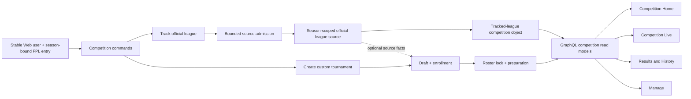
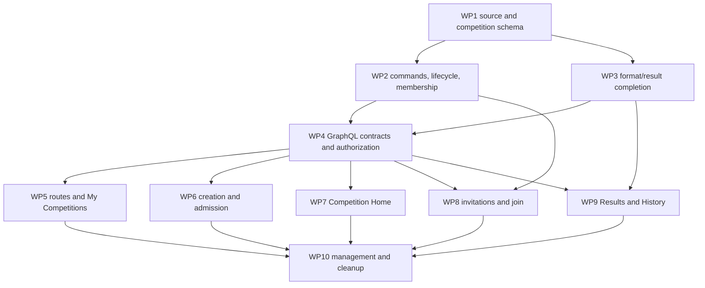

# LetLetMe Competitions Section — High-Level Implementation Plan

- **Status:** Proposed engineering plan, ready for technical review
- **Recorded:** 10 August 2026
- **Scope:** Web-owned account identity → `letletme_data` → `letletme-graphql` → `letletme-web`
- **Product inputs:** [LetLetMe Product Conclusions](letletme-product-conclusions.md) and [LetLetMe Four-Section Product Specification](letletme-four-section-specification.md)
- **Shared implementation contract:** [LetLetMe Cross-Section — High-Level Implementation Plan](letletme-cross-section-implementation-plan.md)

## 1. Scope

This document does not redefine the Competitions product. It translates the approved Section 3 decisions into cross-repository implementation work.

The cross-section plan governs shared identity references, season context, metadata families, principal verification, canonical links, compatibility, and delivery gates. This plan is authoritative for official-source and Competition persistence, admission, membership, lifecycle, result format, and management.

The fixed inputs are:

- The public category is **Competitions**; one object is a **competition**.
- A competition has one explicit persisted kind: `tracked_official_league` or `custom_tournament`.
- Every competition and official source is scoped to one FPL season.
- A tracked official league follows its official roster between gameweeks, freezes the gameweek cohort during active play, and uses official standings and finalized results.
- A fixed snapshot or selected subset from an official league is a custom tournament, not a tracked official league.
- A tracked official league is admitted only when its initial official roster contains at most 500 entries. Once admitted, it remains maintained through that season even if it later grows.
- A custom tournament roster contains at most 500 selected entries throughout its supported lifecycle.
- A source league above 500 may seed a custom tournament only through bounded entry selection; the system must not crawl the complete source to build the selection UI.
- Official source evidence is shared by season, league type, and league ID. Distinct competition objects are not deduplicated.
- Custom tournaments have a draft/enrollment period, a roster lock, preparation, active play, a finalized result, and an archived state.
- Structural custom rules and membership are editable before roster lock and immutable after lock for the initial implementation.
- Custom tournaments support invitations and self-joining; tracked leagues derive membership from official FPL and do not use invitations.
- The organizer is owned by a stable LetLetMe user identity. Competitive participation remains tied to a season-specific FPL entry.
- Competition names are display metadata and are not globally unique.
- `My Competitions` is a private participant/organizer list, not a public directory.
- Competition Home is the canonical object page; Live remains the detailed current-result surface and Results/History owns the settled shared record.
- A format is publicly supported only when creation, explanation, setup, Live, settlement, history, and management work end to end.
- Existing-format completion and participant activation take priority over adding formats.
- Archive is the normal removal action after results exist. Ordinary organizer hard deletion is restricted to competitions without published results.

## 2. Current implementation baseline

### Web

| Area | Current implementation |
| --- | --- |
| Navigation | `components/layout/config.ts` exposes a singular Tournament category with New Tournament and Browse Tournaments; Live and My FPL also use Tournament wording |
| Membership list | `/tournament/browse` loads every tournament for the bound entry, then provides useful client-side search, Classic/H2H and status filters, organizer filtering, sorting, progressive rows, and Live/Manage actions |
| Creation | `/tournament/create` offers a recommended copied-Classic path and a custom builder; both fetch the complete official source roster before submission |
| Create model | `creationMode`, `participantSource`, league type, roster mode, and format fields overlap; they do not express one durable competition kind |
| Custom formats | The form exposes points groups plus single- or double-elimination configuration and validates schedules and power-of-two brackets |
| Canonical object | `/tournament/[id]` redirects directly to `/live/tournaments/[id]`; no permanent non-Live Competition Home exists |
| Live | The current detail contains identity, roster, rules, setup, recovery, management links, comparison, filters, and a generic live-points table |
| Settled results | Rich shared points-race and field analysis currently lives inside `/me/tournament`, mixed with viewer-specific summaries |
| Invitations | No invitation, join, claim, enrollment, or roster-lock route exists |
| Management | The organizer can rename, pause/resume, retry setup, retry or enable official roster sync, and permanently delete after exact-name confirmation |
| Identity | Management authority is based on the current bound `adminEntryId`; the stable signed-in Web user ID is not persisted on the competition |

### GraphQL

| Area | Current implementation |
| --- | --- |
| Metadata | `TournamentInfo` exposes league, format, roster mode, lifecycle, and setup fields but no competition kind, season, stable owner, visibility, roster-lock, or archival fields |
| List | `entryTournaments` returns full metadata for every object; a slimmer Web selection exists but still uses the same general query |
| Access | Full metadata, participants, Live, and result queries are membership-gated; management is gated by `adminEntryId` |
| Results | Points-race event results, season snapshots, selection stats, battle-group results, and viewer H2H results are readable through separate queries |
| Knockout | GraphQL exposes knockout metadata but no complete bracket/result read model for the Web journey |
| Source association | Official leagues are enriched through a singular `tournamentId`, although one source may be associated with several competition objects |
| Vocabulary | The public contract uses Tournament names throughout and provides no format capability/readiness contract |

### Data

| Area | Current implementation |
| --- | --- |
| Competition row | `tournament_infos` stores name, creator text, `admin_entry_id`, league identity, roster mode, format, state, and setup progress; it has no season or competition kind |
| Name identity | `unique_tournament_name` makes display names globally unique |
| Roster | `tournament_entries` stores the selected entries for each tournament; `official_sync` can reconcile an eligible Classic roster between gameweeks |
| Creation limit | Create input accepts up to 5,000 selected IDs and performs no authoritative 500-entry rule |
| Official tracking | An eligible Classic plan becomes `official_sync`, but a configuration flag can silently persist it as `snapshot` |
| Source loading | League-member services paginate the complete standings and new-entry cursors, up to 100 pages, before the plan is accepted |
| Shared evidence | `league_event_results` is shared at league type/ID/event/entry grain, while official-source admission, roster state, and some audit/setup work remain competition-owned |
| Custom results | Points-group, battle-group, knockout, selection, pick, transfer, and audit machinery already exists in separate tables/services |
| Lifecycle | `active`, `inactive`, and `finished` coexist with setup status/phase; there is no draft, enrollment, lock, or archive state |
| Deletion | Management performs destructive tournament deletion rather than preserving a published shared record through archive |

## 3. Target technical structure



The implementation separates four identities that the current model combines:

1. **Official source:** one season/type/ID resource, admission decision, roster evidence, source coverage, and source audit.
2. **Competition:** one user-visible tracked-league or custom-tournament object.
3. **Participant:** one season-specific FPL entry in a competition roster, optionally claimed by a LetLetMe user.
4. **Organizer:** one stable LetLetMe account that owns management authority.

## 4. Cross-repository contracts

### 4.1 Official source and competition identity

Add a first-class Data source record, provisionally named `official_league_sources`:

```text
id
season
leagueType
leagueId
sourceName
admissionState
initialEntryCount
admittedAt
coverageStartsAtEventId
rosterCheckedAt
createdAt
updatedAt
```

Required invariant:

```text
UNIQUE (season, league_type, league_id)
```

Add to `tournament_infos` without renaming the physical table during this implementation:

```text
competitionKind: tracked_official_league | custom_tournament
season
officialLeagueSourceId nullable
ownerUserId nullable
ownershipState: resolved | recovery_required | owner_deleted_archived
rosterLockedAt nullable
activatedAt nullable
finishedAt nullable
archivedAt nullable
```

Rules:

- A tracked official league requires `officialLeagueSourceId`, `official_sync`, and the official rules/result authority.
- A custom tournament may reference an official source for reusable facts or initial participant provenance, but its selected roster and LetLetMe rules remain independent.
- Several competition records may reference the same source. Do not merge or reject distinct user-created competition objects.
- `league_event_results` must become season-safe and source-owned. Add `season` and/or the source foreign key before relying on same-numbered league/event IDs across rollovers.
- Source roster checkpoints and source audits are stored once and fanned out to dependent reads. Tournament-specific calculations and audits remain keyed by competition ID.
- Remove the global unique name constraint. Keep a normal search index on normalized name; numeric ID remains canonical.
- New competitions require `ownerUserId` and `ownershipState=resolved`. A migrated competition may
  retain `ownerUserId=null` only with `ownershipState=recovery_required` until an unambiguous
  account claims it. `owner_deleted_archived` requires an archived lifecycle and null owner, is
  terminal for self-service management, and cannot appear on an active competition.
- Retain `admin_entry_id` temporarily for compatibility, participant display, and the bounded recovery authorization path; stop using it as management authority as soon as ownership is resolved.

### 4.2 Competition-kind and roster rules

The create command must contain explicit intent:

```text
TRACK_OFFICIAL_LEAGUE
CREATE_CUSTOM_TOURNAMENT
```

It must not derive intent from `participantSource`, group configuration, or roster mode.

Tracked official league invariants:

- Official Classic only in the initial release.
- Official source roster contains at most 500 entries at admission.
- All admitted source members are represented in the tracked competition.
- `rosterMode` is always `official_sync`; unavailable synchronization returns a typed failure and never changes the object to a snapshot.
- Source membership is reconciled only at a safe between-gameweek boundary.
- The active gameweek cohort remains frozen.
- Growth beyond 500 after admission does not stop maintenance in the admitted season.
- Official H2H remains disabled until separately verified end to end.

Custom tournament invariants:

- A `DRAFT` or `ENROLLING` roster may contain 0 to 500 entries so invitations and incremental selection can populate it.
- The roster-lock command requires 2 to 500 entries; a locked or later lifecycle state must retain that range.
- Roster acquisition is independent of competition kind: explicit entry IDs/URLs, bounded source selection, seeded entries, and invitations are permitted.
- A full source roster above 500 is never fetched only to filter it in Web.
- A fixed copied roster, including all members at one moment, is a custom tournament unless it follows the tracked-league contract.
- Official entry results are source inputs; LetLetMe rules determine the custom result.

Define one shared Data constant. Validate the upper bound at source admission and every
custom-roster mutation/lock boundary; do not apply the admission cap again to later
synchronization of an admitted tracked source:

```text
MAX_COMPETITION_ENTRIES = 500
```

### 4.3 Admission and bounded source selection

Split official source handling into two commands:

1. `inspectOfficialLeagueSource`
2. `admitOfficialLeagueSource`

`inspectOfficialLeagueSource` must return a bounded response:

```text
season
leagueType
leagueId
name
entryCount or overLimit
eligibleForTracking
existingSourceId
```

Implementation requirements:

- Prefer one upstream count response when the verified official contract supplies an exact count.
- Otherwise use a capped paginator that stops as soon as entry 501 is observed; do not finish crawling an ineligible source.
- Do not persist an admitted source or launch full setup from an inspection read.
- Make admission idempotent by season/type/ID and reuse an existing source record.
- A repeated request may create or associate a distinct competition object, but it does not duplicate source collection.
- Full tracked-roster preparation begins only after successful admission.
- Custom creation from a source above 500 accepts only explicit bounded selected entries or enrollment; it never asks Data to enumerate the entire source.

### 4.4 Lifecycle, roster lock, and setup

Use separate contracts for product lifecycle and operational setup.

Target product lifecycle:

```text
DRAFT
ENROLLING
PREPARING
ACTIVE
PAUSED
FINISHED
ARCHIVED
```

Retain the existing setup contract independently:

```text
PENDING
PROCESSING
READY
FAILED
```

Transitions:

- Tracked league: admission → `PREPARING` → `ACTIVE`.
- Custom tournament: `DRAFT` → `ENROLLING` → roster lock → `PREPARING` → `ACTIVE`.
- A custom organizer may move directly from `DRAFT` to roster lock when the complete roster was seeded at creation.
- Structural fields and roster membership are editable only in `DRAFT` or `ENROLLING`.
- The roster-lock command validates entry count, organizer participation policy, rules, schedule, format capability, and current gameweek boundary in one transaction.
- Setup begins only after the lock transaction commits.
- `PAUSED` stops scheduled competition work without reopening structural editing.
- Completion is automatic from the configured final event or an explicit safe management command.
- `ARCHIVED` removes the object from active defaults but preserves its result and audit history.

Do not overload `setupStatus` to represent enrollment, active play, pause, completion, or archive.

### 4.5 Membership, invitations, and ownership

Keep the competition roster entry-centric so imported managers do not need LetLetMe accounts before the competition exists. Extend roster metadata or add a companion table for:

```text
membershipOrigin: official_sync | import | organizer_added | invitation
membershipState: seeded | joined | claimed | removed
participantUserId nullable
joinedAt nullable
removedAt nullable
```

Add `competition_invitations` with hashed tokens:

```text
id
competitionId
tokenDigest
createdByUserId
status: active | revoked | expired
expiresAt nullable
maxUses nullable
useCount
createdAt
updatedAt
```

Add a Data-owned principal lifecycle fence without retaining the raw Web user identifier:

```text
principal_lifecycle_fences
  principal_digest
  state: DELETION_PENDING | DELETED
  fence_version
  requested_at
  finalized_at nullable

Web account_deletion_operations
  operation_id
  principal_digest
  fence_version
  state: REQUESTED | PREFLIGHT_PASSED | AUTH_DELETE_IN_PROGRESS | AUTH_DELETED | CANCELED
  created_at
  updated_at
  unique(principal_digest, fence_version)
  unique active principal where state not in (AUTH_DELETED, CANCELED)
```

`principal_digest` is a deterministic HMAC produced only by the trusted command boundary. Every
transaction that can create or receive competition ownership, and the command that starts account
deletion, acquires the same principal-scoped transaction lock before reading or changing this
record. This serializes an already authenticated owner write against deletion without making Data
retain a recoverable Web account identifier.

Rules:

- Never store a reusable raw invitation token.
- Invitation preview exposes only sanitized competition identity, organizer display name, rules summary, schedule, participant count, capacity, and join state.
- Joining requires a signed-in user with a verified active-season FPL entry.
- Join validates the token, season, lifecycle, capacity, duplicate entry, existing claim, and roster policy atomically.
- A seeded roster entry can be claimed without adding a duplicate participant only after the user proves ownership of the same season-bound entry; a raw direct binding is not sufficient proof.
- The organizer can revoke invitations and see aggregate/participant join states.
- Tracked leagues do not create invitation records; their membership continues to come from source synchronization.
- Persist a resolved `ownerUserId` as an opaque stable Web user identifier received through the trusted signed server command. Data does not need a foreign key to the Web authentication database.
- For a migrated `recovery_required` row, never transfer ownership from a raw direct binding alone. The recovery command requires a signed principal whose same-season `admin_entry_id` binding carries an ownership-verified assurance from the challenge flow, or a separately audited operator-mediated recovery. It atomically records `ownerUserId`, changes ownership to `resolved`, and writes the proof kind and audit event.
- Web account deletion first calls a signed `beginAccountDeletion` command. Under the
  principal-scoped lock, Data durably writes `DELETION_PENDING` and returns `fence_version`; every
  later competition creation, ownership recovery, and owner-transfer target check acquires the same
  lock and rejects that principal. The ownership preflight is bound to the same fence version and
  deletion is blocked while the account owns any non-archived competition: the organizer may
  transfer each one away through an audited owner command or archive it, but cannot receive new
  ownership while fenced. Web deletes the auth row only after a fresh zero-owner preflight for that
  fence version, then sends an idempotent finalize command that stores only the digest as `DELETED`,
  records the account-deletion audit event, changes archived rows to
  `owner_deleted_archived`, and clears their management principal. Data makes repeated/concurrent
  begin commands for one pending principal idempotently return the same fence version. Web inserts
  or selects exactly one operation under the `(principal_digest, fence_version)` uniqueness
  contract; a partial unique constraint also permits only one active operation for the principal.
  Worker and cancellation lookup and lock by that principal/fence identity rather than trusting an
  independently supplied `operation_id`. The deletion worker rechecks the exact operation/fence
  version, changes it to `AUTH_DELETE_IN_PROGRESS`, and
  deletes the auth row in the same Web-database transaction. Cancellation takes the same lock and
  is accepted only from `REQUESTED` or `PREFLIGHT_PASSED`; once the worker claims the operation it
  is retry-to-finalize only and the Data fence remains closed. After Web durably records `CANCELED`,
  its signed version-bound cancel command may release only the matching `DELETION_PENDING` fence;
  a stale worker cannot cross the canceled operation state. A `DELETED` fence is permanent. This
  protocol rejects stale already-authenticated ownership commands and must never leave a live
  competition resolved to an identifier that can no longer authenticate.
- `recovery_required` is therefore limited to audited legacy migration and explicit operator
  recovery; account deletion is not an implicit first-claim takeover path.
- Owner transfer is atomic and requires the current owner plus an accepting target account; the
  target must carry an ownership-verified same-season participant binding. Data records both signed
  command identities in the audit before the old Web account may be deleted.
- Joining or a verified claim persists `participantUserId` so later access does not depend on whichever FPL entry is active on the account.
- Historical and private competition reads authorize a stable matching `participantUserId`; a raw
  or unclaimed `EntryRef` never grants roster-member visibility. A user with an ownership-verified
  binding for an unclaimed same-season roster entry may access only a sanitized claim preflight and
  atomically persist `participantUserId`; full Competition Home, Live, Results/History, and roster
  reads become available only after that claim succeeds.
- A legacy member whose `participantUserId` is still null must complete an ownership-verified historical claim; when upstream historical proof is no longer possible, recovery is operator-mediated rather than accepting a seasonless or unverified binding.
- Keep one organizer initially. Co-organizer roles are outside this plan.

### 4.6 Access and visibility

Initial visibility is private:

- `My Competitions`: organizer or stable claimed roster member only.
- Competition Home, Live, Results/History, and participant roster: organizer or stable claimed
  roster member only. An unclaimed entry receives only the sanitized ownership-verified claim flow.
- Manage: resolved stable organizer, or the narrowly scoped compatibility principal while completing an audited `recovery_required` ownership claim.
- Invite preview: possession of a valid token, sanitized projection only.
- Explicit share cards: sanitized immutable result projection, added separately from full page access.
- No anonymous competition directory and no arbitrary official-league lookup.

GraphQL authorization must evaluate stable organizer identity, stable claimed participant identity,
and ownership-verified claim eligibility separately. Historical, archived, and all private
competition reads require `participantUserId` when the viewer is not the organizer, so an unverified
direct binding cannot impersonate an unclaimed roster entry. The narrowly projected claim preflight
may compare an ownership-verified same-season `EntryRef`; after the atomic claim, authorization uses
the persisted account identity. The legacy entry-based recovery path is valid only while
`ownershipState=recovery_required` and only with ownership-verified assurance for the competition
season; after resolution, `admin_entry_id` cannot grant management access. A user can remain the
organizer even if their competitive entry is later absent from a synchronized official roster.

### 4.7 Format capability and result contract

Persisted enums and calculation tables are not sufficient evidence that a format is supported. Add a server-owned capability map:

```text
canCreate
canExplainRules
canPrepare
canShowLive
canFinalize
canShowHistory
canManage
```

The create endpoint exposes only formats whose required capabilities are all enabled for the active season.

Initial target result types:

```text
OFFICIAL_CLASSIC_STANDINGS
CUSTOM_POINTS_TABLE
CUSTOM_BATTLE_MATCHUPS
CUSTOM_KNOCKOUT_BRACKET
```

Rules:

- Official Classic tracking and custom points-race competition are the first fully supported paths.
- Existing single/double-elimination controls remain hidden or explicitly beta-gated until bracket Live and Results/History reads are complete.
- Battle and H2H structures remain unavailable for new creation until their full Web journey is complete.
- Official H2H is a separate future capability and must not be inferred from custom battle/H2H support.
- GraphQL returns a discriminated result body so Web cannot render every format as a generic standings table.
- Current results carry the shared `LiveResultMeta`; finalized Results/History carry the shared `SettledResultMeta`. Format bodies extend those contracts without creating another readiness/status family.
- Every finalized result exposes the settled `revision`; consumers use it for coherent cache and
  relevant-change comparisons instead of response timestamps.

### 4.8 Required GraphQL read models

Add new competition-named queries while retaining current tournament queries during migration:

| Read model | Required projection |
| --- | --- |
| `myCompetitions` | Bounded identity, kind, season, lifecycle, viewer role, viewer position/matchup summary, current stage, setup attention, and available actions; no full field table |
| `competition` | Canonical identity, source/rules, lifecycle, setup, current stage, compact latest/current result, participant count, access, and links/capabilities |
| `competitionParticipants` | Paginated member-safe roster with membership origin/state where appropriate |
| `competitionLive` | One selected competition/event with shared Live metadata, viewer context, and a bounded discriminated format-specific result connection |
| `competitionResult` | One finalized event result with settled revision, official/custom authority, and a bounded format-specific result connection |
| `competitionHistory` | Paginated event/stage summaries and season path without returning every detailed row at once |
| `managedCompetition` | Organizer-only settings, setup/recovery, source sync, invitation, lock, archive, and delete capabilities |

Mutation commands continue through the trusted Web-to-Data API initially. Do not add public GraphQL mutations merely to rename the product contract.

`competitionLive` and `competitionResult` never return the complete field in one body, including
when a tracked source grows beyond its admission-time count. Each format exposes a typed result
connection:

```text
resultConnection(first: Int = 50, after: Cursor)
  nodes: format-specific rows, matchups, or bracket entries
  totalCount
  pageInfo.endCursor
  pageInfo.hasNextPage

viewerResult
resultAtRank(rank)
searchResults(query, first <= 20)
```

Rules:

- `first` is capped at 100 and cursors include competition, season, event/stage, result type, and
  settled/live revision so they cannot continue through another snapshot.
- Standings use stable rank then entry identity order; matchup/bracket formats use stable stage,
  match, then participant order.
- `viewerResult`, exact `resultAtRank`, and bounded search are separate targeted lookups and do not
  force preceding result pages to load. They obey the same membership/privacy authorization.
- Web server-renders the first bounded page, continues explicitly, and keeps rank/search navigation
  available. It does not ask GraphQL for all admitted or synchronized entries.

### 4.9 Route and page ownership

Target Web routes:

```text
/competitions
/competitions/create
/competitions/[id]
/competitions/[id]/results
/competitions/[id]/join
/competitions/[id]/manage
/live/competitions
/live/competitions/[id]
```

Responsibilities:

- `/competitions`: My Competitions.
- `/competitions/create`: intent selection, source inspection/admission, custom draft creation.
- `/competitions/[id]`: canonical Competition Home.
- `/competitions/[id]/results`: settled shared result and history.
- `/competitions/[id]/join`: invitation preview and join result.
- `/competitions/[id]/manage`: organizer operations.
- `/live/competitions*`: current or selected-gameweek detailed Live result only.

Preserve locale and meaningful query state when redirecting the existing `/tournament/*` and `/live/tournaments/*` URLs.

## 5. Implementation work packages

### WP1 — Data source identity and schema migration

**Repository:** `letletme_data`

Changes:

1. Add competition-kind, lifecycle, membership-origin/state, invitation-status, and source-admission enums.
2. Add `official_league_sources` and source-membership/checkpoint storage.
3. Add season, kind, source reference, stable owner, lifecycle timestamps, and roster lock to `tournament_infos`.
4. Make `league_event_results` season/source safe and update its unique constraint.
5. Remove `unique_tournament_name`; add normalized-name search indexing.
6. Add invitation storage and roster claim metadata.
7. Backfill source records by existing league type/ID and derived season without merging competition rows.
8. Generate a migration audit for every ambiguous snapshot Classic object.

Primary files:

- `src/db/schemas/enums.schema.ts`
- `src/db/schemas/tournament-infos.schema.ts`
- `src/db/schemas/tournament-entries.schema.ts`
- `src/db/schemas/league-event-results.schema.ts`
- new source and invitation schemas
- `migrations/`

Migration classifications:

- `official_sync` + Classic + official structure → tracked official league.
- Selected subset or custom rules/knockout → custom tournament.
- Snapshot + full Classic-like structure → ambiguous; do not auto-promote to tracked. Resolve through an audit record or explicit migration decision.
- Existing ready/active custom objects with results → locked and active/finished, never reopened as draft.

### WP2 — Data admission, lifecycle, membership, and command services

**Repository:** `letletme_data`

Changes:

1. Add bounded source inspection and idempotent admission services.
2. Add the shared 500-entry domain constant and enforce it after authoritative participant resolution.
3. Stop source pagination at 501 when no exact upstream count exists.
4. Remove the `official_sync` downgrade path.
5. Split tracked-league creation from custom-draft creation.
6. Add custom rules update, participant add/remove, roster lock, and activation transitions.
7. Add invite create/revoke/preview/join/claim services with transaction-safe capacity checks.
8. Make one source roster sync update source evidence and project changes to dependent tracked competition reads.
9. Preserve custom roster immutability after lock.
10. Add archive and pre-publication hard-delete policies.
11. Add signed owner-transfer, principal-lifecycle-fence, version-bound account-deletion preflight,
    cancel/finalize, and archived-owner tombstone commands. Serialize every ownership-creating
    command on the same principal lock, reject a pending/deleted owner target, and reject account
    deletion while any owned competition remains non-archived. Accept cancellation only for the
    matching still-pending operation version; Web serializes that command with auth-row deletion on
    one durable operation row.

Primary files:

- `src/domain/tournament.ts`
- `src/services/tournament-create.service.ts`
- `src/services/tournament-league-members.service.ts`
- `src/services/tournament-roster.service.ts`
- `src/services/tournament-management.service.ts`
- `src/services/tournament-setup.service.ts`
- new official-source, lifecycle, membership, and invitation services
- `src/repositories/tournament-infos.ts`
- `src/repositories/tournament-roster.ts`
- `src/repositories/tournament-management.ts`
- `src/api/tournaments.api.ts`

Tests:

- Exact 500 accepted and 501 rejected for tracking and custom rosters.
- Admitted source growth beyond 500 remains synchronized through the season.
- Repeated source admission reuses source evidence without merging competitions.
- Large-source bounded selection never executes a full-roster crawl.
- Tracked creation fails explicitly when official sync is unavailable.
- Draft/enrollment changes are accepted before lock and rejected after lock.
- Invite claim, duplicate, capacity race, revocation, expiration, and season mismatch.
- Archive preserves results; hard delete rejects a published competition.

### WP3 — Data format completion and result publication

**Repository:** `letletme_data`

Changes:

1. Define the active-season capability map in server configuration/domain code.
2. Verify points-race setup, per-event calculation, finalization, history, and audit against the new lifecycle.
3. Add one bracket read repository that composes `tournament_knockouts` and `tournament_knockout_results` into rounds, ties, legs, scores, and advancement.
4. Add one battle read repository that returns matchups and a table under the same finalized-event contract.
5. Prevent setup/finalization jobs for a format whose required capabilities are disabled.
6. Keep official inputs and custom-derived results under separate source/tournament audit states.
7. Expose `coverageStartsAtEventId`, prepared-through event, source check time, result authority, and finalization state.

Primary files:

- `src/services/tournament-setup.service.ts`
- `src/services/tournament-points-race-results.service.ts`
- `src/services/tournament-battle-race-results.service.ts`
- `src/services/tournament-knockout-results.service.ts`
- `src/services/tournament-audit.service.ts`
- `src/repositories/tournament-points-group-results.ts`
- `src/repositories/tournament-battle-group-results.ts`
- `src/repositories/tournament-knockouts.ts`
- `src/repositories/tournament-knockout-results.ts`

### WP4 — GraphQL competition contracts and authorization

**Repository:** `letletme-graphql`

Changes:

1. Add `CompetitionKind`, lifecycle, viewer role, result authority, capability, and discriminated result types.
2. Add the read models in section 4.8 with bounded pagination/limits, revision-bound result cursors,
   viewer/rank lookups, and bounded search.
3. Carry season and source identity through all competition/cache keys.
4. Replace organizer checks based only on `adminEntryId` with signed Web user ID checks; retain entry membership checks for participant reads and isolate the audited `recovery_required` compatibility claim path.
5. Keep retained organizers authorized even when an official source roster removes their FPL entry.
6. Replace singular `League.tournamentId` assumptions with zero-to-many competition associations and an explicit tracked-league kind.
7. Add bracket and battle result repositories/resolvers.
8. Keep old Tournament fields and queries as compatibility adapters until Web migration is complete.
9. Update query complexity and row limits for list, roster, history, Live, and result reads.

Primary files:

- `src/domains/tournaments/schema.ts`
- `src/domains/tournaments/repository.ts`
- `src/domains/tournaments/service.ts`
- `src/domains/tournaments/resolvers.ts`
- `src/domains/leagues/schema.ts`
- `src/domains/leagues/repository.ts`
- `src/graphql/authorization.ts`
- `src/graphql/limits.ts`

Tests:

- Owner versus participant versus unrelated viewer access.
- Season mismatch and stale entry binding rejection.
- Cheap list query does not load full standings.
- Live/final result bodies enforce 50-default/100-maximum pagination, continue without gaps or
  duplicates across more than 500 synchronized entries, and reject stale-revision cursors.
- Viewer, rank, and bounded search lookups avoid scanning/materializing preceding result pages.
- Correct result union for official, points, battle, and knockout objects.
- Source reuse does not collapse distinct competitions.
- Old query compatibility during migration.

### WP5 — Web navigation, routes, and My Competitions

**Repository:** `letletme-web`

Changes:

1. Rename public navigation and copy from Tournament to Competitions.
2. Add the target `/competitions*` route namespace and compatibility redirects.
3. Replace `/tournament/browse?mine=true` with `/competitions` as My Competitions.
4. Retain useful search, sort, progressive rows, status, and organizer filters.
5. Default to active/relevant objects across both kinds rather than Classic-only filtering.
6. Add kind, viewer role, current stage, compact viewer result, setup attention, and contextual Home/Live/Manage actions.
7. Remove any copy implying a public/open competition directory.
8. Keep the list read bounded and do not request one full result table per row.

Primary files:

- `components/layout/config.ts`
- `app/[locale]/tournament/browse/page.tsx`
- `app/tournament/browse/TournamentListClient.tsx`
- new `app/[locale]/competitions/**` and feature components
- `messages/en.json`
- `messages/zh-CN.json`
- `lib/graphql/operations/tournaments.ts` during migration

### WP6 — Web create journeys and source admission

**Repositories:** `letletme-web`, supported by WP2 and WP4

Changes:

1. Replace `classic | custom` and `participantSource` as the primary model with two explicit intent cards.
2. Track path:
   - parse URL/ID;
   - inspect source;
   - show detected source, count/eligibility, existing preparation, and coverage expectation;
   - confirm admission and create the tracked competition;
   - show setup progress/recovery.
3. Custom path:
   - create a draft shell;
   - choose a supported format and show its complete rules/tie-break preview;
   - add explicit entries or bounded source selections;
   - create/reuse an invitation;
   - lock the roster and start preparation.
4. Never render a complete participant picker for an ineligible large source.
5. Remove the global name-availability request; validate length/content only.
6. Display typed 500-limit, source-unavailable, active-gameweek boundary, duplicate, and unsupported-format errors.

Primary files:

- `app/tournament/create/**` during migration
- `app/api/tournaments/route.ts`
- `app/api/tournaments/participants/route.ts`
- `app/api/tournaments/check-name/route.ts`
- `lib/tournament/security.ts`
- `lib/tournament/create-server.ts`
- new source-inspection and competition-command proxies

### WP7 — Competition Home

**Repository:** `letletme-web`

Build one canonical server-seeded page with a contextual local navigation.

Required modules:

- identity: name, kind, season, organizer, official source where applicable;
- lifecycle and setup status;
- one current-state card: enrollment, preparation, current Live handoff, latest finalized result, or finished record;
- format/rules summary;
- participant count and roster preview;
- current stage and coverage;
- links to Live and Results/History;
- invitation/share action where authorized;
- Manage action for the organizer.

Do not embed the full Live table or entire season history on Home. Rehome rules, roster, setup, and management context from the current Live detail before removing those panels there.

Primary files:

- replace `app/[locale]/tournament/[id]/page.tsx`
- new `app/[locale]/competitions/[id]/page.tsx`
- reusable modules extracted from `app/live/tournaments/[id]/TournamentDetailClient.tsx`
- new competition shell and local-navigation components

### WP8 — Invitations and Join

**Repository:** `letletme-web`

Changes:

1. Add organizer invitation creation, copy, revocation, and enrollment status UI.
2. Add a token-based preview route that reveals only the sanitized projection.
3. Route unauthenticated users through login while preserving the invitation token.
4. Route users without an active-season binding through binding while preserving the invitation token.
5. Present explicit joined, claimed, duplicate, full, closed, expired, revoked, wrong-season, and unavailable states.
6. Return successful users to Competition Home with membership confirmed.
7. Avoid browser-native confirmations; use the existing dialog system.

Primary files:

- new `app/[locale]/competitions/[id]/join/**`
- new `app/api/competitions/[id]/invitations/**`
- new invitation and enrollment components
- existing auth/bind `next` continuation helpers

### WP9 — Results/History and format-specific presentation

**Repositories:** `letletme-web`, supported by WP3 and WP4

Changes:

1. Add `/competitions/[id]/results` with event/stage selection and finalized authority metadata.
2. Rehome shared field-wide components from `/me/tournament`:
   - final table;
   - leaders and averages;
   - captain/chip/bench/hit/transfer context;
   - risers/fallers;
   - season path and charts.
3. Keep viewer-only summaries reusable by My FPL rather than duplicating the full shared page.
4. Add distinct result renderers for official standings, points tables, battle matchups/tables, and knockout brackets.
5. Server-render the first bounded result page and add explicit continuation plus rank/search access;
   never hydrate a full synchronized field by default.
6. Show compact source check, prepared-through, finalization, revision, and audit/degraded state once per result surface.
7. Preserve direct result deep links by competition, event, and stage.
8. Do not produce transfer recommendations or label one manager's decisions as correct/incorrect.

Primary files:

- `app/[locale]/me/tournament/page.tsx`
- `app/me/tournament/**`
- new `app/[locale]/competitions/[id]/results/**`
- new format-specific result components
- `lib/graphql/operations/tournaments.ts`

### WP10 — Manage, archive, deletion, localization, and cleanup

**Repository:** `letletme-web`, supported by WP2 and WP4

Changes:

1. Move management to the Competition route and stable owner contract.
2. Shared operations: display metadata, lifecycle, setup retry, pause/resume, archive.
3. Tracked-only operations: source identity, roster synchronization status/retry, coverage.
4. Custom-only operations: rules and participants before lock, invitation controls, roster lock, immutable post-lock summary.
5. Replace ordinary post-result delete with archive.
6. Show hard delete only when the server reports `canDeletePermanently`; retain exact confirmation.
7. Remove obsolete sync-enable behavior once tracked creation cannot silently become a snapshot.
8. Update English and Simplified Chinese copy, metadata, analytics route normalization, and terminology tests.
9. Remove old routes/components only after redirect and query telemetry confirms migration.
10. Integrate Web account deletion with Data's begin/preflight/finalize fence protocol. Keep the
    returned fence version through the request, require transfer-away or archive before deleting an
    organizer identity, and persist a deletion-operation state machine whose row lock serializes
    pre-auth cancellation with the transaction that claims and deletes the auth row.

Primary files:

- `app/[locale]/tournament/[id]/manage/page.tsx`
- `app/tournament/[id]/manage/**`
- `app/api/tournaments/[id]/route.ts`
- `lib/tournament/management-security.ts`
- `lib/analytics/web-vitals.ts`
- `messages/en.json`
- `messages/zh-CN.json`

## 6. Dependency and delivery order



Required sequence:

1. Introduce source, season, kind, stable owner, lifecycle, and migration reports.
2. Enforce admission and lifecycle rules at the Data command boundary.
3. Complete bounded GraphQL read contracts and authorization.
4. Move navigation/list and establish Competition Home.
5. Replace creation with explicit tracked/custom flows.
6. Add enrollment and roster lock.
7. Rehome settled reports and complete format renderers.
8. Migrate management, archive policy, routes, and old contracts.

Do not expose invitations before roster-lock semantics exist. Do not expose a format in Create before its Live and finalized result contracts are ready.

## 7. Migration and compatibility plan

### Database

- Add nullable source/kind/season/owner/lifecycle fields plus explicit ownership state first.
- Create source records and season-safe evidence keys without merging existing competition IDs.
- Produce counts and exact IDs for unambiguous tracked, unambiguous custom, and ambiguous snapshot objects.
- Resolve ambiguous source/kind/season/lifecycle rows before adding their non-null constraints; do not make `ownerUserId` non-null while any audited `recovery_required` row remains.
- Drop global name uniqueness only after create/name-check code no longer depends on it.
- Backfill stable owner IDs through a signed Web-owned mapping only where the competition-season admin entry has one unambiguous ownership-verified account. Mark unverified or unmatched owners `recovery_required`, keep `ownerUserId` null, and retain the audited challenge/operator recovery path until each is resolved.
- Backfill `participantUserId` for every roster row that has one unambiguous ownership-verified account in season-aware binding history. Keep unmatched rows nullable and expose the verified historical-claim path; never authorize a prior-season row by comparing it with the account's current-season entry number.
- Map existing published competitions to locked lifecycle states.
- Preserve all current result, audit, and setup rows.

### GraphQL

- Add Competition-named fields and types additively.
- Keep Tournament queries as adapters while Web pages migrate.
- Add season to cache keys before enabling cross-season reads.
- Keep authorization denial-by-default for every new root field.
- Remove singular league association only after My FPL and Competitions consume the zero-to-many contract.

### Web routes

- Add `/competitions*` pages first.
- Redirect `/tournament/browse`, `/tournament/create`, `/tournament/[id]`, and `/tournament/[id]/manage` while preserving `mine`, `created`, invitation, event, and locale state where relevant.
- Coordinate `/live/tournaments*` redirects with the Live implementation plan.
- Keep `/me/tournament` until its viewer components and shared reports have both moved.
- Remove obsolete route code only after analytics shows no meaningful unresolved traffic.

## 8. Verification plan

### Data

- Source uniqueness and season isolation.
- Duplicate display names accepted.
- Competition records remain distinct when sharing a source.
- Count inspection stops at 501 and performs no admission write.
- Tracked 500 accepted, tracked 501 rejected, admitted 500→501 maintained.
- Custom 500 accepted and 501 rejected through every command path.
- Large-source explicit selection/invitation never crawls the complete source.
- Official sync cannot silently become snapshot.
- Safe-boundary source roster publication and active-gameweek freeze.
- Draft/enrollment/lock/prepare/active/pause/finish/archive transition matrix.
- Post-lock rule and roster mutations rejected.
- Invitation token hashing, expiration, revocation, capacity race, duplicate claim, and wrong-season rejection.
- Published history survives archive; organizer deletion is rejected after publication.
- Account deletion is blocked for a non-archived owned competition; audited transfer preserves
  management, and archived-owner cleanup cannot create an unclaimable active competition.
- Points, battle, and knockout result finalization/audit fixtures.

### GraphQL

- Every new root field is classified and denied without the required principal.
- Stable owner and entry-member permissions remain distinct.
- Stable participant access survives active-entry rebinding and season rollover; unverified direct bindings cannot claim organizer or historical participant identity.
- An unverified or merely direct-bound roster entry cannot read any private competition surface;
  the ownership-verified claim preflight exposes only sanitized identity and grants access only
  after `participantUserId` is committed.
- List payload stays bounded and does not perform one table calculation per competition.
- Participant/history/result-body pagination, revision-bound cursors, search caps, and complexity limits.
- Correct discriminated result type and authority for every supported format.
- Coverage, source, finalization, and audit metadata.
- Existing Tournament query compatibility during migration.

### Web

- English and `/zh-CN` route/navigation coverage.
- Old-route redirects preserve query state.
- My Competitions defaults, filters, setup-attention, and empty/error states.
- Track path: eligible, over-limit, existing source, unavailable source, active-gameweek boundary, setup failure/retry.
- Custom path: draft, seeded roster, invitation, join/claim, full/closed, lock, setup, active.
- Organizer, participant, invited non-member, unrelated signed-in user, unbound user, and guest access cases.
- Competition Home across enrollment, preparing, live, settled, finished, paused, archived, failed, and partial states.
- Format-specific Live and result rendering for every enabled capability.
- Archive and conditional hard-delete behavior.
- Owner transfer plus the account-deletion fence across Web and Data, including a creation or
  transfer-to request authenticated before deletion begins, concurrent preflight, version mismatch,
  concurrent/retried begin collapsing to one principal/fence operation, cancellation racing a
  worker claim, rejection of cancellation after the atomic auth-delete claim, stale-worker
  rejection after cancellation, idempotent finalization, and a failed preflight causing no auth-row
  deletion.
- Mobile tables/brackets, keyboard navigation, focus restoration, dialog labeling, status announcements, and reduced-motion behavior.
- No native confirmation/notification UI.

## 9. Observability and rollback

Record structured events for:

- source inspection latency, upstream pages/calls, eligible/over-limit result, and early-stop count;
- source admission reuse versus new source creation;
- competition kind, participant count, format, lifecycle transition, and time to ready;
- invitation created, previewed, joined, claimed, rejected reason, revoked, and expired;
- creation-to-lock, lock-to-ready, active entrants, matchday return, gameweek completion, and season completion;
- source roster additions/removals and coverage start/prepared-through state;
- GraphQL list/detail/result latency, row count, authorization rejection, and result type;
- archive and rejected/allowed hard deletion;
- compatibility route and query use.

Rollback boundaries:

- Migrations are additive until backfill verification is complete.
- Old Tournament GraphQL queries and Web routes remain available during migration.
- New create formats and invitations are feature-gated independently.
- Source admission can be disabled without changing already admitted source identity.
- If a new format renderer fails, disable its create capability and preserve existing stored results for recovery.
- Never roll back by converting a tracked league to a snapshot or deleting settled competition history.

## 10. Completion criteria

The Competitions implementation is complete when:

- every object has a verified season, explicit kind, stable organizer, and non-global display name;
- official source evidence is unique per season/type/ID and reused without merging distinct competitions;
- tracked creation enforces the initial 500-entry rule, never silently snapshots, and maintains admitted source growth through the season;
- custom creation and every membership command enforce the 500-entry rule without crawling an oversized source;
- a custom organizer can draft, invite or seed entries, lock the roster, recover setup, and reach active play without technical support;
- My Competitions is a bounded private participant/organizer list with clear kinds, current state, and actions;
- Competition Home is the canonical object page before, during, and after Live;
- Live and settled Results/History use format-specific presentations and explicit official/custom authority;
- the shared parts of My Tournament have moved to Results/History and viewer-only summaries remain available to My FPL;
- management uses stable account ownership, archive preserves published history, and permanent deletion is server-restricted;
- only end-to-end-capable formats appear in Create;
- old URLs and queries have a tested compatibility period and can be retired from observed evidence.
