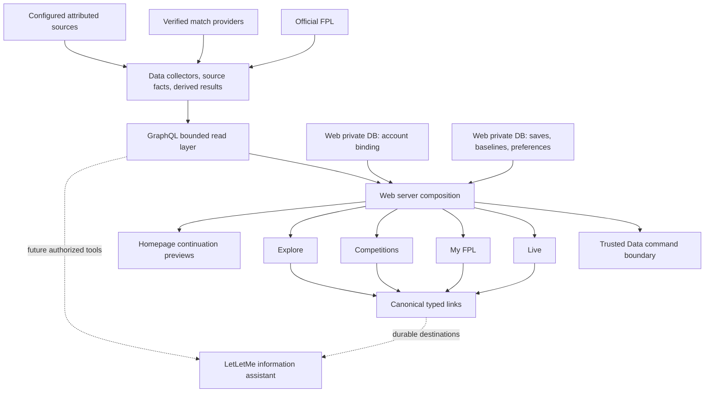
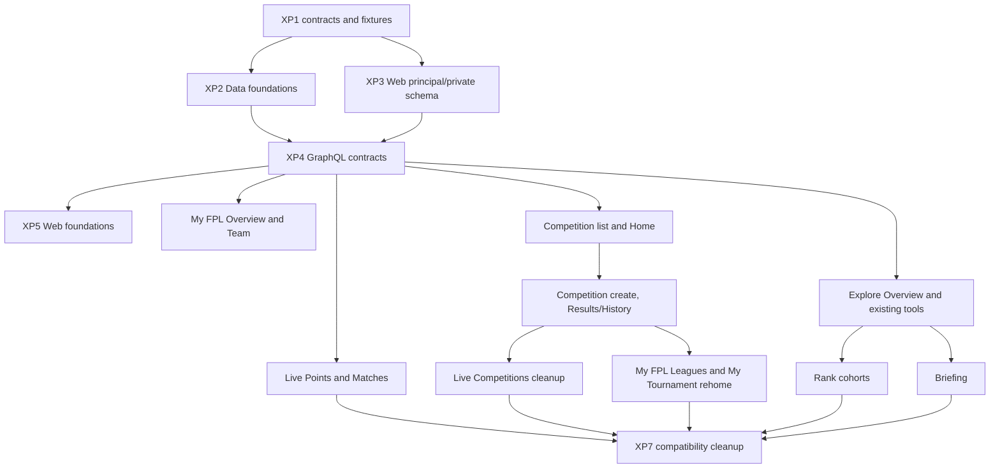

# LetLetMe Cross-Section — High-Level Implementation Plan

- **Status:** Agreed high-level engineering plan
- **Recorded:** 10 August 2026
- **Scope:** Web-owned private data + `letletme_data` → `letletme-graphql` → `letletme-web`
- **Product inputs:** [LetLetMe Product Conclusions](letletme-product-conclusions.md) and [LetLetMe Four-Section Product Specification](letletme-four-section-specification.md)
- **Section plans:** [Live](letletme-live-section-high-level-design.md), [My FPL](letletme-my-fpl-section-high-level-design.md), [Competitions](letletme-competitions-section-high-level-design.md), and [Explore](letletme-explore-section-high-level-design.md)

## 1. Scope and precedence

This document coordinates implementation shared by the four website sections. It does not redefine their product purposes or replace their section-specific work packages.

The precedence rule is:

- This document is authoritative for shared identities, season/gameweek context, result-metadata families, account binding, command/read ownership, canonical links, compatibility gates, and cross-section delivery order.
- The Competitions plan is authoritative for official-source, Competition, membership, lifecycle, and format persistence.
- The Live plan is authoritative for live refresh, current-result presentation, retained coverage, and live-page behaviour.
- The My FPL plan is authoritative for personal persistence, relevant-change baselines, team review, and provisional-to-final reconciliation.
- The Explore plan is authoritative for `EvidenceContext`, sampled-cohort semantics, Briefing rights, and evidence presentation.
- A local section example must use the shared contract rather than create a competing version. Section-specific fields may extend the shared type additively.

The fixed implementation decisions are:

- Implementation is contract-first and uses versioned fixtures; there is no new cross-repository runtime package in this phase.
- All new identities, storage keys, and cache keys are season-safe.
- One canonical season/gameweek context is consumed by every section.
- Live, settled, and evidence states remain separate typed metadata families.
- An official league source and a LetLetMe Competition remain different persisted identities.
- Web owns private account binding and preferences; Data owns official and derived FPL facts.
- GraphQL exposes bounded, authorized read models rather than one whole-site mega-query.
- Existing command ownership remains unchanged unless a section plan explicitly requires a later command migration.
- Each object has one canonical page owner; contextual cards link rather than duplicate the full page.
- Migrations are additive, observable, independently reversible, and cleaned up only after parity.
- The future information assistant must consume these same contracts and canonical links rather than scrape rendered pages.

## 2. Current integration baseline

The section plans identify strong existing capabilities, but the current implementation does not yet provide one cross-section contract layer.

| Area | Current condition | Cross-section risk |
| --- | --- | --- |
| Season/event | Data and Redis have active-season/event authorities, while individual routes still resolve or gate the event independently | Different pages can interpret preseason, current, settling, or historical state differently |
| Entry identity | Official entry facts are season-scoped in Data, but the Web account binding and signed GraphQL envelope do not carry binding season | The same numeric entry ID can be mistaken for the current manager after rollover |
| Official league and Competition | League evidence, Tournament objects, roster modes, and a singular enrichment link encode overlapping ideas | Live, My FPL, and Competitions can select different objects or duplicate source work |
| Result state | Live snapshot metadata exists; finalized entry, league, and tournament reads expose different readiness/audit shapes | Web pages invent local loading/final/error meanings and cannot hand off cleanly from Live to settled review |
| Evidence | Market, selection, Player State, official FPL, and verified match evidence expose different source/coverage metadata | Reused cards can lose scope, freshness, method, or limitations |
| Private context | The Web account database stores the current binding, while most saved/view state is local or absent | Homepage, My FPL, and Explore cannot provide reliable cross-device continuity |
| GraphQL composition | Existing queries are capability-specific and some pages compose several independent reads | A naive shared dashboard can introduce unbounded fan-out, N+1 reads, and mixed authorization |
| Routes | Current names include `/live/tournaments`, `/tournament/*`, `/me/tournament`, and direct `/data/*` tools | Public naming can change before canonical target pages or compatible redirects exist |
| Shared UI | Refresh, status, gameweek controls, evidence labels, and object links are implemented per page | Equivalent facts can look or behave differently across sections |

## 3. Target technical structure



The implementation does not introduce a second aggregation backend for the homepage or future assistant. Both compose bounded reads from the same GraphQL and Web-private authorities used by the canonical pages.

## 4. Shared contract registry

| Contract ID | Canonical owner | Primary consumers |
| --- | --- | --- |
| `CS-IDENTITY-1` | Data identity rules, reflected in GraphQL | All sections, caches, links, jobs |
| `CS-SEASON-1` | Data active-season/event authority exposed by GraphQL | All sections and entry authorization |
| `CS-COMPETITION-1` | Competitions/Data | Live, My FPL, Competitions, Explore exact cohorts |
| `CS-PRINCIPAL-1` | Web private identity plus Data season verification | My FPL, protected Live and Competition reads |
| `CS-LIVE-META-1` | Live/Data and GraphQL | Live, My FPL reconciliation checkpoint |
| `CS-SETTLED-META-1` | My FPL/Data and GraphQL | My FPL and Competition Results/History |
| `CS-EVIDENCE-1` | Explore/Data and GraphQL | Explore and evidence cards reused elsewhere |
| `CS-PERSONAL-1` | Web private persistence | My FPL, Explore, homepage continuation |
| `CS-LINK-1` | Web route registry | Navigation, cards, sharing, assistant citations |

### 4.1 Contract governance and fixtures

Each shared contract has:

```text
contractId
contractVersion
owner
producer
consumers[]
fixtures[]
compatibilityRule
removalGate
```

Implementation rules:

- Store the semantic specification and representative fixtures in source control.
- Use the same contract ID and version in producer tests and every consumer test.
- Give fixtures stable cases for current, historical, partial, unavailable, stale-season, unauthorized, and rollover behaviour where applicable.
- Treat GraphQL SDL as the public read-schema authority and generate Web GraphQL types from the deployed-compatible schema.
- Use golden payload fixtures for cross-language Data/GraphQL boundaries; compare their semantic fields and version rather than relying on structurally similar local mock objects.
- A producer may add nullable fields under the same compatible version. A semantic or stored-shape change increments the appropriate contract/cache version.
- Do not create a shared runtime package merely to centralize constants across different languages. Repository-native constants must be fixture-tested against the canonical value.
- Coordinated pull requests record which contract versions they produce and consume.

### 4.2 Season-safe identity references

New interfaces use explicit references:

```text
SeasonRef
  season

EventRef
  season
  eventId

EntryRef
  season
  entryId

OfficialLeagueSourceRef
  season
  leagueType
  leagueId

CompetitionRef
  competitionId
  season

PlayerRef
  playerId
  seasonalMappings[]

AccountRef
  userId
```

Rules:

- A numeric event, entry, league, or FPL element ID is never sufficient outside an already season-scoped aggregate.
- New database uniqueness constraints, Redis keys, job identities, Data API commands, GraphQL loader keys, URLs that need disambiguation, and audit logs include the relevant season identity.
- `competitionId` remains the canonical LetLetMe object ID. Its stored season is validated whenever it is combined with an event, entry, source, or result.
- Stable internal player identity is separate from a seasonal FPL element ID and from provider-specific match-data IDs.
- Stable account identity is separate from competitive entry identity. It is not exposed in public payloads unless required and authorized.
- Legacy fields remain readable during migration but are converted to these references at the first trusted boundary.

### 4.3 Canonical season and gameweek context

GraphQL exposes one additive context:

```text
SeasonContext
  season
  phase: PRESEASON | PRE_DEADLINE | LIVE | SETTLING | SETTLED | OFFSEASON
  currentEventId nullable
  nextEventId nullable
  latestSettledEventId nullable
  deadlineAt nullable
  checkedAt
  revision
```

Rules:

- Data/Redis active-season and event facts remain authoritative. Web never derives the active season from its calendar.
- `currentEventId` being absent is a valid preseason/offseason state, not a route-level system error.
- Historical routes use their requested `EventRef`; they do not silently replace it with the current event.
- A page may derive presentation state from `phase`, but it must not independently redefine the phase boundaries.
- The signed principal context carries binding season separately and is checked against `SeasonContext.season`.
- Context changes invalidate only season/event-dependent reads; stable public route and player identities remain reusable.

### 4.4 Official source and Competition identity

The detailed persistence contract belongs to the Competitions plan. The shared minimum is:

```text
OfficialLeagueSource
  sourceId
  season
  leagueType
  leagueId
  admissionState
  coverage

CompetitionIdentity
  competitionId
  season
  competitionKind: tracked_official_league | custom_tournament
  officialLeagueSourceId nullable
  format
  lifecycle
  rosterMode
  resultAuthority
```

Rules:

- One official source is unique by `(season, leagueType, leagueId)` and owns reusable roster/evidence collection.
- Several distinct Competition objects may reference that source; they are never merged by source or display name.
- A tracked official league follows the admitted official source contract. A fixed or selected snapshot is a custom tournament.
- Official source evidence is stored once. Competition-specific membership, rules, calculations, audits, and reports remain keyed by `competitionId`.
- `MAX_COMPETITION_ENTRIES = 500` is one domain invariant fixture-tested at every applicable boundary: tracked-source admission and custom-roster mutation/lock. It is not re-applied to post-admission synchronization of an already admitted tracked source.
- The source-admission, post-admission growth, roster-freeze, invitation, lifecycle, and archive rules remain defined by the Competitions plan.
- Live and My FPL consume this identity; neither creates a separate mirror identity or selects an arbitrary first associated Tournament.

### 4.5 Principal and binding context

Web owns private binding history:

```text
PrincipalContext
  userId
  bindingSeason nullable
  entryId nullable
  bindingVerifiedAt nullable
  envelopeVersion
```

Rules:

- The Web private schema permits at most one active binding per `(userId, season)` and active uniqueness for `(season, entryId)` according to the My FPL migration.
- Web signs the principal envelope; clients cannot supply another account or entry identity.
- GraphQL verifies that `bindingSeason` matches Data's active season before authorizing active-season personal reads.
- A missing binding and a stale-season binding are distinct typed states. Stale state returns `rebind required` rather than querying another manager with the same number.
- Stable organizer ownership uses the account identity through the trusted Web command mapping; participation and standings continue to use `EntryRef`.
- Logs record mismatch category and contract version without unnecessary personal labels.

### 4.6 Result metadata families

There is no universal website `status` enum. Three contracts share identity/time primitives but preserve their different meanings.

```text
LiveResultMeta
  season
  eventId
  revision
  state: SCHEDULED | LIVE | SETTLED
  publishedAt
  checkedAt
  authority: OFFICIAL_FPL | LETLETME_RULES | MIXED
  coverage.expected
  coverage.succeeded
  coverage.failed
  reasonCode nullable

SettledResultMeta
  season
  eventId
  state: PREPARING | FINAL | PARTIAL | UNAVAILABLE
  authority: OFFICIAL_FPL | LETLETME_RULES
  sourceCheckedAt nullable
  detailsReadyAt nullable
  coverageThroughEventId nullable
  reasonCode nullable
```

Rules:

- Existing `LiveSnapshotMeta` remains the Live revision authority and maps additively into `LiveResultMeta`.
- Existing `source` fields may remain compatibility aliases during migration; new consumers use `authority` so provider provenance is not confused with result-rule authority.
- Web adds retained-row counts and freshness presentation to Live state but does not rewrite producer coverage.
- Official entry and official-league final records use official authority. Custom results use LetLetMe rule authority after their official input and audit gates pass.
- A custom result may cite official input evidence without changing its result authority to official.
- Live-to-final reconciliation reads a coherent accepted Live revision and an official settled record; GraphQL reads do not create checkpoints.
- Missing, partial, unavailable, delayed, settling, and final are never collapsed into an empty successful result.

### 4.7 Evidence context

`EvidenceContext` remains defined in detail by the Explore plan. It is separate from both result metadata families.

The shared obligations are:

- Expose evidence class, source identity/label, season/event scope, observed/captured/published time, truth state, coverage state, exact/sample semantics, method/version, and limitations where applicable.
- Preserve official facts, LetLetMe derivations, verified match evidence, observed manager behaviour, official/club statements, reporter information, and creator opinion as distinct classes.
- A sampled result declares target population, actual denominator, sample size, and method version.
- A contextual card embedded in Live, My FPL, Competitions, the homepage, or the future assistant retains the same evidence metadata and canonical Explore URL.
- Personal intersections are composed privately in Web and are not added to a public evidence object's canonical URL or share payload.

### 4.8 Private saved and followed context

Web private persistence keeps separate typed ownership:

| Context | Owning product domain | Examples |
| --- | --- | --- |
| Saved personal objects | My FPL | Players, comparisons, rival entries, pinned Competitions |
| Relevant-change baseline | My FPL | Last successful facts revision and bounded baseline |
| Briefing preferences | Explore | Followed/muted topics, publishers, creators |
| Continuation preview | Homepage composition only | Bounded read of the above; no independent persistence model |

Rules:

- Store stable identity keys, ordering, explicit labels, and last-seen revisions; resolve current display facts through authorized reads.
- Use domain-specific tables or discriminated records with strict caps. Do not create one untyped preference JSON bag.
- Client payloads never supply another user ID.
- Do not silently import local browser history into an account.
- Private saved/followed state never changes the ordering or meaning of public aggregate evidence for other users.
- Relevant change is a bounded comparison with an explicit successful baseline, not an infinite activity feed.

### 4.9 Read and command boundaries

GraphQL reads:

- Prefer bounded page-oriented roots such as `myFplOverview`, `competition`, `competitionLive`, `competitionResults`, `exploreOverview`, and typed evidence reads.
- Reuse canonical identity, metadata, authorization, loaders, and repositories beneath those roots.
- Do not introduce one whole-site dashboard query that calls every section or returns full competition tables for a list.
- Enforce maximum sizes/cursors and stable ordering on every collection.
- Batch entry, player, event, source, Competition, and preference-resolved lookups; test for N+1 behaviour.
- Keep legacy roots as compatibility adapters until all Web consumers move.

Commands:

- Competition creation/management continues through the trusted Web-to-Data command boundary during this migration.
- My FPL saved context and Explore preferences use authenticated Web server endpoints and the Web private database.
- GraphQL is not given public mutations solely to rename Tournament as Competition.
- Official FPL transfer, lineup, captaincy, or chip actions remain external links.
- Read traffic never starts arbitrary official-league preparation, writes reconciliation checkpoints, or schedules user-defined rank cohorts.

### 4.10 Canonical page and route ownership

| Object or job | Canonical owner | Target route |
| --- | --- | --- |
| Current personal points | Live | `/live/points` |
| Current prepared Competition result | Live | `/live/competitions/[id]` |
| Current matches and squad impact | Live | `/live/matches` |
| Personal season/gameweek record | My FPL | `/me` and `/me/team` |
| Personal official-league summaries | My FPL | `/me/leagues` |
| Competition identity/setup/rules | Competitions | `/competitions/[id]` |
| Competition settled shared record | Competitions | `/competitions/[id]/results` |
| Competition joining/management | Competitions | `/competitions/[id]/join` and `/manage` |
| Player, fixture, market, cohort, or attributed evidence | Explore | Stable `/data/*` routes |
| Acquisition and continuation | Homepage | `/`; bounded previews only |

Rules:

- A contextual card may summarize another domain, but its primary link resolves through a typed route builder to the canonical owner.
- Live does not retain setup/rules/history implementations after Competition Home reaches parity.
- My FPL does not retain full shared Competition reports after Competition Results/History reaches parity.
- The homepage does not become a duplicate My FPL or Explore dashboard.
- Redirects preserve locale and meaningful object, event, view, and filter state.
- Canonical public URLs exclude private preference state and untrusted return URLs.
- Existing English `/data/*` routes remain stable while the visible category becomes Explore.

### 4.11 Shared Web primitives

Create small typed primitives rather than shared monolithic pages:

```text
SeasonEventControl
LiveStatusBar
SettledStatus
EvidenceDisclosure
CanonicalEntityLink
CompetitionIdentityBadge
CoverageSummary
PersonalImpactSummary
TypedUnavailableState
```

Rules:

- Components receive normalized view models; they do not contain Data authority or competition-kind inference.
- Page shells own only section navigation, layout, contextual controls, and composition.
- Status text, time formatting, partial/empty distinctions, and source disclosure use shared mapping functions with English and Simplified Chinese coverage.
- Accessibility, mobile table behaviour, focus restoration, reduced motion, and status announcements are verified once at primitive level and again in representative pages.
- Sharing uses canonical typed links and public evidence only.

### 4.12 Cache, revision, and invalidation

- Every new season-dependent Redis and GraphQL cache key includes season.
- Competition results include `competitionId`; official source evidence includes `OfficialLeagueSourceRef`; neither key substitutes for the other.
- Stored-shape changes receive a new cache version. Old readers never consume a partially migrated payload under an unchanged key.
- Live revisions are monotonic per `EventRef` and result scope.
- Settled facts revisions change only when authoritative stored facts or readiness change.
- Evidence revisions include method/source-policy version when it affects the public meaning or allowed fields.
- Web-private relevant-change baselines record the facts revision and their own schema version.
- Feature disablement invalidates or suppresses public reads without deleting audit history.

## 5. Cross-section implementation work packages

### XP1 — Contract registry and golden fixtures

**Repositories:** all three product repositories plus this documentation set

1. Record the nine contract IDs, initial compatible versions, owners, consumers, and removal gates.
2. Create canonical fixtures for identity, season context, principal state, Live metadata, settled metadata, and EvidenceContext.
3. Add producer and consumer tests using the same fixture versions.
4. Add a coordinated-change checklist that records Data, GraphQL, and Web compatibility.
5. Prevent new naked season-dependent IDs in the touched contracts through schema/type review tests where practical.

**Exit criteria:** every shared contract has one owner, one semantic definition, representative fixtures, and at least one producer/consumer test path.

### XP2 — Data identity and metadata foundations

**Repository:** `letletme_data`

1. Implement the Competition source/kind/season migration once under the Competitions plan; Live and My FPL consume it without parallel columns or inference.
2. Make official league, competition, entry/event result, job, and new reporting identities season-safe.
3. Expose the canonical active season/event context and monotonic revision.
4. Add Live metadata mapping, settled metadata/checkpoints, and EvidenceContext mapping without rewriting current result history.
5. Version affected Redis shapes and keep compatibility reads during consumer rollout.
6. Produce bounded migration audits for ambiguous Competition/source rows and seasonless historical identities.

**Exit criteria:** Data can produce every shared public fact with an unambiguous identity and typed metadata, while existing consumers continue to read compatible shapes.

### XP3 — Web principal and private-context foundations

**Repository:** `letletme-web`

1. Add season-aware binding history and the versioned signed principal envelope.
2. Add typed My FPL saved-context, relevant-change, and Explore preference persistence.
3. Dual-write current binding fields and binding history for one compatibility period.
4. Implement missing, verified, stale-season, and rebind-required principal states.
5. Build authenticated server-only preference command modules with caps, origin checks, validation, rate limits, and structured errors.
6. Keep the homepage a bounded consumer of private context rather than an owner.

**Exit criteria:** Web can identify the active-season manager safely and persist typed continuity without relying on browser-local state.

### XP4 — GraphQL foundational contracts and adapters

**Repository:** `letletme-graphql`

1. Add `SeasonContext`, season-safe reference fields, Competition identity/source associations, and metadata-family types.
2. Accept the new principal envelope version and reject stale-season entry authorization.
3. Add bounded section read models and shared loaders without removing current operations.
4. Map existing `LiveSnapshotMeta`, official final records, custom result audits, Market coverage, and provider metadata into their correct contract families.
5. Add cache-key versions before stored shape changes and retain legacy adapters.
6. Enforce query bounds, authorization, public/private field projection, and source-rights projection.

**Exit criteria:** both old and new Web clients can run during migration, and every new root returns typed identity/metadata without unbounded fan-out.

### XP5 — Web route, composition, and shared-primitive foundations

**Repository:** `letletme-web`

1. Add the shared season/event resolver, principal resolver, metadata normalizers, route registry, and typed canonical-link builders.
2. Build shared status/evidence primitives and section shells without moving business authority into Web.
3. Add target routes before changing public navigation or installing redirects.
4. Make server-selected first-page state useful for current, historical, preseason, partial, and unavailable cases.
5. Keep locale and meaningful query state through internal links and redirects.
6. Compose homepage continuation previews only after their canonical destination reads are available.

**Exit criteria:** every target section can consume the same contexts and link registry, and no homepage/card implementation becomes a second canonical detail page.

### XP6 — Coordinate section vertical slices

This package does not duplicate the detailed section work. It enforces these cross-section dependencies:

- Live Points may migrate after `CS-SEASON-1` and `CS-LIVE-META-1` without waiting for Competition Home.
- Live Matches may migrate after the shared Live shell and metadata contract.
- Competition list/Home require `CS-COMPETITION-1` and bounded GraphQL Competition reads.
- Live Competitions requires Competition identity and a minimum Competition Home before removing inline setup/rules/history.
- My FPL Overview/Team require principal, season, personal, and settled contracts.
- My FPL Leagues requires zero-to-many official-source/Competition association reads.
- `My Tournament` removal requires Competition Results/History parity and My FPL personal-summary parity.
- Explore Overview and existing-tool alignment require `CS-SEASON-1`, `CS-EVIDENCE-1`, and canonical link builders.
- Sampled rank cohorts require persisted method/coverage gates; Briefing requires source-policy and rights gates.

**Exit criteria:** each section release declares its consumed contract versions and passes every upstream release gate before removing a legacy responsibility.

### XP7 — Compatibility, telemetry, and cleanup

**Repositories:** all three product repositories

1. Keep old database fields, Tournament GraphQL adapters, routes, and cache readers through the documented compatibility period.
2. Add server-controlled switches for new roots/routes and independent Explore capabilities.
3. Shadow-compare official versus existing Live facts before changing authority.
4. Record new/legacy query and route use, redirect failures, stale principal states, partial coverage, and contract-version mismatches.
5. Remove legacy code only in dedicated cleanup changes after production parity and rollback observation.
6. Retain audit/history data even when public capability exposure is disabled.

**Exit criteria:** each retired path has measured replacement coverage, a completed removal checklist, and no unresolved producer/consumer version dependency.

### XP8 — Future assistant read boundary

No assistant UI or model harness is implemented by this plan.

Prepare only the durable boundary:

- section read models remain composable as authorized tools;
- every tool result carries typed identity, metadata, limits, and a canonical page URL;
- private reads require the same principal checks as pages;
- commands that affect LetLetMe state remain explicit and official FPL actions remain unavailable;
- the assistant never treats attributed opinion as official fact or an unavailable result as empty evidence.

**Exit criteria:** later assistant design can use the website's read contracts without introducing page scraping or a second truth layer.

## 6. Dependency and delivery order



Required execution:

1. Freeze contract versions and golden fixtures.
2. Land additive Data identity/metadata and Web private-schema migrations.
3. Land additive GraphQL types, authorization, bounded roots, and compatibility adapters.
4. Land shared Web contexts, normalizers, route registry, and target route shells.
5. Proceed concurrently where dependencies permit:
   - Live Points and Live Matches;
   - My FPL Overview and Team;
   - Competition list and minimum Competition Home;
   - Explore Overview and existing-tool alignment.
6. Complete Competition admission/create, lifecycle, Results/History, and format parity.
7. Then complete Live Competitions responsibility cleanup, My FPL Leagues, and `My Tournament` rehome.
8. Rank cohorts and Briefing proceed independently after their data-method and source-rights gates.
9. Change final navigation/redirect ownership only when target routes pass verification.
10. Remove legacy contracts and code in later cleanup deployments.

Within a cross-service vertical slice, production deployment order is **Data → GraphQL → Web**. Additive Web private-schema migrations land before Web code that reads them.

## 7. Release gates

| Gate | Required before | Evidence |
| --- | --- | --- |
| `RG-IDENTITY` | New Competition, league, entry, cohort, or cache consumers | Migration counts; ambiguous IDs isolated; season-safe fixture tests |
| `RG-PRINCIPAL` | Active-season My FPL and protected personal reads | Binding backfill audit; stale-season denial; rebind E2E |
| `RG-LIVE-AUTHORITY` | Retiring a local official-score/bonus calculation path | Live-gameweek shadow comparison for completeness, timing, totals, bonus, squad, and failure recovery |
| `RG-COMPETITION-HOME` | Removing setup/rules/roster/manage UI from Live | Canonical Competition Home parity and authorized links |
| `RG-COMPETITION-RESULTS` | Removing `/me/tournament` shared reports | Results/History format parity plus My FPL personal-summary parity |
| `RG-COHORT` | Publishing sampled rank evidence | Persisted cohort method, deterministic sample, coverage threshold, privacy, atomic revision, load test |
| `RG-BRIEFING-RIGHTS` | Enabling a source adapter or public display mode | Source policy fixture, acquisition basis, allowed fields, removal/correction and emergency-disable tests |
| `RG-ROUTES` | Navigation cutover or legacy route removal | Locale/deep-link redirects, canonical metadata, analytics and rollback verification |

Failure of one optional gate does not block independent canonical sections. For example, Briefing can remain disabled while Gameweek, Fixtures, Market, Trends, and Players continue to work.

## 8. Migration and compatibility plan

### Database and stored data

- Add nullable identity/authority fields and new tables first.
- Backfill in bounded batches and output exact counts plus unresolved identifiers.
- Do not infer ambiguous Competition kind, source, owner, season, or historical cohort method.
- Add new unique constraints only after audit and compatible writers exist.
- Keep official source evidence distinct from Competition-derived results.
- Preserve finalized result, audit, setup, and published history rows.
- Dual-write active binding fields/history only for the declared compatibility period.

### GraphQL

- Add fields and roots; do not rename/remove current operations initially.
- Accept old and new principal envelopes temporarily, but never authorize stale active-season identity.
- Generate Web types against the additive schema.
- Mark legacy Tournament and singular-association fields deprecated only after zero-to-many consumers pass.
- Remove a root only after query telemetry and route migrations show no required consumer.

### Redis and other caches

- Introduce versioned, season-safe keys before new writers publish changed shapes.
- Keep old keys readable while old GraphQL consumers remain deployed.
- Prevent new readers from interpreting partially migrated payloads under an old version.
- Invalidate by contract/source-policy revision where public meaning or allowed fields change.

### Web routes and private schema

- Add target routes before redirects and navigation changes.
- Preserve existing English URLs where the product decision keeps them, including `/data/*`.
- Preserve `/zh-CN` locale routing and meaningful `gw`, object, view, filter, topic, and comparison state.
- Keep `/me/tournament`, `/tournament/*`, and `/live/tournaments/*` until their documented release gates pass.
- Never turn an unauthorized or invalid private scope into a different public object silently.

### Cleanup

- Cleanup is a separate implementation change, not part of the first compatible producer/consumer deployment.
- Remove duplicated local normalizers and route-specific status meanings after shared primitives reach parity.
- Remove legacy database fields, queries, keys, and routes only when no deployed consumer depends on them.
- Retain migration and audit reports with the release record.

## 9. Verification plan

### Contract verification

- Every contract fixture validates in its producer and consumers.
- Additive/nullable field compatibility and unknown-enum handling are tested.
- Contract and stored-cache version mismatches fail visibly.
- Seasonless/naked identity use is rejected in new boundary tests.

### Data

- Season/source/Competition uniqueness and rollover isolation.
- The same official source can support distinct Competition objects without duplicate source collection.
- Entry limits, admitted growth, custom roster limits, roster freeze, and lifecycle rules.
- Monotonic Live revision and coherent final checkpoint behaviour.
- Settled authority and coverage mapping.
- Sample and Briefing policy gates where enabled.

### GraphQL

- Principal authorization, stale-season denial, public/private projection, and stable denial responses.
- Bounded list sizes, cursors, batching, query cost, and N+1 detection.
- Live, settled, and evidence metadata are not cross-mapped into the wrong enum family.
- Old/new query and principal-envelope compatibility.
- Canonical Competition/source association and result discriminators.

### Web

- Current, historical, preseason/offseason, settling, partial, unavailable, stale-binding, and unauthorized first render.
- English and Simplified Chinese navigation, labels, status text, metadata, and redirects.
- Mobile and desktop shells, keyboard/focus behaviour, screen-reader status, reduced motion, and wide result tables.
- Canonical links retain meaningful public context and omit private state.
- Homepage previews remain bounded and link to canonical pages.

### Cross-section journeys

1. Live provisional result → official final → My FPL reconciliation.
2. Competition setup → collection → Live result → settled Results/History.
3. My FPL league row → tracked Competition or preparation handoff without arbitrary whole-league calculation.
4. My FPL player/change → Explore evidence → return to the original context.
5. Competition viewer summary in My FPL → canonical Live or settled Competition page.
6. Existing URL/query → state-preserving target route or compatible existing page.
7. Season rollover → old binding, caches, saved seasonal entries, and result keys cannot become current-season facts.

### Deployment verification

- Apply Data migration and verify counts before new producer code writes.
- Deploy GraphQL and verify both compatibility and new contract smoke queries.
- Deploy Web private migrations before the consuming Web build.
- Run authenticated and public browser journeys against the deployed target.
- Observe error, latency, coverage, old/new route, and old/new query telemetry before each cleanup.

## 10. Observability and rollback

Record structured fields where applicable:

```text
contractId
contractVersion
season
eventId
entryScopeHash
officialLeagueSourceId
competitionId
resultAuthority
revision
coverageExpected
coverageSucceeded
coverageFailed
principalState
routeId
legacyAdapterUsed
reasonCode
durationMs
```

Do not log unnecessary names, raw private saved state, Briefing content, invitation tokens, or unredacted signed envelopes.

Rollback rules:

- Additive database migrations remain in place during application rollback.
- GraphQL compatibility adapters remain until every Web rollback target no longer needs them.
- New Web routes can be disabled independently while old routes remain deployable.
- Official Live authority can revert to the verified fallback without changing Competition identity or historical audit rows.
- Rank-cohort and Briefing exposure can be disabled independently without deleting published/audit state.
- Cleanup and destructive schema removal require a separate approval after the observation period.

## 11. Completion criteria

The cross-section layer is complete when:

1. Every shared contract has one owner, version, fixtures, producers, consumers, and removal gate.
2. All new season-dependent identities, jobs, stored rows, and cache keys are season-safe.
3. Every section consumes one canonical `SeasonContext` and handles no-current-event states without a route-level system error.
4. Web account binding and GraphQL principal authorization reject stale-season entry identity safely.
5. Official league source evidence is reused without merging distinct Competition objects.
6. Live and My FPL no longer use a separate mirror identity or singular first-Tournament association.
7. Live, settled, and evidence metadata remain typed, visibly distinct, and consistently rendered.
8. Page-oriented GraphQL reads are bounded, authorized, batched, and compatible with existing clients during migration.
9. Commands remain behind their trusted Web/Data or Web-private boundaries; read traffic creates no hidden preparation work.
10. Canonical route ownership is enforced through typed links, redirects, and removal gates.
11. Homepage continuation is bounded and does not duplicate canonical My FPL or Explore pages.
12. Shared status, evidence, time, coverage, link, and unavailable-state primitives work in English and Simplified Chinese.
13. Live-to-final, Competition lifecycle, My FPL-to-Explore, compatibility-route, and season-rollover journeys pass end to end.
14. Every legacy removal has production telemetry, a verified replacement, and a rollback record.
15. The future information assistant can consume authorized typed reads with canonical destinations without page scraping or a second truth model.

## 12. Configuration decisions that do not block the foundation

The following remain implementation configuration until measured evidence is available:

- initial sampled-cohort size and rank-band boundaries;
- Briefing source allowlist and source-specific rights mode;
- independent feature-exposure order;
- measured Live freshness thresholds derived from producer cadence;
- duration of compatibility observation before cleanup.

They require explicit configuration and operational tests, but they do not change the shared identities, ownership, or dependency structure in this plan.
