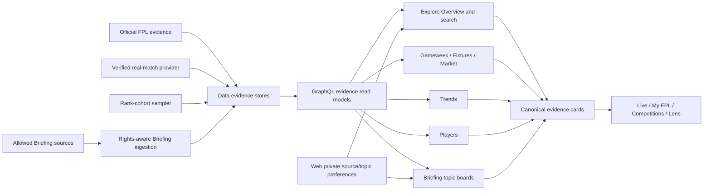

# LetLetMe Explore Section — High-Level Implementation Plan

- **Status:** Proposed engineering plan, ready for technical review
- **Recorded:** 10 August 2026
- **Scope:** `letletme_data` → `letletme-graphql` → `letletme-web`, plus Web-owned private Explore preferences
- **Product inputs:** [LetLetMe Product Conclusions](letletme-product-conclusions.md) and [LetLetMe Four-Section Product Specification](letletme-four-section-specification.md)
- **Shared implementation contract:** [LetLetMe Cross-Section — High-Level Implementation Plan](letletme-cross-section-implementation-plan.md)

## 1. Scope

This document does not redefine Explore. It translates the approved Section 4 decisions into cross-repository implementation work.

The cross-section plan governs shared identity references, season context, result-metadata separation, principal verification, canonical links, compatibility, and delivery gates. This plan is authoritative for `EvidenceContext`, rank-cohort semantics, Briefing acquisition/rights, and evidence-specific presentation.

The fixed inputs are:

- The public category is **Explore**. Existing `/data/*` paths remain stable during this implementation.
- The Explore label opens a lightweight Overview at `/data`; its compact submenu remains Gameweek, Fixtures, Market, Trends, Players, and Briefing.
- Explore is an evidence layer. It does not produce buy/sell/avoid/essential/best-captain verdicts, optimized teams, expected-points models, expected-minutes models, or price-change predictions.
- Explore Overview is a bounded router and deterministic search surface, not a duplicate homepage, infinite feed, or question-and-answer interface.
- Gameweek remains the concise official round-level view.
- Fixtures retains FDR, BGW/DGW, team-run, and linked-squad context while removing residual advisory language.
- Market remains an observed-change product and never becomes an unofficial predictor.
- League Trends becomes **Trends** and supports explicit cohort kinds rather than treating every field as a league.
- Existing prepared tracked-official and custom-competition fields remain exact cohorts when their collection is complete.
- Top-10k and rank-band evidence uses a deterministic, stratified, resource-bounded sample unless an exact collector later passes a separate operational gate.
- Cohort membership is based on the latest settled overall rank before the gameweek deadline; new frozen picks are captured after the deadline.
- Selection movement is not called a transfer unless actual transfer evidence was collected under the same cohort definition.
- Player Stats becomes **Players** and retains one-player inspection plus optional two-player comparison.
- Official FPL data and verified real-match provider data remain separate evidence classes joined only through verified entity links.
- Per-metric comparison emphasis is allowed only for valid like-for-like metrics; there is no aggregate winner or transfer score.
- Deterministic Player State is presented only as an optional **Evidence Summary** with rules, coverage, limitations, and withheld states.
- The Player State overall directional headline remains withheld whenever its release evidence has not demonstrated reliable ordering.
- Briefing is a new topic-board evidence class inside Explore. It is not a platform feed, newsroom, or consensus engine.
- Briefing keeps official/club facts, reporter/publisher information, observed manager behaviour, and creator/KOL opinion visibly separate.
- No source is scraped, stored, summarized, embedded, or redistributed until its acquisition method and rights basis are explicitly configured.
- My FPL owns saved players and personal watchlist context. Explore owns followed or muted Briefing topics, publishers, and creators.
- Existing direct tools remain available to power users while their evidence becomes reusable inside Live, My FPL, Competitions, Players, Briefing, and Lens.
- Every material figure or attributed statement exposes consistent source, scope, time, coverage, and derivation metadata.
- Shared evidence objects use stable canonical Explore links and do not leak private personal context into public URLs or share payloads.

## 2. Current implementation baseline

The baseline includes the current Web work plus the in-progress GraphQL/Data platform branches that the product record assumes are completed and available.

### Web

| Area | Current implementation |
| --- | --- |
| Navigation | `components/layout/config.ts` exposes `Data` with Gameweek, Fixtures, Market, League Trends, and Player Stats; there is no `/data` page or Briefing item |
| Homepage | The homepage exposes selected gameweek, market, fixture, Dream Team, and personal fragments, but it is a whole-product acquisition/continuation page rather than an Explore router |
| Gameweek | `/data/gameweek` exposes official overall round statistics, chips, Dream Team, double-digit hauls, provisional/settled state, update time, preseason/empty states, and player links; selected gameweek is client state rather than a canonical query scope |
| Fixtures | `/data/fixtures` provides selectable FDR horizons, easiest/hardest runs, next-fixture cards, BGW/DGW and unknown states, team matrix, linked-squad overlay, neutral candidate groups, sharing, and player links; metadata still contains hunt/avoid language |
| Market | `/data/market` exposes observed price, ownership, transfer, availability, and player-pool changes with a 14-day coverage contract, latest-day price filtering, player lookup/history, stale states, and sharing |
| Trends | `/data/selections` exposes exact prepared competition fields and curated public prepared competitions, gameweek selection, ownership, EO, captaincy, transfers, template core, personal exposure, and sharing; cohort type and capture metadata are not consistently visible |
| Players | `/data/player-stats` provides bounded server-side player search, one/two-player state, availability, fixtures, recent gameweeks, season production, official expected metrics, price history, FPL percentiles, verified Understat process, coverage, My Squad context, and query-driven selection |
| Player State | The Web renders a large deterministic state profile with dimension ratings, reasons, coverage, provider revisions, historical context, and withheld-state copy; it is requested beside the lightweight player overview rather than only when its evidence summary is opened |
| Cross-links | Gameweek, Fixtures, Market, and Trends already link to Players, and Players links to Fixtures; there is no shared typed evidence-card contract or Explore-wide search |
| Personal Explore state | Recent player selections use local storage. No durable source/topic follow or mute model exists |

### GraphQL

| Area | Current implementation |
| --- | --- |
| Core evidence | Events, fixtures, teams, players, player detail, player values, market pulse, live boards, entry facts, and tournament selection statistics already support the five quantitative tools |
| Public Trends | The in-progress `publicLeagueTrends` contract exposes an allowlisted catalogue of prepared public tournament fields and exact selection aggregates |
| Player State | The in-progress `playerStateProfile` contract composes current/historical FPL evidence, verified Understat process, fixtures, availability, peer/own baselines, provider revisions, limitations, and release-gated directional state |
| Player search | `playersForPicker` supplies bounded server-side filtering, sorting, and cursor pagination |
| Evidence metadata | Market and Player State have purpose-specific coverage contracts, but no common evidence context spans Gameweek, Fixtures, Trends, Players, and future Briefing items |
| Missing contracts | No rank-cohort catalogue/snapshot, Briefing source/topic/item, Explore Overview, Explore search, or common share-card read model exists |

### Data

| Area | Current implementation |
| --- | --- |
| Official FPL | Season-scoped events, fixtures, teams, players, player gameweek statistics, player season summaries, values, market snapshots, entry picks/results/transfers, and prepared competition evidence are persisted or published through bounded caches/read models |
| Competition fields | Prepared competition membership and `reporting.tournament_selection_stats` provide exact ownership, captaincy, vice-captaincy, and transfer aggregates for bounded fields |
| Curated public fields | The in-progress `competition.public_league_trends` catalogue marks selected prepared competitions for public Trends reads |
| Real-match provider | Understat clients, tables, queues, workers, sync manifests, and caches remain independent from FPL; provider entity links and mapping status control cross-provider reads |
| Player State inputs | Reporting player summaries, historical FPL gameweek facts, market snapshots, fixtures, Understat player process, and verified links support the in-progress state engine |
| Missing rank data | No managed Top-10k/rank-band cohort definition, sample plan, sampled membership, pick capture, aggregate, publication, or coverage model exists |
| Missing Briefing data | No public-source registry, acquisition policy, content item, topic, entity link, deduplication, correction/removal, or ingestion-run model exists |

## 3. Target technical structure



The implementation has seven shared foundations:

1. One additive evidence-context contract across public read models.
2. One bounded, resumable, season/gameweek-scoped rank-cohort pipeline.
3. One rights-aware Briefing source and content model.
4. Verified, season-safe entity identity across FPL, real-match, and public-source evidence.
5. Bounded GraphQL Overview, search, Trends, and Briefing reads.
6. Stable URL scope plus reusable Web evidence cards.
7. Web-owned private follow/mute preferences without a personalized engagement feed.

## 4. Cross-repository contracts

### 4.1 Shared evidence context

This section is authoritative for the shared `CS-EVIDENCE-1` contract referenced by the cross-section plan. Introduce one additive GraphQL evidence metadata shape and equivalent Data/domain types. Existing domain responses may embed it directly or return it beside their current payload during migration.

```text
EvidenceContext
  evidenceClass
  sourceKey
  sourceLabel
  season
  eventId nullable
  scopeKind
  scopeKey nullable
  scopeLabel
  observedAt nullable
  capturedAt nullable
  publishedAt nullable
  truthState
  coverageState
  availabilityState
  exact
  targetPopulation nullable
  denominator nullable
  sampleSize nullable
  methodKey nullable
  methodVersion nullable
  limitations[]
```

Initial evidence classes:

```text
OFFICIAL_FPL_FACT
LETLETME_DERIVATION
VERIFIED_MATCH_EVIDENCE
OBSERVED_MANAGER_BEHAVIOUR
OFFICIAL_OR_CLUB_STATEMENT
REPORTER_OR_PUBLISHER_INFORMATION
CREATOR_OPINION
```

Initial truth and coverage states:

```text
truthState: SCHEDULED | PROVISIONAL | SETTLED | OBSERVED | ATTRIBUTED | UNAVAILABLE
coverageState: COMPLETE | PARTIAL | STALE | UNKNOWN | NOT_APPLICABLE
availabilityState: AVAILABLE | MISSING | COLLECTION_FAILED | NOT_YET_CAPTURED | CONFIRMED_EMPTY | STALE
```

Rules:

- `exact=true` means the declared scope was fully observed, not that the upstream value is infallible.
- A sampled cohort always sets `exact=false`, supplies `sampleSize`, and identifies its sampling method/version.
- `denominator` is the number used for the displayed calculation; it is not silently substituted with target population.
- `observedAt`, `capturedAt`, and `publishedAt` retain different meanings and are not collapsed into one `updatedAt` field.
- A derived figure supplies `methodKey` and `methodVersion`; user-facing methodology may resolve from those stable keys.
- `availabilityState` is the typed reason a payload can or cannot be used; it distinguishes missing, failed, not-yet-captured, confirmed-empty, and stale evidence even when `truthState=UNAVAILABLE` or `coverageState=UNKNOWN` would otherwise look identical.
- `AVAILABLE` means the evidence is usable under its declared truth and coverage states; `STALE` means a retained value remains renderable but must be labelled stale.
- Briefing attribution metadata does not make an attributed statement an official or verified fact.
- Existing Market coverage and Player State provider revisions map into this shared context without losing their more detailed domain fields.

### 4.2 Rank-cohort definitions and snapshots

Add season-scoped reporting tables, provisionally named:

```text
reporting.manager_cohorts
  season_id
  cohort_id
  slug
  display_name
  cohort_kind: RANK_SAMPLE
  lower_rank
  upper_rank
  sampling_method
  method_version
  target_sample_size
  enabled
  created_at
  updated_at

reporting.manager_cohort_snapshots
  season_id
  cohort_id
  event_id
  rank_reference_event_id
  deadline_at
  state: PENDING | CAPTURING | PUBLISHED | PARTIAL | FAILED
  target_population
  target_sample_size
  actual_sample_size
  coverage_numerator
  coverage_denominator
  captured_at
  published_at
  revision
  failure_code nullable
  method_version

reporting.manager_cohort_members
  season_id
  cohort_id
  event_id
  entry_id
  sampled_rank
  stratum
  source_checked_at

reporting.manager_cohort_player_stats
  season_id
  cohort_id
  event_id
  element_id
  pick_count
  captain_count
  vice_captain_count
  effective_ownership_count
  selection_delta nullable
  denominator

reporting.manager_cohort_chip_stats
  season_id
  cohort_id
  event_id
  chip
  entry_count

reporting.manager_cohort_formation_stats
  season_id
  cohort_id
  event_id
  formation
  entry_count
```

Required invariants:

- Cohort definition is unique by `(season_id, slug)`.
- One published snapshot exists per `(season_id, cohort_id, event_id, method_version)`.
- Member identity is internal evidence and is not exposed through public GraphQL reads.
- The sample positions are deterministically derived from cohort bounds, strata, event, and method version.
- The target sample size is configuration bounded by one tested service maximum; Web cannot increase it.
- Rank membership comes from the latest settled rank snapshot before the target deadline.
- Gameweek 1 has no prior settled rank cohort and publishes `UNAVAILABLE`, not an invented Top-10k field.
- The capture job begins after the deadline and freezes the accepted member set for that event.
- Standings discovery fetches only pages required for the predetermined sample positions and stops at the configured bound.
- Entry-pick capture uses bounded concurrency, upstream-aware retry, checkpoints, and a hard request budget.
- Publication is atomic: readers see the prior complete snapshot until the new revision is published.
- A partial snapshot may publish only when its coverage threshold and product label are explicit; otherwise the read is unavailable.
- Selection delta compares compatible published aggregate snapshots. It is not named transfer-in/out.
- Actual transfer statistics require an explicit separately collected transfer contract; membership changes cannot manufacture them.
- Exact tracked/custom/curated competition cohorts continue to use prepared competition evidence. A GraphQL adapter unifies their presentation without copying their source rows into sampled-cohort tables.

The initial product requires a Top-10k definition. Additional rank bands use rows in `manager_cohorts`; their exact boundaries and configured sample sizes are operational configuration, not new schemas.

### 4.3 Briefing source, rights, and content model

Add a dedicated schema or equivalently isolated ownership module, provisionally named `briefing`:

```text
briefing.sources
  source_id
  source_class: OFFICIAL_CLUB | REPORTER_PUBLISHER | CREATOR
  platform
  display_name
  canonical_url
  locale
  acquisition_method
  rights_basis
  display_mode: LINK_ONLY | METADATA | SUMMARY | EXCERPT | TRANSCRIPT
  enabled
  checked_at
  created_at
  updated_at

briefing.items
  item_id
  source_id
  external_id
  canonical_url
  title nullable
  summary nullable
  summary_method: SOURCE | EDITORIAL | MODEL_ASSISTED | NONE
  excerpt nullable
  media_type
  language
  published_at
  captured_at
  fingerprint
  status: ACTIVE | CORRECTED | REMOVED | EXPIRED
  correction_note nullable
  rights_revision
  created_at
  updated_at

briefing.topics
  topic_id
  slug
  title
  topic_kind: PLAYER | TEAM | GAMEWEEK | QUESTION
  season_id nullable
  event_id nullable
  status
  created_at
  updated_at

briefing.topic_items
  topic_id
  item_id
  relevance_order
  relationship

briefing.item_entities
  item_id
  entity_type: PLAYER | TEAM | GAMEWEEK | TOPIC
  entity_key
  link_status: VERIFIED | REVIEWED | UNRESOLVED
  created_at

briefing.ingest_runs
  run_id
  source_id
  started_at
  completed_at nullable
  status
  fetched_count
  accepted_count
  duplicate_count
  rejected_count
  removal_count
  checkpoint nullable
  error_code nullable
```

Rules:

- `rights_basis` and `display_mode` are server configuration, never inferred from a successful HTTP response.
- `LINK_ONLY` stores and returns only the allowed identity, link, timestamp, and minimal metadata.
- Excerpts and transcripts are stored only when the configured rights mode permits them and must remain within the configured limit.
- Full paywalled article bodies are not stored or rendered.
- A model-assisted summary is labelled by `summary_method`, retains every source link, and cannot change the item's evidence class.
- One item has one canonical source identity. Reposts may link to the original and are not counted as independent agreement.
- Fingerprint and provider identity deduplicate retries and cross-topic reuse without deleting legitimate distinct items.
- Corrections update status and retain audit history. Removal tombstones the item so caches and topic boards stop serving it.
- Public text is stored/rendered as controlled plain text or sanitized allowed markup; arbitrary provider HTML and scripts are never rendered.
- Embedded media uses an explicit provider allowlist and privacy/security policy. A normal source link remains available when embedding is disabled.
- Observed manager behaviour remains owned by Trends. Briefing may reference a canonical Trends evidence card rather than duplicating cohort aggregates as attributed content.
- A source adapter is enabled only after its API, feed, permission, rate, retention, summarization, and display rules are documented and tested.

### 4.4 Entity identity and cross-source links

Use explicit typed entity keys:

```text
PLAYER: stable FPL player code + season mapping to element ID
TEAM: stable club identity + season mapping to FPL team ID
GAMEWEEK: season + event ID
COHORT: season + cohort kind + cohort ID
BRIEFING_TOPIC: stable topic slug
SOURCE: stable source ID
```

Rules:

- Do not use current-season FPL element ID as a cross-season player identity.
- Existing verified FPL ↔ Understat entity links remain the only bridge for verified match evidence.
- Briefing entity links are separate from provider-statistical verification; a matching name alone does not create a verified link.
- Automatic candidate matching may enqueue a reviewable link but does not publish ambiguous player identity.
- Team promotion/relegation and player transfers retain season mappings instead of mutating a historical identity.
- Canonical URLs serialize public identifiers, not internal database rows or private user IDs.

### 4.5 Web-owned Explore preferences

Source and topic preferences remain in the Web-owned private database and are accessed through authenticated Web server code.

```text
bauth.explore_source_preferences
  user_id
  source_id
  state: FOLLOW | MUTE
  created_at
  updated_at

bauth.explore_topic_preferences
  user_id
  topic_id
  state: FOLLOW | MUTE
  created_at
  updated_at
```

Rules:

- My FPL saved-player and comparison tables remain the authority for personal watchlist context; Explore does not duplicate them.
- Source/topic IDs are validated against bounded GraphQL lookup before persistence.
- Enforce explicit per-user caps and idempotent upsert/delete behaviour.
- Muting removes the source/topic from personalized Overview and Briefing composition but does not alter public canonical topic pages.
- Following affects ordering and relevant updates; it does not create an opaque engagement ranking or recommendation profile.
- Anonymous users may browse public Briefing and keep only non-authoritative recent UI state on their device.
- No browser-local recent history is silently copied into the account.

Authenticated Web endpoints:

```text
GET    /api/explore/preferences
PUT    /api/explore/preferences/source/[sourceId]
DELETE /api/explore/preferences/source/[sourceId]
PUT    /api/explore/preferences/topic/[topicId]
DELETE /api/explore/preferences/topic/[topicId]
```

Use the existing session, origin, rate-limit, validation, and structured error conventions. Client payloads never supply another user ID.

### 4.6 Required GraphQL read models

Add bounded additive reads:

| Read model | Required shape |
| --- | --- |
| `exploreOverview` | Current season/event phase, bounded official/gameweek changes, bounded fixture and market changes, latest published rank-cohort references, latest Briefing topics, evidence contexts, and a facts revision |
| `exploreSearch` | Bounded typed results for players, teams, gameweeks, public/authorized cohorts, Briefing topics, and sources with canonical route data |
| `trendCohorts` | Cohort ID/kind/name, exact/sample flag, rank bounds where applicable, latest available event, sample/population metadata, and availability state |
| `trendCohortSnapshot` | Evidence context; player ownership/EO/captaincy/vice-captaincy; chips; formations; template; compatible prior-snapshot change; personal exposure only when an authorized exact field and entry picks are available |
| `briefingTopics` | Cursor-paginated topic cards with type, entities, latest item time, bounded evidence-class counts, followed state supplied separately by Web, and canonical slug |
| `briefingTopic` | Topic identity, bounded cursor-paginated attributed items, evidence-class grouping, short timeline, source metadata, rights-aware display fields, correction/removal state, canonical related Explore evidence references |
| `briefingSources` | Enabled public source identity, class, platform, locale, canonical URL, display mode, and latest allowed publication/capture metadata |
| Player extension | Bounded related Briefing topic/item references plus the existing official/verified evidence contexts; no copied content inside `playerDetail` |

Rules:

- `exploreOverview` is a bounded composition read, not a hidden call to every full Explore page.
- Saved player codes supplied by authenticated Web composition are capped and resolve only public player signals.
- Search normalizes the query once, enforces a minimum/maximum length, caps results per type, and never exposes private competition membership.
- Exact prepared competition Trends authorization continues to use existing membership/public-catalog rules.
- Sampled rank-cohort snapshots are aggregate-only and public only after publication.
- All public lists use bounded limits/cursors and stable deterministic ordering.
- Briefing returns only the display fields permitted by the stored rights mode.
- Outbound URLs are parsed and validated against the enabled source record; stored arbitrary schemes are rejected.
- Player, team, cohort, and Briefing resolvers batch lookups and avoid per-card queries.
- Existing Gameweek, Fixtures, Market, player, public-league, and tournament-stat queries remain during migration.

### 4.7 Routes and page ownership

Initial route contract:

```text
/data                                  Explore Overview
/data/gameweek?gw=<event>
/data/fixtures?from=<event>&horizon=<n>&team=<team>
/data/market?view=<mode>&days=<n>
/data/selections?cohort=<typed-key>&gw=<event>
/data/player-stats?p1=<player>&p2=<player>&section=<section>
/data/briefing?topic=<slug>&player=<code>&team=<key>&gw=<event>&source=<id>
/data/briefing/<topic-slug>
```

Rules:

- Public labels change to Explore, Trends, and Players without changing existing English route identity.
- `/zh-CN/data...` continues through the existing locale router.
- The top-level Explore label links to `/data`; the desktop dropdown contains the six direct tools.
- Meaningful controls update the URL through replace/push without losing locale or unrelated valid scope.
- Gameweek, cohort, player comparison, and Briefing topic links render a useful server-selected state on first load.
- Invalid or unauthorized scope falls back visibly to a safe default; it is not silently interpreted as another private object.
- A future `/explore/*` migration requires explicit approval and permanent redirects that preserve query/hash state. It is not part of this plan.
- Briefing topic slug changes use aliases/redirects so shared links remain durable.
- Canonical metadata points to the scoped public URL and excludes private preference or watchlist state.

### 4.8 Player Evidence Summary release boundary

Keep the existing deterministic engine and release gate, but change its product integration:

- Rename the visible concept from a headline `Player State` score to `Evidence Summary` where product copy implies an overall judgment.
- Load the lightweight official player overview independently.
- Request the Evidence Summary only when its panel is visible or intentionally prefetched under a measured budget.
- Continue to expose availability/role evidence, FPL output, historical reliability, fixture outlook, verified process, reasons, samples, baselines, provider revisions, mapping status, and limitations.
- Preserve `UNKNOWN` and the `TREND_WITHHELD_*` reasons while the release evidence remains failed or incomplete.
- Do not reconstruct a directional headline in Web from the visible dimensions.
- Same-position comparison may highlight the directionally stronger individual metric when data is available and comparable.
- Cross-position and neutral-direction metrics receive no winner emphasis.
- Missing radar axes are omitted/marked unavailable; they are not plotted as zero.
- A failed optional Evidence Summary does not block player search, official overview, fixtures, or other independent evidence sections.
- Official FPL and Understat labels, revisions, and mapping status remain visible and are never blended into an unlabeled composite metric.

### 4.9 Reusable evidence cards and sharing

Define a small Web view-model family rather than a universal untyped card:

```text
GameweekEvidenceCard
FixtureEvidenceCard
MarketEvidenceCard
CohortEvidenceCard
PlayerEvidenceCard
BriefingEvidenceCard
```

Every card implements shared presentation fields:

```text
canonicalHref
evidenceClass
sourceLabel
scopeLabel
timeLabel
coverageLabel nullable
stateLabel
limitations[]
sharePolicy: PUBLIC | AUTHENTICATED | PRIVATE_NO_SHARE
```

Rules:

- A card keeps its domain-specific body; do not flatten unrelated evidence into generic title/value pairs.
- Contextual copies inside Live, My FPL, Competitions, and Lens link to the canonical Explore object.
- A private card may produce a private in-app link but never public share text containing entry, rank, league, or preference data without an explicit safe formatter.
- Public share text/cards include source, season/gameweek or time scope, exact/sample label, and canonical URL.
- Copy/share formatting is a pure tested function; DOM text is not scraped to build payloads.
- Existing Fixtures, Market, and Trends share utilities migrate to the common metadata/footer contract without losing their domain content.

## 5. Implementation work packages

### WP1 — Evidence context and supporting Data schema

**Data**

- Add the shared evidence-domain types used by reporting publication.
- Add rank-cohort tables, constraints, indexes, retention ownership, and migration rollback notes.
- Add Briefing source/item/topic/entity/run tables or their equivalently isolated schema.
- Add rights-mode, item-status, cohort-state, and source-class enums with database checks.
- Add season/event foreign keys where the v3 platform contract supplies them; avoid references to compatibility views that cannot enforce identity.
- Add service-role writes and GraphQL-reader selects only; do not grant browser roles direct access.
- Add history/audit ownership for source-rights revisions, corrections/removals, and cohort publication revisions.

**GraphQL**

- Add shared `EvidenceContext` schema/type mapping.
- Add evidence-class, truth-state, and coverage-state enums.
- Map existing Market coverage, public competition Trends, and Player State provider context without breaking existing fields.
- Add query complexity limits for every new nested evidence context.

**Web**

- Add a typed evidence metadata presenter for source, scope, time, coverage, and limitations.
- Do not replace existing visible metadata until the new and old values have parity tests.

**Exit criteria**

- Migrations apply to a v3-shaped database and rollback through the documented additive path.
- The same evidence-state fixture renders consistently across at least Market, Trends, and Players.
- Exact/sample, unavailable/empty, and observed/captured/published semantics have contract tests.

### WP2 — Navigation, routes, and Explore shell

**Web**

- Add `/data/page.tsx` and its locale loading/error states.
- Rename the public category from Data to Explore.
- Rename League Trends to Trends and Player Stats to Players in navigation, headings, metadata, breadcrumbs, analytics names, and both locales.
- Add Briefing to the Explore submenu.
- Make the Explore category label link to `/data`; expose Overview explicitly in mobile navigation if required by the component interaction.
- Keep all current `/data/*` paths and query compatibility.
- Add a shared Explore shell only for common category navigation/search/metadata; do not wrap every detailed page in a blocking Overview request.
- Add typed builders/parsers for gameweek, fixtures, market, cohort, player, and Briefing URL state.

**Exit criteria**

- All seven Explore destinations are keyboard and mobile reachable.
- Existing shared `/data/*` URLs continue to open the same meaningful state.
- English and Simplified Chinese navigation/metadata keys remain in parity.

### WP3 — Explore Overview and deterministic search

**GraphQL**

- Implement `exploreOverview` from bounded event, market, fixture, published cohort, and Briefing topic read models.
- Implement typed `exploreSearch` with capped per-type results and stable ordering.
- Reuse player/team picker indexes and Briefing topic/source indexes; do not load full directories into GraphQL memory.
- Return one facts revision so Web can cache the public portion coherently.

**Web private data**

- Add Explore source/topic preference tables and authenticated endpoints.
- Reuse My FPL saved-player reads rather than creating another saved-player table.

**Web**

- Compose public Overview data, optional saved-player signals, source/topic preferences, and recent local comparisons in the server layer.
- Render phase, material change, latest cohorts, Briefing topics, and direct-tool entry points in bounded sections.
- Implement a direct search/scope control that returns typed destinations and routes on selection.
- Do not render a message composer, conversation history, model disclaimer, or generic answer block.
- Keep the whole-site homepage independent; reuse small evidence cards rather than moving the homepage into `/data`.
- Model no-data, first-season, preseason, public-source-disabled, partial, and query-failure states independently.

**Exit criteria**

- A guest can find a player, club, gameweek, public cohort, topic, or source without opening a dropdown chain.
- A signed-in manager sees saved-player/source context only within bounded queries and without leaking it into cacheable public markup.
- Overview failure does not break any direct Explore route.

### WP4 — Gameweek, Fixtures, and Market alignment

**Gameweek**

- Make `gw` canonical URL state and server-seed the requested valid event.
- Add the shared evidence context for official status, provisional/settled state, and live-board publication.
- Add a bounded top-transfer board from the existing official event/player contract where available.
- Add small canonical links to relevant Trends and Players evidence; do not embed the full cohort desk.
- Preserve Dream Team, double-digit hauls, chips, preseason, and settled history.

**Fixtures**

- Remove hunt, avoid, target, recommended, and equivalent advisory wording from page metadata, headings, empty states, share text, and both locales.
- Keep factual easiest/hardest FDR, low-owned/popular review groups, linked-squad highlighting, and player links.
- Preserve `unknownEventIds` separately from confirmed empty BGW fixtures.
- Add URL state for start event, horizon, and optional team focus.
- Add fixture-source/window evidence context and method text for any derived run average/group.

**Market**

- Preserve latest-day filtering for the price-change board and multi-day semantics for ownership/transfer windows.
- Map its existing coverage contract into shared evidence metadata without discarding requested/observed days or stale state.
- Keep official availability evidence separate from future attributed injury/reporting content.
- Retain player lookup, history, view modes, and current share functions.
- Add canonical player and Briefing context links only where a source-backed topic exists.

**Exit criteria**

- Every visible figure has an unambiguous gameweek/date window and source.
- No Fixtures metadata or action label implies a transfer verdict.
- A failed fixture event never renders as a confirmed blank.
- Market single-day and multi-day boards have contract fixtures proving their different windows.

### WP5 — Rank-cohort collection and publication

**Data**

- Add cohort configuration loading and a deterministic stratified rank-position generator.
- Resolve the latest settled rank reference before the target deadline.
- Fetch only required standings pages and map sampled positions to entry IDs.
- Persist the frozen sample plan before pick capture so retries cannot change membership.
- Add checkpointed, bounded-concurrency entry-pick capture with request budgets and typed upstream failures.
- Validate picks, captain/vice-captain, multiplier, chip, and formation inputs before aggregation.
- Aggregate player selection, captaincy, vice-captaincy, EO, chips, formations, template, and compatible prior-snapshot selection delta.
- Publish snapshot and revision atomically after coverage checks.
- Add safe retry, resume, abandon, and republish commands that never mix method versions.
- Add retention and season rollover rules for member evidence and aggregates.
- Do not enqueue arbitrary user-created cohort bounds from Web or GraphQL.

**Operational gate**

- Load-test the configured sample size, standings-page count, pick request count, duration, storage, Redis impact, and retry behaviour.
- Set one initial cap only after the test; keep it in server configuration and expose the resulting actual sample to users.
- Any future exact Top-10k collector requires a separate approval based on measured upstream reliability and resource cost.

**Exit criteria**

- Re-running the same event/method produces the same sample membership and aggregate result.
- Worker restart resumes from checkpoints without duplicate accepted rows.
- Gameweek 1 and insufficient coverage publish the correct typed state.
- No public read exposes sampled entry identities.
- The job stays within its configured upstream-call, concurrency, time, and storage budgets.

### WP6 — Unified Trends contract and page

**GraphQL**

- Implement `trendCohorts` across exact prepared competition fields, curated public prepared fields, and published rank samples.
- Implement `trendCohortSnapshot` through separate exact-field and sampled-field adapters behind one response contract.
- Return explicit cohort kind, source/competition identity, exact/sample label, rank bounds, rank reference, denominator, sample, capture/publication time, coverage, and method.
- Return vice-captaincy, chips, and formations when the underlying exact or sampled evidence supports them.
- Keep actual transfers and selection delta as distinct fields and capabilities.
- Compute personal exposure only for authorized exact fields with trustworthy entry picks.
- Add capability flags rather than returning misleading empty arrays for unsupported measures.

**Web**

- Rename `/data/selections` UI from League Trends to Trends.
- Replace `mine/public` ontology with typed cohort groups and labels.
- Keep the current prepared-competition selector and personal exposure behaviour through its adapter.
- Add sampled cohort metadata above every Top-10k/rank-band result.
- Add ownership, EO, captaincy, vice-captaincy, chips, formations, template, and selection-change sections only when supported.
- Use `Top 10k sample` consistently in headings, share text, metadata, and both locales.
- Preserve gameweek and cohort in the URL and initial server render.
- Keep full competition-wide analysis canonically in Competitions while Trends remains the cross-cohort evidence desk.

**Exit criteria**

- A prepared 100-entry competition displays `exact · 100/100`; a sampled Top-10k cohort displays its real configured values in the form `sample · actual/10,000`.
- Unsupported transfer evidence cannot be mistaken for zero transfers.
- Cohort switching never reuses cached data under another cohort/event/method identity.
- Share output includes scope, gameweek, exact/sample, denominator, capture time, and canonical URL.

### WP7 — Players and Evidence Summary alignment

**GraphQL**

- Keep `playerDetail`, bounded picker search, price history, and `playerStateProfile` as separate compatible reads.
- Attach shared evidence context to official current/season data and verified real-match provider sections.
- Add bounded related Briefing topic references by stable player code.
- Preserve provider mapping status and release-gate reasons.
- Batch source/topic references for two-player comparison.

**Web**

- Rename the public page to Players while keeping `/data/player-stats`.
- Keep the official player overview independently renderable when personal seed, market context, fixtures, Understat, Evidence Summary, or Briefing fails.
- Load each supporting evidence section only when opened or intentionally prefetched under a measured budget.
- Rename/reframe the deterministic synthesis as Evidence Summary.
- Never promote dimension labels into an aggregate winner or recommendation.
- Allow like-for-like per-metric emphasis only when metric direction and data availability are explicit.
- Keep cross-position comparisons neutral and explain incompatible metrics.
- Add source-labelled related Briefing cards and canonical topic links without merging attributed statements into FPL/Understat metrics.
- Preserve `p1`, `p2`, and section URL state; expose stable share links.

**Exit criteria**

- Player search and official overview work when every optional evidence source is unavailable.
- No withheld trend is recreated in the client.
- Missing metric axes are not displayed as zero/minimum.
- A comparison can show different trade-offs without an overall winner treatment.
- FPL, Understat, and Briefing content are visually and semantically distinct.

### WP8 — Briefing acquisition and publication

**Data**

- Implement the source registry and server-only source-management command path.
- Define a source-adapter interface for discovery, fetch, normalization, checkpoint, rate handling, removal detection, and rights-aware projection.
- Enable no adapter until its source policy fixture is present.
- Validate canonical URLs, provider IDs, publication times, locale, media type, and display mode.
- Deduplicate by provider identity plus canonical fingerprint and preserve original/repost relationships.
- Add entity-link candidate generation and reviewed/verified publication gates.
- Add topic assignment with explicit provenance; do not publish ambiguous player links.
- Add correction/removal reconciliation and cache invalidation events.
- Add summary provenance and content-length enforcement by rights mode.
- Add bounded queues/workers with per-source concurrency, rate, retry, and circuit-breaker policy.
- Store raw provider payloads only when the source policy explicitly permits retention; otherwise retain bounded audit metadata and normalized allowed fields.

**Operations**

- Provide source enable/disable, pause, resync, removal, and rights-revision commands.
- Record source policy owner, review date, and next review date outside user-facing content.
- Make emergency source disable invalidate public reads without deleting audit history.

**Exit criteria**

- A `LINK_ONLY` source cannot leak body, transcript, excerpt, or generated summary through Data, cache, or GraphQL.
- Duplicate ingestion is idempotent.
- Correction/removal reaches topic reads and cache invalidation.
- Ambiguous entity links remain unpublished.
- Every enabled source has a tested acquisition and rights policy.

### WP9 — Briefing GraphQL, topic boards, and preferences

**GraphQL**

- Implement source, topic-list, and topic-detail reads with cursor pagination and evidence contexts.
- Enforce rights-mode field projection in the repository/service layer, not only the resolver.
- Return grouped evidence classes and chronological data; do not compute consensus, sentiment, or recommended-player scores.
- Add bounded related quantitative evidence references rather than copying full Trends/Players payloads.
- Add cache revisions that include item status, source rights revision, topic membership, and removal events.

**Web**

- Add `/data/briefing` discovery and `/data/briefing/[topic]` canonical topic boards.
- Render topic summary, affected entities, evidence-class groups, short timeline, disagreement, attribution, publication time, allowed excerpt/summary, direct original links, and related quantitative evidence.
- Use a source card treatment that distinguishes official/club, reporter/publisher, and creator/KOL.
- Add authenticated follow/mute controls through Web endpoints; do not expose preferences in public cache keys or URLs.
- Add source-disabled, link-only, corrected, removed, partial-ingestion, no-topic, and no-rights empty states.
- Treat every outbound link as external with safe attributes and clear source identity.
- Do not create a reverse-chronological all-source infinite feed.

**Exit criteria**

- A topic with disagreement presents named views separately and never emits a consensus conclusion.
- Link-only and richer rights modes render only their allowed fields.
- Follow/mute is idempotent, private, capped, and reflected in Overview/Briefing without changing the canonical public board.
- A removed item disappears from active topic evidence while its audit remains intact.

### WP10 — Cross-section reuse, sharing, localization, analytics, and cleanup

**Web**

- Extract domain-specific evidence cards and shared metadata/footer primitives.
- Reuse them in bounded contexts inside Live explanations, My FPL, Competition analysis, Players, Briefing, and later Lens boards.
- Add canonical Explore deep links from every contextual card.
- Migrate Fixtures, Market, and Trends share utilities to the shared evidence footer.
- Add Gameweek, Players, and Briefing public share formatters.
- Enforce public/private share policy before clipboard or native-share actions.
- Add both-locale terminology, source class, coverage, rights, cohort, and unavailable-state copy.
- Remove old Data/League Trends/Player Stats public labels and residual advisory metadata only after route and test migration.
- Add analytics events for Overview routing, deterministic search selection, contextual evidence opens, cohort switching, source opens, follow/mute, comparison, and share.
- Do not use raw search text, private entry IDs, private competition membership, or article excerpts as analytics properties.

**GraphQL/Data**

- Remove compatibility fields only after Web no longer calls them and rollback windows close.
- Keep source/provider pipelines independent even when the same Web card family presents their evidence.
- Document cache keys, invalidation events, and retention ownership for new cohorts and Briefing objects.

**Exit criteria**

- Contextual cards render the same source/scope/time/coverage semantics as their canonical Explore pages.
- No public share output includes private personal context.
- English and Simplified Chinese leaf-key parity, route coverage, and metadata pass.
- Direct Explore tools remain usable without Overview, Briefing, or Lens.

## 6. Dependency and delivery order

The technical dependency graph is:

```text
WP1 evidence/schema foundation
  ├── WP2 navigation/routes
  │     └── WP3 Overview/search
  ├── WP4 existing-tool alignment
  ├── WP5 rank-cohort collection
  │     └── WP6 unified Trends
  ├── WP7 Players alignment
  └── WP8 Briefing acquisition
        └── WP9 Briefing UI/preferences

WP3 + WP4 + WP6 + WP7 + WP9
  └── WP10 cross-section reuse and cleanup
```

Required sequencing constraints:

1. Evidence semantics and additive schema land before public sampled-cohort or Briefing claims.
2. The `/data` route and renamed labels may land before rank cohorts and Briefing, but hidden/disabled navigation must not lead to placeholder error pages.
3. Cohort definition/sample-plan persistence lands before any entry-pick fan-out.
4. Data cohort publication and coverage gates pass before GraphQL marks a sampled cohort available.
5. Source policy and rights-mode enforcement land before enabling any Briefing adapter.
6. Briefing Data field projection is verified before public GraphQL/UI publication.
7. Player Evidence Summary integration preserves the backend release gate before copy/visual changes.
8. Cross-section reuse begins only after canonical Explore metadata and URLs are stable.
9. Compatibility query/label cleanup waits until direct-route and rollback verification completes.

This is dependency order, not a product-version roadmap. Independent work may proceed concurrently after its prerequisites are satisfied.

## 7. Migration and compatibility plan

### Database

- Add rank-cohort and Briefing schemas/tables without mutating existing FPL, Understat, competition, or reporting identities.
- Backfill no historical Top-10k sample unless the original rank reference, deadline-frozen picks, and declared method can be reconstructed reliably.
- Seed cohort definitions disabled; enable only after operational testing.
- Seed Briefing sources disabled and link-only by default; richer display modes require explicit policy revision.
- Add Web preference tables without copying local-storage recents.
- Preserve existing curated public prepared-competition catalogue and tournament selection statistics.

### GraphQL

- Add new types/queries and evidence fields; do not rename/remove current operations in the first migration.
- Keep `publicLeagueTrends` and tournament selection-stat reads while `/data/selections` migrates to the unified cohort adapter.
- Keep `playerDetail` and `playerStateProfile` independently callable.
- Version caches by evidence method/source rights revision where required.
- Remove legacy public-operation allowlist entries only after Web and E2E prove no use.

### Web routes

- Add `/data` and `/data/briefing` routes.
- Keep `/data/gameweek`, `/data/fixtures`, `/data/market`, `/data/selections`, and `/data/player-stats` unchanged.
- Change visible labels independently of paths.
- Preserve locale, query, and hash state in internal navigation.
- Add redirects only for genuinely replaced legacy paths already known to exist; do not create an `/explore` migration inside this plan.

### Feature exposure

Use independent server-controlled exposure flags for:

```text
EXPLORE_OVERVIEW_ENABLED
EXPLORE_RANK_COHORTS_ENABLED
EXPLORE_BRIEFING_ENABLED
EXPLORE_BRIEFING_SOURCE_<ID>_ENABLED
```

Flags control exposure, not schema correctness. Disabled features return an intentional unavailable/not-enabled state and do not leave stale navigation or cached content visible.

## 8. Verification plan

### Data

- Migration, constraint, index, permission, and rollback tests for cohort and Briefing schemas.
- Deterministic sample-position and membership tests across retries and process restarts.
- Deadline/rank-reference tests, including gameweek 1 and unsettled prior gameweek.
- Required-standings-page and hard-request-budget tests.
- Pick validation, captain/vice multiplier, EO, chip, formation, template, and selection-delta aggregation tests.
- Partial/failed/complete coverage and atomic publication tests.
- Season rollover and method-version isolation tests.
- Raw member non-publication and retention tests.
- Briefing rights-mode projection tests from repository through cache payload.
- Source URL, fingerprint, repost, deduplication, correction, removal, and source-disable tests.
- Entity ambiguity/review gate and season-safe player/team mapping tests.
- Queue retry, checkpoint, rate, circuit-breaker, and idempotency tests.

### GraphQL

- Schema and authorization tests for every new query/type.
- Public versus authenticated prepared-cohort access tests.
- Exact/sample and supported-capability contract tests.
- Cursor, maximum-limit, complexity, and malformed search/scope tests.
- N+1 detection for Overview, search, cohort snapshot, topic board, and two-player Briefing references.
- Evidence-context semantic tests for observed/captured/published and unavailable/empty/partial/stale.
- Briefing rights-mode and outbound-URL allowlist tests below the resolver layer.
- Removal/rights/cohort revision cache-key and invalidation tests.
- Player State release-gate regression tests proving withheld trends remain withheld.
- Compatibility tests for existing Gameweek, Fixtures, Market, public Trends, player, and value operations.

### Web

- Unit tests for typed URL parsing/building, evidence labels, cohort labels, source classes, share policy, and neutral wording.
- Server/client boundary tests proving private preferences and saved players do not enter public cacheable payloads.
- Route tests for `/data` and every direct tool under both locales.
- E2E: Explore Overview search → typed destination.
- E2E: gameweek URL scope → server-selected round → player deep link.
- E2E: fixture unknown versus confirmed BGW.
- E2E: Market latest-day price versus multi-day transfer window.
- E2E: exact prepared cohort versus sampled Top-10k cohort metadata.
- E2E: unsupported sampled transfers remain absent rather than zero.
- E2E: Players official overview survives optional evidence failures.
- E2E: withheld Evidence Summary and separate FPL/Understat/Briefing presentation.
- E2E: Briefing topic disagreement, link-only mode, correction/removal, outbound link, and follow/mute.
- E2E: public/private share policy and canonical deep links.
- Accessibility: keyboard search, cohort selectors, tables/cards, timelines, external links, focus management, screen-reader evidence metadata, reduced motion, and colour-independent states.
- Responsive testing for small mobile topic boards, player comparison, FDR matrix, Trends tables, and source metadata.
- English/Simplified Chinese leaf-key parity and metadata tests.

### Operational rehearsal

Before enabling sampled rank cohorts:

- Run one sealed historical or staging event through sample plan, capture, aggregate, publication, GraphQL, and Web.
- Measure request count, completion time, error/retry rate, rows, cache size, and query latency.
- Confirm a worker restart resumes the same sample.

Before enabling a Briefing source:

- Review the source policy and rights/display mode.
- Run discovery, duplicate retry, correction/removal, entity ambiguity, cache invalidation, GraphQL, and Web rendering.
- Verify stored and returned fields against the policy fixture.

## 9. Observability and rollback

### Metrics

Data:

```text
rank_cohort_runs_total{cohort,event,state,method}
rank_cohort_upstream_requests_total{endpoint,outcome}
rank_cohort_capture_duration_seconds{cohort,event}
rank_cohort_sample_size{cohort,event}
rank_cohort_coverage_ratio{cohort,event}
rank_cohort_publish_lag_seconds{cohort,event}
briefing_ingest_runs_total{source,state}
briefing_items_total{source,outcome}
briefing_source_lag_seconds{source}
briefing_rights_rejections_total{source,reason}
briefing_entity_unresolved_total{entity_type}
briefing_removals_total{source}
```

GraphQL:

```text
explore_query_duration_seconds{operation,outcome}
explore_search_results_total{type}
trend_snapshot_requests_total{kind,state}
briefing_topic_requests_total{state}
evidence_partial_responses_total{domain,reason}
```

Web product events:

```text
explore_overview_opened
explore_search_destination_opened{type}
explore_context_card_opened{origin,evidence_type}
explore_cohort_opened{kind}
explore_player_compared
explore_briefing_source_opened{source_class}
explore_preference_changed{object_type,state}
explore_evidence_shared{evidence_type,scope_policy}
```

Do not emit raw queries, private entry/competition IDs, source content, excerpts, user preference lists, or player watchlists as analytics properties.

### Alerts

- Rank capture exceeds request, duration, retry, or lag budget.
- Sample coverage falls below publication threshold.
- Cohort revision is published without matching aggregate counts.
- Briefing adapter repeatedly violates its configured policy or rate budget.
- Enabled source freshness exceeds its documented expectation.
- Removal/correction invalidation fails.
- GraphQL returns a field prohibited by rights mode.
- Explore Overview or direct-tool error rate exceeds baseline.
- Evidence metadata is missing on a newly migrated public card.

### Rollback

- Disable rank-cohort exposure while retaining the last published rows for audit; Trends continues with prepared exact fields.
- Disable one Briefing source or all Briefing exposure independently; direct quantitative tools continue.
- Disable Explore Overview; direct `/data/*` routes remain available.
- Roll back public labels without changing route/data identity if navigation regression requires it.
- Restore prior Web queries while additive GraphQL fields/tables remain inert.
- Do not destructively delete cohort samples, source policies, correction/removal audit, or content provenance as a rollback mechanism.

## 10. Completion criteria

The Explore implementation is aligned when:

1. Public navigation says Explore, Trends, and Players while existing direct URLs continue to work.
2. `/data` is a bounded Overview and deterministic search surface rather than a feed or assistant screen.
3. Gameweek, Fixtures, Market, Trends, Players, and Briefing remain directly reachable.
4. Every migrated material figure or statement exposes consistent source, scope, time, state, coverage, and method metadata.
5. Gameweek has stable URL scope, official state, top-transfer context, and canonical player/cohort links.
6. Fixtures contains no transfer-advisory language and never converts unknown data into a BGW.
7. Market remains observational with correct single-day versus multi-day semantics.
8. Trends distinguishes exact prepared fields, curated public prepared fields, and sampled rank cohorts.
9. Top-10k is visibly labelled as a sample and exposes rank reference, method, actual sample, target population, coverage, and capture time.
10. The rank-cohort pipeline is deterministic, resumable, atomically published, resource-bounded, and private at member level.
11. Selection movement and actual transfers remain distinct capabilities.
12. Players keeps official, verified real-match, and attributed Briefing evidence visibly separate.
13. Player official overview works independently of every optional evidence source.
14. Evidence Summary preserves the backend release gate and never supplies an aggregate player winner or recommendation.
15. Briefing uses topic boards, named attribution, direct links, disagreement, correction/removal, and rights-aware display.
16. Every enabled Briefing source has an explicit tested acquisition and rights policy.
17. Mention volume never becomes consensus, sentiment, or a LetLetMe verdict.
18. My FPL owns saved players; Explore owns source/topic follow and mute preferences.
19. Reusable evidence cards preserve canonical links and public/private share policy across Live, My FPL, Competitions, and Lens contexts.
20. Existing quantitative Explore tools remain useful when Overview, rank cohorts, Briefing, personal context, or Lens is unavailable.
21. Data, GraphQL, and Web verification plus operational rehearsals pass under measured request, storage, cache, and latency budgets.
