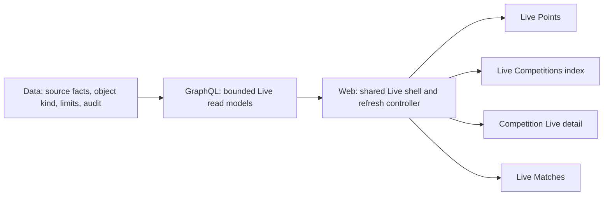
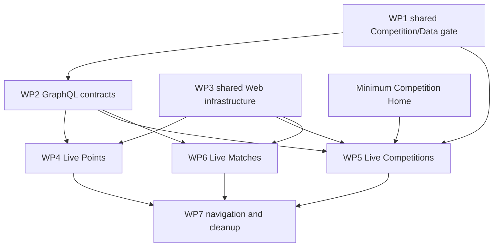

# LetLetMe Live Section — High-Level Implementation Plan

- **Status:** Proposed engineering plan, ready for technical review
- **Recorded:** 10 August 2026
- **Scope:** `letletme_data` → `letletme-graphql` → `letletme-web`
- **Product inputs:** [LetLetMe Product Conclusions](letletme-product-conclusions.md) and [LetLetMe Four-Section Product Specification](letletme-four-section-specification.md)
- **Shared implementation contract:** [LetLetMe Cross-Section — High-Level Implementation Plan](letletme-cross-section-implementation-plan.md)

## 1. Scope

This document does not redefine the Live product. It translates the agreed design into cross-repository implementation work.

The cross-section plan governs shared identity, season context, metadata families, canonical links, compatibility, and delivery gates. The Competitions plan owns the official-source and Competition persistence contract. This plan owns the Live-specific refresh, coverage, presentation, and fallback behaviour that consumes them.

The fixed inputs are:

- Routes remain grouped as Live Points, Live Competitions, and Live Matches.
- `/live/points` remains the default Live destination; there is no Live Overview.
- Points and Competition Live support current and historical gameweeks.
- Live Competitions reads prepared objects only; it never starts an arbitrary official-league calculation.
- A tracked official league and a custom tournament are different persisted object kinds.
- The creation limit is 500 entries for a tracked league and 500 selected entries for a custom tournament.
- Official finalized entry and official-league results are authoritative.
- Custom tournament results remain LetLetMe calculations over official entry facts.
- Setup, rules, roster management, and full history move to Competition Home.
- No official FPL team actions are added.

## 2. Current implementation baseline

### Web

| Area | Current implementation |
| --- | --- |
| Navigation | `components/layout/config.ts` exposes Live Points, Live Tournaments, and Live Matches |
| Live Points | Server seed plus `useLivePoints`, 30-second revision probe, gameweek switching, player explanations, sharing |
| Live competitions | `/live/tournaments` combines object selection and a full live table; `/live/tournaments/[id]` independently implements a full detail/table plus setup, rules, roster, and management UI |
| Live Matches | Server seed, match-state tabs, revision probe, retained last-good payload |
| Shared refresh | `lib/live-refresh.ts` contains snapshot polling rules, but each page still owns most refresh/error presentation and request orchestration |
| Event resolution | Points, tournaments, and matches are gated by `getCurrentEventId()` at route level |

### GraphQL

| Area | Current implementation |
| --- | --- |
| Snapshot | `LiveSnapshotMeta` supplies event, revision, state, timestamps, and source counts |
| Entry result | `calcLivePointsByEntry` supplies the entry scoreboard and squad |
| Competition result | `calcLivePointsForTournament` supplies a tolerant batch of generic entry rows |
| Competition metadata | `TournamentInfo` supplies source, roster mode, setup state, and format fields |
| Official league history | `leagueEventResults` reads shared league/event/entry evidence |
| Limits | Entry live batches are capped at 500 |

### Data

| Area | Current implementation |
| --- | --- |
| Live publication | Coordinated Redis snapshots with revision metadata and durable finalization checkpoints |
| Competition storage | `tournament_infos` stores source, format, roster mode, lifecycle, and setup state, but does not persist the FPL season that scopes its league/event identities |
| Official roster mode | `official_sync` supports between-gameweek synchronization and active-gameweek freezing |
| Shared official evidence | `league_event_results` is keyed by league type, league ID, event, and entry rather than tournament ID |
| Custom results | Tournament-specific group, race, and knockout outputs are persisted separately |
| Creation | The current input permits more than 500 selected IDs and can silently downgrade `official_sync` to `snapshot` when the feature flag is disabled |

## 3. Target technical structure



The implementation consumes two cross-section foundations and adds two Live-specific foundations:

1. The shared `CS-COMPETITION-1` identity contract.
2. The shared `CS-LIVE-META-1` snapshot/coverage contract specialized by Live.
3. Separate cheap competition-index and full competition-detail reads.
4. One Web refresh controller and status renderer.

## 4. Cross-repository contracts

### 4.1 Competition identity specialization

Consume the persisted Competition kind, source, and season identity governed by the cross-section and Competitions plans. Live does not introduce a parallel identity or source table:

```text
tracked_official_league
custom_tournament
```

Implementation rules:

- Add `competition_kind` to `tournament_infos`; do not rename the physical tournament tables during this change.
- Add a four-digit `season` to `tournament_infos`; league IDs, entry IDs, and gameweek numbers are meaningful only inside that season.
- Backfill kind and season only where existing setup/event evidence is unambiguous; generate an audit report and resolve every ambiguous row before making either column non-null.
- Do not infer the kind permanently from the object name, `roster_mode`, or a combination of group/knockout fields.
- Keep `roster_mode` as a separate field because it answers a different question: synchronized official membership versus stored selected membership.
- Compute result authority from competition kind in the read model:
  - tracked official league → official FPL result;
  - custom tournament → LetLetMe rules.
- Stop silently changing a requested tracked league from `official_sync` to `snapshot`. If official synchronization is disabled, return a typed unavailable response or leave setup pending without changing the object meaning.

The Competitions implementation introduces a first-class season-scoped official-league source record. Existing `league_event_results` remains the reusable league/event/entry evidence grain, but it must become season/source safe and reference or resolve that source consistently. Tournament-specific result tables remain separate, and distinct competition objects are never merged merely because they share a source.

### 4.2 Live status and coverage

Keep `LiveSnapshotMeta` as the authority for the official fact snapshot and map it additively into
the shared `LiveResultMeta` contract rather than replacing existing fields. A result projection has
its own revision because custom calculation state can change without a new official snapshot.

Required fields:

```text
season
eventId
revision
resultRevision
state: SCHEDULED | LIVE | SETTLED
publishedAt
checkedAt
authority: OFFICIAL_FPL | LETLETME_RULES
coverage.expected
coverage.succeeded
coverage.failed
reasonCode
```

Responsibilities:

- Data publishes internally consistent snapshot metadata.
- GraphQL combines snapshot metadata with query-specific expected, succeeded, and failed coverage.
- Web adds the retained-row count after merging a failed batch with its previous payload, then converts timestamps and coverage into `fresh`, `refreshing`, `delayed`, `partial`, `final`, or `unavailable` through one shared normalizer.
- Freshness thresholds live in one Web configuration initially and must be derived from the actual producer cadence.
- Existing `source` fields remain compatibility aliases while new consumers use `authority`; provider provenance remains available through the underlying facts and must not be confused with result-rule authority.
- Authority describes the result rules only: official results use `OFFICIAL_FPL`, while custom
  results use `LETLETME_RULES`. Multiple upstream/provider inputs are represented by source
  provenance and never by a third authority value.
- Existing GraphQL consumers remain compatible because the new fields are additive.
- `revision` remains the accepted official snapshot revision. `resultRevision` is monotonic within
  the exact entry, competition, or match-result scope and advances whenever its body, coverage,
  failure/retained-row state, or authority changes. Official projections may initially set
  `resultRevision = revision`; custom competition calculation retries and recovery advance
  `resultRevision` independently.
- The cheap refresh probe returns both revisions and Web performs a full fetch when either changes.
  Suppression is allowed only when the exact `(season, eventId, revision, resultRevision)` token is
  unchanged; a custom result can therefore recover without waiting for unrelated upstream facts.

### 4.3 Required GraphQL read models

| Read model | Implementation requirement |
| --- | --- |
| `calcLivePointsByEntry(event: EventRef!, entryId: Int!)` | Keep the current full entry contract and add shared result metadata; request all scoreboard fields already available in `LiveCalcData` |
| `entryPreparedCompetitions` | Return metadata and cheap viewer summaries only; never calculate a full table for every object |
| `competitionLive(competitionId: ID!, event: EventRef!, viewerEntryId: Int)` | Return one competition identity, shared result metadata, viewer context, and a discriminated result body |
| `liveMatches(event: EventRef!, viewerEntryId: Int)` | Retain the current match groups and optionally include one linked entry's squad-impact map |

`liveSnapshot(event: EventRef!)` and every repository/cache key below these roots use the same
season-bearing event input. During compatibility, active-season wrappers may call the new roots,
but no protected or historical root is allowed to infer season from the current clock or from a
numeric event/entry ID.

`competitionLive` reuses the canonical result discriminants owned by the Competitions
contract; it must not introduce Live-only aliases:

```text
OFFICIAL_CLASSIC_STANDINGS
CUSTOM_POINTS_TABLE
CUSTOM_BATTLE_MATCHUPS
CUSTOM_KNOCKOUT_BRACKET
```

Official H2H remains disabled until its upstream contract is verified and a canonical
`OFFICIAL_H2H` result discriminant is added to the Competitions contract. A custom
head-to-head or knockout mode must use the custom discriminants above and must not activate
the future official H2H result type.

### 4.4 Official live facts adapter

Do not make Web choose between official and locally calculated facts.

- Data ingests and validates official live facts.
- GraphQL exposes one entry/competition contract regardless of provider.
- Keep the existing calculation path as a fallback while official live coverage is being verified.
- Run official-versus-current-calculation comparison in audit/shadow mode during initial live gameweeks.
- Switch official entry totals, official standings/ranks, bonus, and squad state to primary only after completeness and timing checks pass.
- Keep LetLetMe calculation primary for custom tournament rules.

## 5. Implementation work packages

### WP1 — Shared Competition/Data foundation gate

**Repository:** `letletme_data`, implemented once through Competitions WP1/WP2 and consumed by Live

This is a Live release dependency and acceptance checklist, not a second Competition schema migration.

Changes:

1. Add the competition-kind enum plus `tournament_infos.competition_kind`, `tournament_infos.season`, and the official-source reference defined by the Competitions implementation plan.
2. Add a two-step kind/season backfill:
   - classify kind and derive season for unambiguous existing objects;
   - report and resolve ambiguous objects before adding the non-null constraints.
3. Add one shared `MAX_COMPETITION_ENTRIES = 500` domain constant.
4. Reuse the season-scoped official-source inspection/admission service; read and reject a source count above 500 before importing a tracked-league roster, then validate the selected roster again after resolution for every creation path.
5. Reject 501+ tracked leagues at creation; once admitted, do not apply the creation gate again during that season's roster synchronization.
6. Reject custom selected membership above 500.
7. Ensure a large source league can seed a custom tournament only through bounded selection; do not fetch its complete roster merely to filter locally.
8. Remove the silent `official_sync` → `snapshot` downgrade.
9. Preserve existing active-gameweek roster freeze, setup jobs, league evidence, custom result tables, and audit paths.

Primary files:

- `src/db/schemas/enums.schema.ts`
- `src/db/schemas/tournament-infos.schema.ts`
- `migrations/`
- `src/domain/tournament.ts`
- `src/services/tournament-create.service.ts`
- `src/services/tournament-roster.service.ts`
- `src/services/tournament-entry-resolver.service.ts`
- `src/api/tournaments.api.ts`

Tests:

- Extend `tests/unit/tournament-domain.test.ts` and `tests/unit/tournament-create.test.ts`.
- Add migration/backfill coverage.
- Extend roster convergence tests for an admitted league growing from 500 to 501+.
- Add bounded-import tests for a custom roster sourced from a league above 500.
- Add rollover tests proving that a prior-season competition cannot associate with a same-numbered current-season league or entry.

### WP2 — GraphQL competition and Live contracts

**Repository:** `letletme-graphql`

Changes:

1. Add `CompetitionKind`, result-authority, result-type, and result-metadata types.
2. Expose `competitionKind` and `season` on the existing tournament metadata type during migration.
3. Add a cheap prepared-competition list projection for one entry.
4. Add one `competitionLive` query for the selected object/event/viewer and require a season-bearing
   `EventRef` on `liveSnapshot`, entry Live, competition Live, and match roots, repositories, and
   cache keys.
5. Reuse shared league evidence for tracked official standings and tournament-specific repositories for custom formats.
6. Return batch coverage and failed entry identifiers without hiding partial results; Web remains responsible for identifying rows retained from its previous payload.
7. Extend entry Live and matches with the shared metadata contract.
8. Add optional viewer squad-impact data to matches through one batched picks read.
9. Keep current queries available until Web migration is complete.
10. Stop relying on `League.tournamentId` as a general one-to-one mapping; return zero-to-many typed Competition associations and never select the first object as authoritative.

Primary files:

- `src/domains/tournaments/schema.ts`
- `src/domains/tournaments/repository.ts`
- `src/domains/tournaments/service.ts`
- `src/domains/tournaments/resolvers.ts`
- `src/domains/entry-live/schema.ts`
- `src/domains/entry-live/calc-service.ts`
- `src/domains/entry-live/batch-service.ts`
- `src/domains/live/schema.ts`
- `src/domains/live/snapshot-meta.ts`
- `src/domains/live-matches/service.ts`
- `src/domains/leagues/schema.ts`
- `src/domains/leagues/repository.ts`
- `src/graphql/limits.ts`

Tests:

- Extend tournament schema/repository/resolver tests for both kinds.
- Extend entry-live batch tests for 500 and rejected 501.
- Add `competitionLive` fixtures for official standings, points groups, and knockout results.
- Extend snapshot tests for coverage, reason codes, composite snapshot/result revision probes, and
  custom-result recovery without an upstream revision.
- Add same-numbered event/entry fixtures in two seasons and prove every Live repository and cache
  key selects only the requested `EventRef`.
- Extend match-service tests for viewer-impact batching.

### WP3 — Shared Web Live infrastructure

**Repository:** `letletme-web`

Create or extract:

```text
components/live/LiveSectionShell.tsx
components/live/LiveSectionNav.tsx
components/live/LiveStatusBar.tsx
components/live/LiveGameweekControl.tsx
hooks/use-live-revision-refresh.ts
lib/live-status.ts
lib/live-event-context.ts
```

Responsibilities:

- `LiveSectionShell`: shared page header, local Live navigation, controls/status slots, and width variants.
- `LiveStatusBar`: render the normalized state, timestamp, coverage, manual refresh, and accessible announcement.
- `LiveGameweekControl`: synchronize the selected `EventRef` with `?season=&gw=`.
- `use-live-revision-refresh`: page visibility/offline checks, 30-second composite
  snapshot/result-revision probe, comparison, request coalescing, and full-fetch callback.
- `live-status`: one pure normalizer from GraphQL result metadata to Web display state.
- `live-event-context`: resolve requested event, current event, and latest finalized fallback on the server.

Refactor, do not duplicate:

- Move reusable behavior out of `LiveAutoRefreshCountdown` and `useLivePoints`.
- Keep page-specific data mapping in the page feature.
- Keep the last valid same-event payload during refresh failure.
- Clear or replace data when switching to a different event so one gameweek is never labelled as another.

Tests:

- Extend `test/live-refresh.test.ts`.
- Add pure status-normalizer and event-context tests.
- Add Playwright coverage for scheduled, live, delayed, partial, final, and unavailable rendering states.

### WP4 — Live Points migration

**Repository:** `letletme-web`

Changes:

1. Replace the route-level `CurrentGameweekUnavailable` gate with `live-event-context`.
2. Read `?season=&gw=` on the server and seed that exact `EventRef`.
3. Update gameweek changes through the URL while retaining client-side refresh behavior.
4. Adopt `LiveSectionShell`, `LiveStatusBar`, and the shared revision hook.
5. Request the complete scoreboard projection already supported by GraphQL, including played/to-play values where available.
6. Preserve `TeamStats`, `PlayerList`, `PlayerRow`, player explanations, and entry lookup.
7. Add both `season` and `gw` to event-scoped share URLs.
8. Change `liveSnapshot` and `calcLivePointsByEntry` operations to pass the resolved `EventRef`,
   including the season in GraphQL variables and cache identity; do not retain a seasonless
   historical adapter.
9. Keep upstream squad state as displayed; add no separate autosub prediction or official-action control.

Primary files:

- `app/[locale]/live/points/page.tsx`
- `app/[locale]/live/points/[id]/page.tsx`
- `app/live/points/LivePointsClient.tsx`
- `app/live/points/[id]/TeamPointsClient.tsx`
- `app/live/points/_hooks/useLivePoints.ts`
- `app/live/points/_components/LivePointsDashboard.tsx`
- `lib/graphql/operations/live.ts`

Required route cases:

- current event;
- explicit historical event;
- no current event with latest-finalized fallback;
- invalid event;
- guest lookup;
- linked entry;
- explicit entry deep link.

### WP5 — Live Competitions migration

**Repositories:** `letletme-web`, supported by WP1 and WP2

New routes:

```text
app/[locale]/live/competitions/page.tsx
app/[locale]/live/competitions/[id]/page.tsx
```

Index changes:

1. Query prepared metadata and cheap viewer summaries only.
2. Do not call the full competition result query for every item.
3. Show kind, source, format, setup/readiness, participant count, and cheap viewer position/matchup.
4. Link one selected object to its detail route.
5. Link setup/create/management needs to Competitions, not an inline Live workflow.

Detail changes:

1. Consolidate the current list-table and detail-table implementations into one full result client.
2. Read `competitionLive(competitionId, event: EventRef, viewerEntryId)` so the selected historical
   season is explicit through GraphQL, repositories, and caches.
3. Render by result discriminator:
   - official standings;
   - custom points/group table;
   - custom knockout/matchup.
4. Retain the viewer row/matchup, search, relevant filters, comparison, partial-row retention, and entry-to-Live-Points links.
5. Support `?season=&gw=` and disable polling for historical/final results.
6. Remove detailed setup phases, full roster, rules tab, and management UI only after Competition Home exposes them.

Compatibility:

- Keep `/live/tournaments` and `/live/tournaments/[id]` as redirects preserving IDs and query parameters.
- Keep old internal clients until the new routes pass parity tests, then remove them.
- Do not redirect `/tournament/[id]` to Live after Competition Home is available.

Completion dependency:

- A minimum Competition Home must expose identity, setup/retry state, rules, roster, history links, and management entry before those controls are removed from Live. Its wider implementation is outside this Live plan, but it is a release gate for WP5 cleanup.

Primary files:

- `app/[locale]/live/tournaments/**`
- `app/live/tournaments/**`
- `components/tournament/TournamentTable.tsx`
- `components/tournament/TournamentHeader.tsx`
- `lib/graphql/operations/tournaments.ts`
- `lib/tournament/liveEntries.ts`
- `lib/tournament/lifecycle.ts`

### WP6 — Live Matches migration

**Repositories:** `letletme-web`, supported by WP2

Changes:

1. Adopt the shared shell, status bar, and revision hook.
2. Keep the existing match-state grouping and preferred-tab behavior.
3. Request optional viewer-impact data only for the linked entry.
4. Map player IDs to `XI`, `Captain`, `Vice-captain`, or `Bench` markers.
5. Preserve a return link when navigation originated from Competition Live.
6. Replace the current route-level no-current-event failure with a schedule/offseason state.
7. Do not add a historical gameweek selector or calculate every related competition.
8. Pass the server-resolved `EventRef` to `liveMatches`; current-event convenience UI must not
   remove season from the operation or cache key.

Primary files:

- `app/[locale]/live/matches/page.tsx`
- `app/live/matches/LiveMatchesClient.tsx`
- `components/live/MatchCard.tsx`
- `lib/live-matches.ts`
- `lib/graphql/operations/live.ts`

### WP7 — Navigation, localization, and cleanup

**Repository:** `letletme-web`

Changes:

1. Rename the public label from Live Tournaments to Live Competitions.
2. Update navigation configuration, metadata, links, breadcrumbs, share URLs, and analytics identifiers.
3. Update English and Simplified Chinese messages in the same change.
4. Preserve existing English URLs through redirects and retain localized routes.
5. Remove old clients, duplicated refresh logic, and unused translation keys only after redirect and parity coverage passes.

Primary files:

- `components/layout/config.ts`
- `messages/en.json`
- `messages/zh-CN.json`
- homepage and Competition/My FPL links that still point to `/live/tournaments`

## 6. Dependency and delivery order



Recommended execution:

1. Agree the additive schema and fixtures first.
2. Implement and migrate Data competition kind and limits.
3. Add GraphQL fields and queries without removing current contracts.
4. Build the shared Web shell in parallel once the status shape is fixed.
5. Migrate Live Points first because it exercises the shared event/status/refresh path with one entry.
6. Migrate Live Competitions after competition identity and result discriminators are available.
7. Migrate Live Matches onto the shared infrastructure.
8. Switch navigation and redirects only after all new routes pass verification.
9. Remove legacy code in a separate cleanup change after production parity is observed.

Production deployment order is **Data → GraphQL → Web**.

## 7. Migration and compatibility plan

### Database

- Use an additive nullable column first.
- Backfill in bounded batches.
- Produce counts for tracked, custom, and ambiguous rows.
- Resolve ambiguous rows before applying a non-null constraint.
- Do not rewrite existing league or tournament result tables.

### GraphQL

- Add new fields and queries without removing the current ones.
- Keep current cache keys readable during Web migration.
- Version any new Redis key only when its stored shape changes.
- Do not let old readers consume partially migrated payloads under an old key.

### Web routes

- Add new routes before redirects.
- Preserve `gw` and object ID through redirects.
- Keep legacy routes deployable until the new pages have production evidence.
- Use a temporary feature switch for new Competition Live routing if rollback cannot be achieved through deployment alone.

## 8. Verification plan

### Data

Run:

```text
bun run typecheck
bun run lint
bun test
bun run test:integration
bun run build
bun run db:check
```

Required evidence:

- Migration/backfill counts.
- 500 accepted and 501 rejected at creation.
- An admitted roster may grow beyond 500 during the same season.
- Custom selection remains bounded when the source league is larger than 500.
- Snapshot publication and tournament finalization tests remain green.

### GraphQL

Run:

```text
bun test
bun run lint
bun run format:check
```

Required evidence:

- Schema/resolver tests for both competition kinds.
- No N+1 or upstream per-entry calls in prepared list/detail reads.
- Batch limit and partial coverage tests.
- Old queries remain compatible during migration.

### Web

Run:

```text
npm test
npm run lint
npm run build
npm run test:e2e
```

Required browser scenarios:

- Scheduled, live, settled, delayed, partial, unavailable, and recovered snapshot states.
- Current, historical, and no-current-event routes.
- Linked entry, explicit entry, and guest lookup.
- Tracked Classic, custom points/group, custom knockout, preparing, paused, failed, and finished competitions.
- Legacy tournament redirects with preserved gameweek.
- Match tabs with and without viewer-impact data.
- English and Simplified Chinese at mobile and desktop widths.
- Hidden/offline polling stop and composite snapshot/result-revision-unchanged full-fetch
  suppression, including custom-result-only recovery.
- The same numeric event and entry in two seasons produces distinct GraphQL variables, repository
  reads, cache keys, and historical page data.

## 9. Observability and rollback

Add metrics/log fields for:

- route and selected event;
- snapshot revision, result revision, state, and age;
- composite revision probes versus full payload fetches;
- competition kind/result type and participant count;
- full-result duration and failed/retained rows;
- fallback use between official and calculated entry facts;
- redirect use from legacy Live Tournament URLs.

Rollback rules:

- Data migrations are additive; do not remove the new column during an application rollback.
- GraphQL keeps old queries until the new Live routes are stable.
- Web can route users back to legacy clients while new endpoints remain unused.
- Official-facts authority can return to the existing calculation adapter without changing the Web payload.
- Cleanup and contract removal occur only after a separate production-observation period.

## 10. Completion criteria

Implementation is complete when:

- Data persists explicit competition kind and season and enforces the agreed limits.
- GraphQL exposes bounded entry, competition-index, competition-detail, and match read models with one result metadata contract.
- All three Web pages share season-bearing event resolution, composite revision polling,
  retained-data handling, and status presentation.
- Historical Points and Competition Live work without a current-event gate.
- Only one selected competition triggers a full result read.
- Tracked official and custom result paths are technically and visibly discriminated.
- Legacy URLs redirect without losing object or gameweek context.
- Data, GraphQL, Web, and browser verification pass in dependency order.
- The old duplicate Live Tournament clients and refresh paths can be removed safely.
