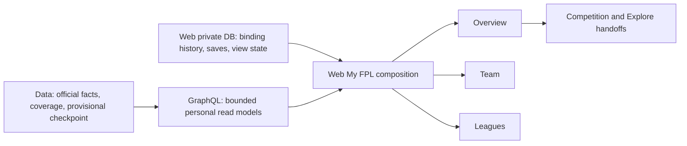
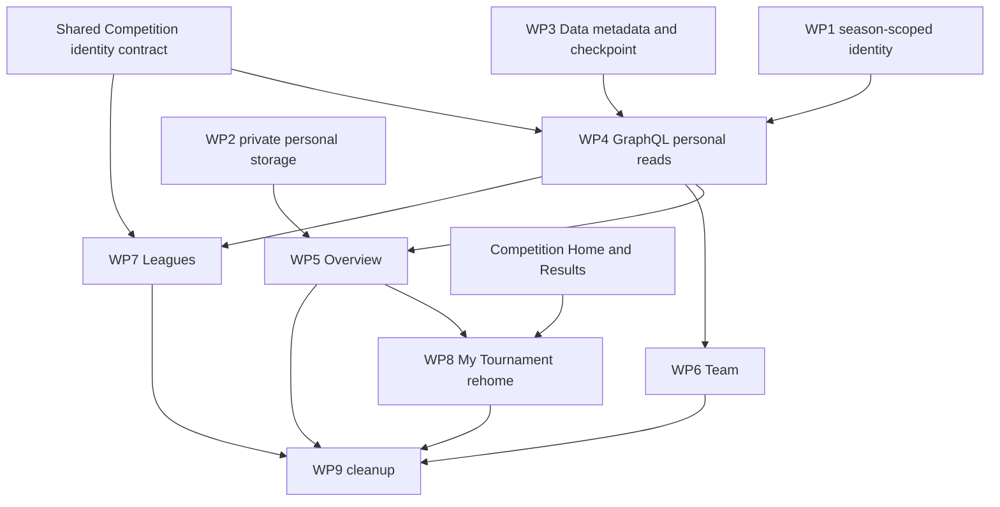

# LetLetMe My FPL Section — High-Level Implementation Plan

- **Status:** Proposed engineering plan, ready for technical review
- **Recorded:** 10 August 2026
- **Scope:** Web-owned private data → `letletme_data` → `letletme-graphql` → `letletme-web`
- **Product inputs:** [LetLetMe Product Conclusions](letletme-product-conclusions.md) and [LetLetMe Four-Section Product Specification](letletme-four-section-specification.md)
- **Shared implementation contract:** [LetLetMe Cross-Section — High-Level Implementation Plan](letletme-cross-section-implementation-plan.md)

## 1. Scope

This document does not redefine My FPL. It translates the approved Section 2 decisions into cross-repository implementation work.

The cross-section plan governs shared identity, season context, metadata families, canonical links, compatibility, and delivery gates. This plan owns Web-private binding and personal context, bounded personal reads, relevant-change state, and provisional-to-final reconciliation.

The fixed inputs are:

- The public section is `My FPL`; the initial route namespace remains `/me`.
- Its permanent navigation is Overview, Team, and Leagues.
- Overview is phase-aware and private to the signed-in, active-season-bound manager.
- Before a deadline, squad context means the latest publicly frozen official squad; LetLetMe does not claim to know the manager's current private draft or unconfirmed actions.
- Team remains the official finalized personal record.
- Leagues shows cheap personal official-league summaries; full prepared-league tables and reports belong to Competitions.
- `My Tournament` is not a permanent target page. Its personal components move to My FPL and its shared components move to Competition Results/History.
- Saved context begins with saved players, saved comparisons, followed rivals, and pinned competitions.
- Relevant change compares the current trusted personal state with the baseline from the last successful view.
- LetLetMe never performs official FPL team actions or produces transfer recommendations.
- One secondary link may hand the user to official FPL when an action is relevant.
- Notifications and publisher/source following are outside this implementation plan; the on-site personal continuity must work without them.
- The current in-page multi-gameweek tab workspace is replaced with a single Season/Gameweek selection unless a separate comparison requirement is approved.
- Automatic-substitution prediction or status tracking is not added. Settled views consume the official finalized squad and may show official substitution markers only where explanatory.

## 2. Current implementation baseline

### Web

| Area | Current implementation |
| --- | --- |
| Navigation | `components/layout/config.ts` exposes `Me` with My Team and My Tournament; there is no `/me` overview or `/me/leagues` |
| Homepage | `PersonalDesk` shows linked team identity, points, overall rank, team value, and official-league rank rows on the public homepage |
| Team | `/me/team` provides substantial settled season/gameweek review, but uses a multi-gameweek tab workspace and has few direct player-evidence links |
| Tournament review | `/me/tournament` combines viewer-specific summaries with full standings, field metrics, captain/chip distributions, risers/fallers, and season reports |
| Binding | `bauth.user` stores one `fplEntryId` plus binding/verification timestamps and identity-name snapshots, without an active-season field or binding history |
| Personal persistence | No durable saved-object, comparison, followed-rival, pinned-competition, or last-seen model exists; selected tournament and similar conveniences are local-device state |
| Private reads | My Team and My Tournament already require an authenticated session and a bound entry and use private `no-store` reads |

### GraphQL

| Area | Current implementation |
| --- | --- |
| Entry review | `entry`, `entryHistory`, `entryEventResult`, and `entryTransferHistory` provide the Team facts |
| League list | `entryLeagues` provides official league name/type and personal current/last rank |
| League association | `League.tournamentId` enriches a league with only the first matching tournament, even though one league may source multiple competition objects |
| League review | `leagueEventResults(leagueId, eventId)` omits league type from the query identity and returns a limited finalized projection |
| Competition summary | `tournamentEntryRankingSummary` can provide a viewer-only points-race summary; other format-specific viewer structures also exist but are not composed into one personal list read |
| Authorization | The signed Web envelope carries user ID, entry ID, and verification time, but no binding season |
| Settlement metadata | Entry and league review queries do not expose a consistent finalized/source-checked/coverage-through contract |

### Data

| Area | Current implementation |
| --- | --- |
| Entry facts | `entry_infos` and `entry_event_results` hold official current identity, season totals, finalized gameweek values, squad picks, captain, bench, chips, value, and rich-sync checkpoints |
| League facts | `entry_league_infos` holds one manager's official league rows; `league_event_results` stores prepared league/event/entry evidence and source-check timestamps |
| Competition facts | Tournament-specific tables preserve membership, rules, points/group/matchup/knockout results, setup state, and audit separately from league evidence |
| Season fencing | Data and Redis use a four-digit active season and per-entry season checkpoints during rollover, but the Web binding does not carry that season |
| Reconciliation | No durable last trusted provisional entry checkpoint exists for comparison with the official finalized entry result |

## 3. Target technical structure



The implementation consumes the shared season/principal/Competition/metadata contracts and adds the My FPL-specific persistence and composition:

1. Active-season-scoped binding authority.
2. Web-owned durable personal context.
3. Bounded GraphQL personal read models.
4. One typed relevant-change baseline and comparator.
5. One optional last-provisional-to-final reconciliation contract.
6. Consistent settled authority, coverage, and source timestamps.

## 4. Cross-repository contracts

### 4.1 Active-season binding

Add an active-season field and binding history to the Web-owned private database.

Required binding identity:

```text
userId
season
entryId
boundAt
verifiedAt
unboundAt
bindingAssurance: UNVERIFIED | OWNERSHIP_VERIFIED
bindingProofKind: DIRECT_BINDING | TEAM_NAME_CHALLENGE | OPERATOR_VERIFIED
teamNameSnapshot
managerNameSnapshot
```

Implementation rules:

- Add `fplEntrySeason`, `fplEntryBindingAssurance`, and `fplEntryBindingProofKind` to `bauth.user`
  for the fast current-binding path.
- Add `bauth.fpl_entry_bindings` for history and rollover audit.
- Replace the current global verified-entry uniqueness with a partial active uniqueness constraint
  on `(season, entry_id)` only for ownership-verified, non-unbound bindings. An `UNVERIFIED`
  direct binding never occupies that ownership slot and therefore cannot prevent the real owner
  from binding and completing the challenge on another account.
- Allow at most one active binding per `(user_id, season)`.
- Keep current `fplEntryId` and name columns during migration; binding and unlink operations
  dual-write the current columns and a history row with the exact assurance/proof kind.
- Direct binding stores `UNVERIFIED` plus `DIRECT_BINDING` and leaves ownership `verifiedAt` null.
  Only a successful team-name challenge stores `OWNERSHIP_VERIFIED` plus
  `TEAM_NAME_CHALLENGE`; an audited operator action stores `OPERATOR_VERIFIED`. Do not infer
  ownership proof from an existing timestamp during backfill.
- Add active season, binding assurance, and proof kind to the signed Web → GraphQL identity
  envelope. GraphQL validates the signed values and never derives assurance from `verifiedAt`.
- Replace every current Web `fplEntryVerifiedAt` route, proxy, session-context, and tournament API
  gate with an explicit requirement appropriate to the operation: active-season binding presence
  for ordinary entry-scoped reads/actions, and `OWNERSHIP_VERIFIED` assurance only for proof-gated
  ownership, claim, and recovery commands. `verifiedAt` remains proof audit metadata, not a general
  signed-in-entry authorization switch.
- GraphQL must ignore/reject an entry identity whose binding season does not equal Data's active season.
- Web must render a rebind state instead of sending stale entry-specific queries after rollover.
- Do not treat a previous-season entry number as current merely because the upstream endpoint returns another entry with the same ID.

Consume the additive shared GraphQL `SeasonContext` rather than defining a My FPL-specific current-event interpretation:

```text
season
phase: PRESEASON | PRE_DEADLINE | LIVE | SETTLING | SETTLED | OFFSEASON
currentEventId nullable
nextEventId nullable
latestSettledEventId nullable
deadlineAt nullable
checkedAt
revision
```

The existing Data/Redis active-season authority remains the source. Web must not derive the season from the local calendar.

### 4.2 Personal persistence ownership

Personal preferences remain in the Web-owned private database and are accessed only through authenticated Web server code. Do not place user saved objects or view state in `letletme_data` or Redis.

Add typed tables under the existing Web-managed private schema:

```text
my_fpl_saved_objects
  user_id
  object_type: PLAYER | RIVAL_ENTRY | COMPETITION
  object_key
  season_scope
  created_at
  updated_at

my_fpl_saved_comparisons
  id
  user_id
  season_scope
  title
  created_at
  updated_at

my_fpl_saved_comparison_players
  comparison_id
  player_key
  position

my_fpl_view_states
  user_id
  scope
  scope_key
  state_version
  facts_revision
  baseline_json
  last_seen_at
```

Rules:

- Store identity keys, ordering, and user labels only; resolve current display facts from GraphQL.
- Use a stable player identity where available and retain an explicit current-season mapping; do not rely on a seasonal element ID for cross-season saves.
- Rival entry keys are season-scoped.
- Competition keys resolve only to objects the user may read.
- Enforce explicit per-type and comparison-size caps in one domain module and in mutation tests.
- Version `baseline_json`; reject or rebuild an unsupported version rather than interpreting stale shapes.
- Never copy browser-local history into the account silently.

Authenticated mutation endpoints:

```text
GET    /api/my-fpl/saved
POST   /api/my-fpl/saved
DELETE /api/my-fpl/saved/[type]/[key]
POST   /api/my-fpl/comparisons
PATCH  /api/my-fpl/comparisons/[id]
DELETE /api/my-fpl/comparisons/[id]
POST   /api/my-fpl/seen
```

Use the existing session, origin, validation, rate-limit, and structured error conventions. Client payloads never supply another user ID.

### 4.3 Bounded GraphQL personal facts

Add authenticated, principal-scoped read models. The entry ID is derived from the verified principal rather than accepted as a free argument.

Required reads:

| Read model | Required shape |
| --- | --- |
| `myFplOverview` | Season/event phase, entry identity/summary, latest finalized personal result, latest publicly frozen squad signals, bounded saved-player signals, bounded league summaries, bounded active competition viewer summaries, facts revision, settled metadata |
| `myOfficialLeagues` | Official league key, name/type, personal rank/movement, start event, tracked-preparation coverage, related Competition associations/count, coverage state, prepare eligibility state when already known |
| `myCompetitionSummaries` | Competition identity/kind/format/state plus only the viewer's position, gap, latest result, matchup, bracket status, or setup attention needed for a compact card |
| `myTeamReviewMeta` | Event, official-final state, source checked time, rich-detail readiness, coverage-through event, optional reconciliation availability |
| `myEntrySettlementReconciliation` | Last trusted provisional revision/time, final result time, total/net delta, typed identified component deltas, or null when no trustworthy baseline exists |

Rules:

- Overview and list reads must not load full standings or call one full tournament result query per card.
- Any saved-player keys supplied by the authenticated Web composition layer are capped and validated; GraphQL resolves facts but does not persist the user's saves.
- Pre-deadline squad signals identify the source gameweek explicitly and never represent the manager's current private draft.
- Add explicit maximum `first` values for league and competition summaries and return continuation metadata where needed.
- Use one stable official-league key: `(season, leagueType, leagueId)`.
- Replace the singular `League.tournamentId` assumption with an association list.
- Use `competitionKind` from the Competitions/Live contract to identify the tracked-official-league competition; custom tournaments remain separate associations.
- Add league type to new official-league result/review query identities. Keep the legacy query during migration.
- Batch entry, league, tournament, event, and player reads; resolver tests must detect N+1 behaviour.
- Existing entry/tournament queries remain available until Web migration and redirects are complete.

### 4.4 Relevant-change state

Relevant change is composed in Web from current GraphQL facts plus the prior private baseline.

Use a versioned pure model:

```text
buildMyFplState(facts, savedContext) -> bounded semantic state
compareMyFplState(previous, current) -> MaterialChange[]
```

Initial change kinds:

```text
GAMEWEEK_FINALIZED
OVERALL_RANK_MOVED
OFFICIAL_LEAGUE_RANK_MOVED
COMPETITION_RESULT_READY
COMPETITION_POSITION_MOVED
MATCHUP_CHANGED
SQUAD_PLAYER_AVAILABILITY_CHANGED
SAVED_PLAYER_AVAILABILITY_CHANGED
SQUAD_OR_SAVED_PLAYER_PRICE_CHANGED
```

Rules:

- First visit creates no invented change list.
- Only identified, material changes render; raw object diffs do not.
- `POST /api/my-fpl/seen` advances the baseline only after the Overview has rendered successfully.
- The acknowledgment includes the facts revision it represents and cannot move a cursor backwards.
- Background prefetch, metadata generation, failed renders, and crawler traffic do not mark state as seen.
- Keep the state bounded to the linked squad and capped saved/personal objects.
- A compact Overview list consumes this model; do not build an infinite activity stream.

### 4.5 Last provisional to official final

Add a durable Data checkpoint only for a coherent accepted entry Live snapshot.

Minimum checkpoint identity and facts:

```text
season
eventId
entryId
snapshotRevision
capturedAt
eventPoints
eventNetPoints
liveTotalPoints
transferCost
captainId
captainPoints
officialOrDerivedBonusSummary
squadMultiplierSignature
```

Rules:

- Keep at most one monotonic checkpoint per `(season, eventId, entryId)`; this is not a refresh history.
- At the last coherent `LIVE` revision before settlement, Data batch-calculates checkpoints for known entries that have complete stored event picks. It reuses the existing entry-picks scan rather than writing from a GraphQL query.
- Update only from a complete same-event snapshot with a newer accepted revision.
- Do not checkpoint partial, retained, stale-season, or failed calculations.
- Freeze the checkpoint when the event becomes settled.
- Compare it with the finalized `entry_event_results` record only after official finalization and rich-detail sync complete.
- Return typed reasons only when the stored facts prove them, for example bonus finalization, captain fallback, official squad multiplier change, transfer-cost correction, or another official correction.
- Do not infer an automatic substitution from an unfinished lineup. The finalized official squad is the authority.
- If no checkpoint exists or component attribution does not reconcile to the total delta, omit the explanation rather than guess.

The Live implementation must expose the accepted snapshot revision to Data's finalization/checkpoint step. GraphQL reads the final checkpoint/reconciliation but does not make an incidental write during a query.

### 4.6 Settled authority and coverage

Consume the shared `SettledResultMeta` shape:

```text
season
eventId
revision
state: PREPARING | FINAL | PARTIAL | UNAVAILABLE
authority: OFFICIAL_FPL | LETLETME_RULES
sourceCheckedAt
detailsReadyAt
coverageThroughEventId
reasonCode
```

Mapping:

- Team and official-league records use `OFFICIAL_FPL` authority.
- A custom competition uses `LETLETME_RULES` authority after its official entry inputs and tournament audit are final.
- Data owns checkpoints and timestamps.
- GraphQL maps them into one contract.
- Existing `source` fields remain compatibility aliases during migration.
- Web renders one page-level status and a specific empty/preparing state; individual cards do not repeat the audit metadata.

### 4.7 Route and page ownership

Target Web routes:

```text
/me
/me/team
/me/leagues
```

Public labels are:

```text
My FPL
  Overview
  Team
  Leagues
```

Supporting routes for saved objects or comparisons may be contextual and are not permanent dropdown entries.

Compatibility rules:

- Keep `/me/team` and its `view`/`gw` deep links.
- Keep `/me/tournament` until Competition Home and Results/History expose every rehomed shared capability.
- After that release gate, redirect
  `/me/tournament?tournamentId=…&view=…&season=…&gw=…` to the canonical competition result while
  preserving object and complete event state.
- A bare `/me/tournament` redirects to My Competitions.
- Do not make the public homepage a duplicate My FPL dashboard.

## 5. Implementation work packages

### WP1 — Season-scoped identity and authorization

**Repositories:** `letletme-web`, `letletme-graphql`

Web changes:

1. Add current-binding season/assurance/proof fields and the binding-history table migration with
   the same durable assurance/proof fields.
2. Replace the global entry uniqueness index with ownership-verified, season-scoped partial active
   uniqueness; unverified direct bindings do not reserve the verified owner slot.
3. Dual-write direct binding, challenge binding, unlink, identity refresh, and mini-program profile
   paths without upgrading direct bindings to ownership-verified assurance.
4. Replace `getVerifiedEntryContext` and every proxy/route/tournament handler that currently gates
   ordinary entry access on `fplEntryVerifiedAt` with season-aware binding context. Return an
   explicit stale-season state instead of a current entry ID, and expose a separate
   ownership-assurance guard for proof-gated commands.
5. Add binding season, assurance, and proof kind to Better Auth server/client typing and the signed
   GraphQL envelope.
6. Add a rebind state for homepage, My FPL, and entry-protected routes.

GraphQL changes:

1. Expose `seasonContext` from the existing active-season/event authority.
2. Accept a new envelope version carrying binding season, assurance, and proof kind. A legacy
   seasonless/assurance-less envelope remains parseable only for public or otherwise
   non-entry-scoped operations during rollout.
3. Refuse every protected entry-scoped authorization when the envelope has no binding season, when
   its binding season differs from the active season, or when the operation requires ownership proof
   and the signed assurance is not `OWNERSHIP_VERIFIED`.
4. Deploy the season-bearing Web signer before enabling that protected-root requirement, then record and remove remaining legacy-envelope use at the compatibility gate.
5. Log mismatch reason without logging unnecessary personal data.

Primary files:

- `lib/db/schema/auth.ts`
- `drizzle/`
- `lib/fpl-entry-binding.ts`
- `lib/fpl-binding-core.ts`
- `lib/session.ts`
- `lib/auth.ts`
- `lib/auth-client.ts`
- `lib/graphql-envelope.ts`
- `lib/miniprogram-account.ts`
- `../letletme-graphql/src/graphql/context.ts`
- `../letletme-graphql/src/graphql/authorization.ts`
- `../letletme-graphql/src/infra/season.ts`
- `../letletme-graphql/src/domains/events/*`

Tests:

- Current-season bind, rebind, unlink, and ownership-verified same-season uniqueness; an unverified
  binding on another account cannot block the real owner's challenge and verified promotion.
- Same numeric entry ID in different seasons.
- Direct binding persists `UNVERIFIED`; successful challenge and audited operator paths persist the
  exact proof kind, and forged/upgraded envelope assurance is rejected.
- Directly bound active-season users retain ordinary My FPL and entry-scoped access while every
  ownership/claim/recovery command rejects them until assurance is `OWNERSHIP_VERIFIED`.
- Legacy seasonless envelopes are denied on protected entry roots but remain compatible with explicitly non-entry/public operations until their removal gate.
- Rollover mismatch blocks entry-scoped GraphQL reads.
- Legacy-envelope compatibility and removal gate.
- Web and mini-program session serialization.

### WP2 — Web private personal-context storage

**Repository:** `letletme-web`

Changes:

1. Add saved-object, comparison, comparison-player, and view-state schemas and migrations.
2. Add typed repositories and validation domain modules under `lib/my-fpl/`.
3. Add authenticated route handlers for save/remove/comparison/seen operations.
4. Add object authorization for rival entries and competitions before persistence or resolution.
5. Implement monotonic view-state acknowledgment and baseline versioning.
6. Add deletion behaviour for account deletion and explicit unlink/season rollover rules.
7. Keep client caches as performance aids only; the database is authoritative.

Primary files:

- `lib/db/schema/auth.ts`
- `drizzle/`
- `lib/my-fpl/persistence.ts`
- `lib/my-fpl/saved-object.ts`
- `lib/my-fpl/view-state.ts`
- `app/api/my-fpl/**`

Tests:

- Authorization and cross-user isolation.
- Duplicate saves and idempotent deletes.
- Type and cap validation.
- Comparison ordering and deletion.
- Monotonic seen acknowledgment under concurrent requests.
- Unknown baseline-version recovery.
- Account deletion and season rollover behaviour.

### WP3 — Data settled metadata and reconciliation checkpoint

**Repository:** `letletme_data`

Changes:

1. Add the entry provisional-checkpoint schema and migration.
2. Add a repository enforcing active-season and monotonic-revision writes.
3. Consume and verify the shared `tournament_infos` season migration delivered once by Competitions WP1; this package does not add a parallel season column or backfill.
4. Correct `entry_league_infos` uniqueness to include league type and audit existing rows before replacing the index.
5. Add a bounded final-live checkpoint step that joins the last coherent Live snapshot to complete stored `entry_event_picks` for known entries; do not write checkpoints from GraphQL read traffic.
6. Freeze the last checkpoint at settlement and make it available to finalized-entry reads.
7. Expose existing entry snapshot/rich-sync and league source-check checkpoints to GraphQL readers.
8. Add composite indexes needed for viewer-centric league history and latest-result reads.
9. Preserve existing official entry, league, tournament, and audit authorities.

Primary files:

- `src/db/schemas/entry-event-results.schema.ts`
- `src/db/schemas/league-event-results.schema.ts`
- `src/db/schemas/entry-league-infos.schema.ts`
- `src/db/schemas/tournament-infos.schema.ts`
- `src/db/schemas/index.schema.ts`
- `src/repositories/entry-event-results.ts`
- `src/repositories/league-event-results.ts`
- new provisional-checkpoint schema/repository
- `src/services/live-snapshot.service.ts`
- `src/jobs/live.jobs.ts`
- `src/services/entry-info.service.ts`
- migrations

Tests:

- Same-season monotonic checkpoint update.
- Season-scoped tournament associations and league-type-aware entry-league uniqueness.
- Stale season, stale revision, partial, and failed snapshots are rejected.
- Only one row remains per entry/event/season.
- Finalization freezes the checkpoint.
- Official finalized data remains authoritative.
- Added indexes match the intended query plans on representative prepared leagues.

### WP4 — GraphQL My FPL read models

**Repository:** `letletme-graphql`

Changes:

1. Add settled metadata and official-league reference types.
2. Add principal-scoped `myFplOverview`, `myOfficialLeagues`, `myCompetitionSummaries`, `myTeamReviewMeta`, and reconciliation reads.
3. Compose entry/history/event data without duplicating existing repositories.
4. Return zero-to-many league Competition associations and identify tracked official-league versus custom associations through `competitionKind` without choosing an arbitrary first object.
5. Add format-discriminated viewer competition summaries.
6. Read reconciliation checkpoints and return null when the comparison is incomplete or unproven.
7. Batch associations, tournament summaries, player metadata, and event metadata.
8. Add facts revisions from stable source checkpoints rather than response timestamps.
9. Keep existing entry, league, and tournament contracts during Web migration.

Primary files:

- `src/domains/entries/*`
- `src/domains/leagues/*`
- `src/domains/tournaments/*`
- new `src/domains/my-fpl/*`
- `src/graphql/authorization.ts`
- `src/graphql/limits.ts`

Tests:

- Own-principal authorization and stale-season rejection.
- Overview does not fetch full standings.
- One league associated with zero, one, or multiple tracked/custom Competition objects without selecting the first association as authoritative.
- League identity includes type and active season.
- Points, H2H, group, and knockout viewer summary fixtures.
- Stable revision under unchanged facts.
- Reconciliation null/incomplete/identified cases.
- Query-count assertions for bounded lists.

### WP5 — My FPL shell, Overview, and homepage migration

**Repository:** `letletme-web`

Create:

```text
app/[locale]/me/page.tsx
app/[locale]/me/layout.tsx
app/me/MyFplOverviewClient.tsx
components/my-fpl/MyFplSectionNav.tsx
components/my-fpl/MyFplStatus.tsx
components/my-fpl/MyFplNow.tsx
components/my-fpl/MyFplChanges.tsx
components/my-fpl/MyFplTeamSummary.tsx
components/my-fpl/MyFplLeagueSummary.tsx
components/my-fpl/MyFplCompetitionSummary.tsx
components/my-fpl/MyFplSavedContext.tsx
lib/my-fpl/overview-model.ts
lib/my-fpl/change-model.ts
lib/my-fpl/routes.ts
```

Changes:

1. Rename the public navigation label from Me to My FPL and add Overview/Team/Leagues.
2. Fetch GraphQL facts and private saved/view state in parallel on the server.
3. Render one phase-aware leading state:
   - pre-deadline evidence intersecting the latest publicly frozen squad and saved players;
   - Live handoff during play;
   - finalized result after settlement.
4. Build material changes with the pure versioned comparator.
5. Acknowledge seen state only after successful client hydration/render.
6. Render bounded league and competition summaries; never fetch their full tables from Overview.
7. Add save/remove controls through authenticated mutation endpoints.
8. Refactor homepage `PersonalDesk` into a compact linked-manager preview and `Open My FPL` action; move the expandable full league list to `/me/leagues`.
9. Preserve guest and signed-in-unbound homepage states.
10. Use one page-level settled/coverage status.

Required states:

- guest;
- signed in but unbound;
- stale previous-season binding;
- preseason/offseason;
- pre-deadline;
- live;
- settling/analysis preparing;
- settled;
- partial personal facts;
- no prior baseline;
- saved objects whose current facts no longer resolve.

### WP6 — Team integration and simplification

**Repository:** `letletme-web`, supported by WP3 and WP4

Changes:

1. Keep the existing season review, gameweek scoreboard, finalized squad, captain, bench, transfer, hit, chip, charts, history, and past-season components.
2. Replace `team-gameweek-workspace` with one URL-backed Season/Gameweek control.
3. Preserve `?view=season` and `?view=gameweek&gw=N` deep links.
4. Add page-level `myTeamReviewMeta` rendering.
5. Add the reconciliation card only when GraphQL returns a proven, reconciled difference.
6. Link squad, captain, bench, and transfer players to the existing player-detail query state; preserve locale and gameweek where relevant.
7. Add one secondary official-FPL handoff in the current/pre-deadline context, not to every historical gameweek.
8. Do not add automatic-substitution polling, prediction, or a separate status control.
9. Remove workspace-only state/components after parity coverage passes.

Primary files:

- `app/[locale]/me/team/page.tsx`
- `app/me/team/TeamStatsClient.tsx`
- `app/me/team/_hooks/useTeamStats.ts`
- `app/me/team/_lib/team-gameweek-workspace.tsx`
- `app/me/team/_lib/team-stats-url.ts`
- `app/me/team/_components/**`
- `lib/graphql/operations/entries.ts`

Tests:

- Season and every valid gameweek deep link.
- No-current-event review fallback.
- Finalized squad and official substitution marker rendering.
- Reconciliation absent, zero-delta, identified-delta, and incomplete cases.
- Player evidence links retain locale/query state.
- Removed workspace tab interactions are not referenced.

### WP7 — Leagues page

**Repository:** `letletme-web`, supported by the shared Competition identity contract and WP4

Create:

```text
app/[locale]/me/leagues/page.tsx
app/me/leagues/LeaguesClient.tsx
components/my-fpl/OfficialLeagueRow.tsx
components/my-fpl/LeagueCoverageBadge.tsx
components/my-fpl/LeaguePersonalSummary.tsx
```

Changes:

1. Move the expandable official-league list from the homepage into this page.
2. Show cheap personal name/type/rank/movement information for every linked league returned by the manager summary.
3. Show explicit `Available in LetLetMe`, `Not prepared`, `Preparing`, `Unavailable`, or `Finished` coverage.
4. For a league with tracked preparation, show one source-coverage summary plus links to the associated Live and canonical Competition objects.
5. For an unprepared league, start the existing bounded creation preflight; do not fetch or display a full table.
6. Run the official source entry-count check during creation and enforce the agreed 500-entry admission rule.
7. Show all related tracked/custom Competition associations contextually without treating the first one as authoritative.
8. Show basic official H2H rows; hide deeper actions until the H2H verification gate passes.
9. Provide clear external official-FPL fallback for leagues that cannot be prepared.

Primary files:

- `components/home/PersonalLeagueRankList.tsx`
- `lib/home-league-ranks.ts`
- `lib/graphql/operations/leagues.ts`
- `lib/graphql/operations/tournaments.ts`
- `app/tournament/create/**`

Required cases:

- unprepared Classic;
- tracked official league;
- one source with multiple custom tournaments;
- preparing/failed/finished tracked preparation;
- 500 accepted and 501 rejected at creation;
- previously admitted league now above 500;
- basic H2H;
- missing/stale personal rank.

### WP8 — My Tournament rehome and compatibility

**Repository:** `letletme-web`, supported by Competition Home

Changes:

1. Extract viewer-specific models/components from `app/me/tournament` for My FPL summary use.
2. Move full season standings, gameweek standings, field leaders/averages, captain/chip distributions, top scorers, risers/fallers, and shared charts into Competition Results/History.
3. Keep shared pure calculation/view models in a neutral competition module rather than copying them.
4. Keep the legacy page operational until the Competition destination has parity.
5. Add redirects preserving tournament ID, selected gameweek, and result view only after the release gate passes.
6. Remove the My Tournament navigation item when Overview and Competition destinations are both live.
7. Delete browser-only last-selected My Tournament preference after its replacement is deployed and observed.

Primary files:

- `app/[locale]/me/tournament/page.tsx`
- `app/me/tournament/**`
- target Competition Results/History files from the Section 3 plan
- `components/layout/config.ts`

Release gate:

- The canonical Competition object exposes shared settled standings/reports for every currently supported format.
- My FPL Overview exposes the viewer-specific summary.
- Legacy deep links redirect without losing object or gameweek context.

### WP9 — Localization, analytics, and cleanup

**Repository:** `letletme-web`

Changes:

1. Update navigation, metadata, breadcrumbs, and English/Simplified Chinese messages together.
2. Add events for Overview state, material-change opens, league preparation handoff, evidence opens, saves, and official-FPL handoff.
3. Record counts/state categories rather than raw saved labels or personal content.
4. Update sitemap/noindex handling so private My FPL routes are not treated as public acquisition pages.
5. Remove obsolete My Tournament, workspace-tab, local preference, and translation code only after migration gates pass.

## 6. Dependency and delivery order



Recommended execution:

1. Agree the active-season, personal-table, GraphQL summary, and settled-metadata contracts.
2. Deploy additive Web binding/personal migrations and Data checkpoint migration.
3. Add GraphQL season validation and bounded My FPL reads without removing current queries.
4. Build the My FPL shell and Overview against the additive contracts.
5. Migrate Team to the shared settled/reconciliation contracts and simplify its gameweek control.
6. Build Leagues after the competition-kind association is available.
7. Rehome My Tournament only after Competition Results/History reaches parity.
8. Switch navigation and remove legacy code in a separate cleanup after production observation.

Production deployment order for cross-service contracts is **Data → GraphQL → Web**. Web private-schema migrations must land before Web code that reads them.

## 7. Migration and compatibility plan

### Web private database

- Add nullable season/current-binding columns and new tables first.
- Resolve the current Data active season through the canonical season contract.
- Revalidate existing bound entry IDs against current-season identity before backfilling binding
  season/history. Backfill legacy direct bindings as `UNVERIFIED` unless a durable challenge or
  operator audit record proves ownership.
- Leave unresolved rows in a recoverable `rebind required` state; do not silently discard or relabel them.
- Dual-write old current columns and binding history during one compatibility period.
- Switch all authorization reads from `verifiedAt` to season-aware binding plus operation-specific
  assurance before removing the old global uniqueness index.
- Add the ownership-verified season-scoped partial unique constraint before accepting same numeric
  IDs for a later season; unverified rows remain non-authoritative and outside that constraint.
- Do not import localStorage selections automatically.

### Data

- Add the provisional checkpoint table and indexes without rewriting finalized result tables.
- Start checkpoint writes in shadow/observation mode and verify monotonic revision behaviour before enabling user-visible reconciliation.
- Retain checkpoints for the defined current-season audit window; do not create an indefinite refresh history.

### GraphQL

- Add the new envelope version with season, assurance, and proof kind plus the related types, fields,
  and queries while current public/non-entry contracts remain readable.
- Deploy the season-bearing Web envelope first. Then accept old and new envelopes at parsing, but reject the old seasonless envelope on every protected entry-scoped root and authorize active-season My FPL only when season identity is proven.
- Keep `League.tournamentId` and the old league results query until Web consumers migrate; mark them deprecated after association-list parity.
- Version cache keys whenever a stored shape gains season or association identity.

### Web routes

- Add `/me` and `/me/leagues` before changing navigation.
- Preserve `/me/team` URLs and query state.
- Keep `/me/tournament` until the Competition release gate passes.
- Preserve English URLs and Simplified Chinese locale prefixes through every redirect.

## 8. Verification plan

### Data

Run:

```text
bun run typecheck
bun run lint
bun test
bun run test:integration
bun run build
bun run db:check
```

Required evidence:

- Provisional checkpoint migration and indexes.
- Monotonic same-season writes and stale/partial rejection.
- Finalized official entry record always wins.
- Source-check and coverage timestamps survive the read path.
- No new per-refresh history growth.

### GraphQL

Run:

```text
bun test
bun run lint
bun run format:check
```

Required evidence:

- Season mismatch cannot authorize an entry read.
- A seasonless legacy envelope cannot authorize an entry read, including when the same numeric ID exists in the active season.
- Overview and league lists are bounded and avoid full standings/N+1 reads.
- One-to-many league associations are correct.
- Viewer summaries cover supported competition result kinds.
- Stable facts revisions and settled metadata, including the producer revision exposed to consumers.
- Old queries remain compatible during migration.

### Web

Run:

```text
npm test
npm run lint
npm run build
npm run test:e2e
```

Required browser scenarios:

- Guest, unbound, current-season bound, and stale-season bound users.
- Overview in preseason, pre-deadline, live, settling, settled, partial, and unavailable states.
- First visit versus a later visit with material changes.
- Save/remove player, rival, competition, and comparison across two browser sessions.
- Team season and gameweek deep links after workspace removal.
- Leagues with no tracked preparation, one or multiple related tracked/custom Competitions, preparation, rejection, and H2H basic state.
- My Tournament compatibility before and after the Competition release gate.
- English and Simplified Chinese at mobile and desktop widths.
- Keyboard, focus, announcements, reduced motion, and empty-state behaviour.

## 9. Observability and rollback

Add metrics/log fields for:

- active season and binding-season match/mismatch;
- Overview phase and facts revision;
- summary counts and query duration, without raw personal labels;
- change count/kind and seen-acknowledgment success;
- saved-object mutation result and cap rejection;
- league association count and coverage state;
- reconciliation availability, delta, and unattributed-difference rejection;
- legacy My Tournament route use and redirect destination.

Rollback rules:

- Database migrations are additive; do not drop history/personal/checkpoint tables during an application rollback.
- Keep current user binding columns and old GraphQL envelope support through the observation period.
- Navigation may return to the existing Me routes while `/me` remains unused.
- Team may temporarily retain the existing workspace client until the simplified control passes parity tests.
- `/me/tournament` remains available until both replacement destinations are stable.
- Reconciliation can be disabled independently while checkpoint collection continues in shadow mode.

## 10. Completion criteria

Implementation is complete when:

- A current binding is season-scoped and stale-season entry IDs cannot authorize My FPL reads.
- Web persists bounded saved context and last-seen state privately and cross-device.
- GraphQL provides bounded principal-scoped Overview, Leagues, competition-summary, Team metadata, and reconciliation contracts.
- My FPL navigation contains Overview, Team, and Leagues under the public `My FPL` label.
- Overview changes its primary state by gameweek phase and never loads full competition standings.
- Team retains settled-review parity with a simpler URL-backed gameweek control, evidence links, and optional proven reconciliation.
- Leagues shows cheap personal rows for all linked official leagues and makes tracked-preparation coverage explicit without offering an arbitrary full table.
- The singular league-to-tournament assumption is no longer used by My FPL.
- My Tournament's personal and shared capabilities have canonical destinations before the legacy page is redirected or removed.
- Page-level settled authority and coverage are visible and consistent.
- Data, GraphQL, Web, migration, localization, accessibility, and browser verification pass in dependency order.
